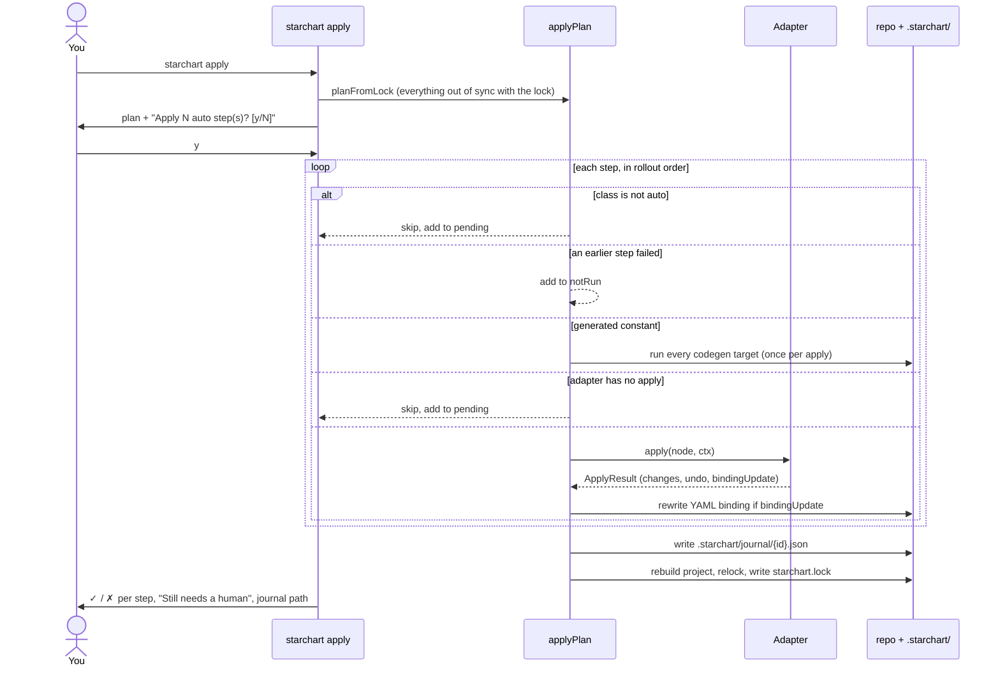

`starchart plan` tells you what a change touches. `starchart apply` fixes the parts a machine can fix, writes a journal of exactly what it did, and re-pins the lockfile. `starchart revert` plays the journal backwards. `starchart ack` marks human work as done. This page covers how `applyPlan` works (auto steps only, rollout order, codegen, stop on first failure, pending tasks, binding edits, the journal format, and relocking), the CLI flags, `ack`, `revert`, `journals`, and real output from the demo.

Source: [`engine/apply.ts`](https://github.com/space-pirate-zero/starchart/blob/main/packages/starchart/src/engine/apply.ts) and the `apply` / `revert` / `ack` / `journals` commands in [`cli/main.ts`](https://github.com/space-pirate-zero/starchart/blob/main/packages/starchart/src/cli/main.ts).

## The flow



## applyPlan, step by step

1. **Plan.** The CLI builds the plan from the lock (`planFromLock`): every fact or tracked code node that changed since `starchart.lock`, plus the changed dependencies of artifacts that are still stale, expanded into impacted items and ordered for rollout (see [Rollout Ordering](Rollout-Ordering)). Locked artifacts that are already in sync are dropped, so a second `apply` doesn't redo the first one's work. Order: explicit `after` / `blocks` edges first, then adapter priority (`stripe` 10 → `appstore` 30 → code 40 → `fs` 50 → `url` 60 → …), then id.
2. **Walk the steps in order.** For each step (filtered by `--only` if given):
   - **Not `auto`** (manual, review, retire, code, break) → added to `pending` with its reason and "why" path. Never touched.
   - **A generated constant** (a code symbol marked `// @starchart generated`, classed `auto` with "regenerate fact constants (codegen)") → the first one runs **every** `codegen:` target in `config.yaml`, once; each generated symbol reports that same result with adapter `codegen`. If an earlier step failed it goes to `notRun`. With no codegen targets configured, it fails with `generated constants found but no codegen targets are configured`. Codegen output is **not** journaled (see [Codegen in apply](#codegen-in-apply)).
   - **`auto` but no adapter binding, or the adapter has no `apply`** → pending, with reason `(no adapter binding)` or `adapter "x" cannot write`.
   - **An earlier step failed** → added to `notRun`. Nothing after a failure runs.
   - Otherwise call `adapter.apply(node, ctx)` with a fresh context (lock values as `previousValues`, `dryRun` from the flag).
3. **Record.** A result with an `undo` (and not a dry run) becomes a journal entry. A result with `bindingUpdate` triggers a YAML rewrite. `ok: false` becomes `report.failed`. A thrown error is converted into a failed result.
4. **Dry run stops here.** Nothing is journaled or relocked.
5. **Journal** (only if there's at least one entry or a written binding edit).
6. **Relock** (only if at least one step succeeded): rebuild the project from disk, then re-pin the applied **artifacts**. Regenerated constants aren't pinned themselves; they're re-read in the rebuild and pinned through the artifacts that depend on them. See [Relocking](#relocking).

Only `auto` steps run, and an artifact is `auto` only if its adapter can write it (see [`canWrite`](Adapters-Overview#canwrite-who-may-touch-reality)). With the default config that means fs only. Stripe and App Store steps are `manual` until you set `write: true`, and even then an adapter can refuse a binding through `canApply`: App Store screenshots and IAP prices stay `manual`, because only bindings with a `field` are writable.

## CLI

```bash
starchart apply                       # show plan, confirm, apply
starchart apply --dry-run             # describe changes, write nothing, no prompt
starchart apply --yes                 # skip the prompt (CI)
starchart apply --only web:pricing-page web:og-pro
```

| Option | Meaning |
|---|---|
| `--dry-run` | Adapters describe `would …` changes. No files, API writes, journal or lock changes. No prompt. |
| `-y, --yes` | Skip the confirmation prompt |
| `--only <ids...>` | Only these ids. Other steps are ignored completely, and aren't listed as pending either. Codegen runs only if a generated symbol id is in the list. |

### The confirmation prompt

Without `--dry-run` or `--yes`, apply prints the full plan and asks `Apply N auto step(s)? [y/N]`. Only `y` or `yes` proceeds. N counts every `auto` item, codegen symbols included, so two generated constants count as two steps even though codegen runs once.

**If stdin is not a TTY** (CI, pipes, scripts), the prompt answers "no" automatically: apply prints `aborted` and exits 1. Use `--yes` in automation.

If nothing is `auto`, you get `✓ nothing to apply automatically` and apply goes on to list pending items without prompting.

### Output

Each step prints one line: `✓` done, `✗` failed, `·` skipped, with the adapter in brackets (`[codegen]` for generated constants) and the changes, error or skip reason. Binding edits print as `↻`. Then the human to-do list, with a hint line for each kind of leftover: `mark artifacts done with: starchart ack <id…>` when artifacts are pending, and `code items: edit the constant, or generate it with starchart codegen` when `code` items are. Last, the journal path.

## Demo walkthrough

In a copy of `examples/pro-universe`, change `usd: 4.99` to `usd: 5.99` in `.starchart/entities/pro.yaml`.

**Dry run:**

```text
$ starchart apply --dry-run
· stripe:price/pro-monthly [stripe] update in stripe (adapter is read-only)
· appstore:iap/pro-monthly [appstore] update in appstore (adapter is read-only)
· appstore:listing/description [appstore] adapter "appstore" cannot write
· appstore:screenshots/6.9/03 [appstore] value is burned into media
· symbol:ios/Pricing.proUSD hardcoded value anchors this fact; update or switch to codegen
✓ symbol:ios/StarchartFacts.AddonPro.Price.usd [codegen] would regenerate apps/web/lib/starchart-facts.ts, apps/ios/Sources/Core/StarchartFacts.swift
✓ symbol:web/lib/starchart-facts#ADDON_PRO_PRICE_USD [codegen] would regenerate apps/web/lib/starchart-facts.ts, apps/ios/Sources/Core/StarchartFacts.swift
· symbol:web/lib/stripe#PRICE_PRO_MONTHLY holds this artifact's external id; update it if the id changes
✓ email:onboarding-day-3 [fs] would addon:pro.price.usd: 4.99 → 5.99
· web:landing-hero [fs] describes this semantically
✓ web:messages-en [fs] would addon:pro.price.usd: 4.99 → 5.99
✓ web:og-pro [fs] would render apps/web/og/pro.svg → apps/web/public/og/pro.png
✓ web:pricing-page [fs] would addon:pro.price.usd: 4.99 → 5.99
· web:live-pricing [url] adapter "url" cannot write
· reel:spring-2026 [youtube] expired 2026-06-30

Still needs a human:
  ! stripe:price/pro-monthly update in stripe (adapter is read-only)
  …
  ✗ reel:spring-2026 expired 2026-06-30
  mark artifacts done with: starchart ack <id…>
  code items: edit the constant, or generate it with starchart codegen
```

**Without `--yes`, from a script:**

```text
$ starchart apply < /dev/null
…plan…
Plan: 5 manual · 6 auto · 1 review · 2 code · 1 retire · 1 tests
(4 informational items hidden; use --verbose)
aborted
$ echo $?
1
```

**For real:**

```text
$ starchart apply --yes
…skips as above…
✓ symbol:ios/StarchartFacts.AddonPro.Price.usd [codegen] regenerated apps/web/lib/starchart-facts.ts; regenerated apps/ios/Sources/Core/StarchartFacts.swift
✓ symbol:web/lib/starchart-facts#ADDON_PRO_PRICE_USD [codegen] regenerated apps/web/lib/starchart-facts.ts; regenerated apps/ios/Sources/Core/StarchartFacts.swift
· symbol:web/lib/stripe#PRICE_PRO_MONTHLY holds this artifact's external id; update it if the id changes
✓ email:onboarding-day-3 [fs] addon:pro.price.usd: 4.99 → 5.99
· web:landing-hero [fs] describes this semantically
✓ web:messages-en [fs] addon:pro.price.usd: 4.99 → 5.99
✓ web:og-pro [fs] render apps/web/og/pro.svg → apps/web/public/og/pro.png
✓ web:pricing-page [fs] addon:pro.price.usd: 4.99 → 5.99
· web:live-pricing [url] adapter "url" cannot write
· reel:spring-2026 [youtube] expired 2026-06-30

Still needs a human:
  ! stripe:price/pro-monthly update in stripe (adapter is read-only)
  ! appstore:iap/pro-monthly update in appstore (adapter is read-only)
  ! appstore:listing/description adapter "appstore" cannot write
  ! appstore:screenshots/6.9/03 value is burned into media
  ⌘ symbol:ios/Pricing.proUSD hardcoded value anchors this fact; update or switch to codegen
  ⌘ symbol:web/lib/stripe#PRICE_PRO_MONTHLY holds this artifact's external id; update it if the id changes
  ? web:landing-hero describes this semantically
  ! web:live-pricing adapter "url" cannot write
  ✗ reel:spring-2026 expired 2026-06-30
  mark artifacts done with: starchart ack <id…>
  code items: edit the constant, or generate it with starchart codegen
journal: .starchart/journal/2026-09-29T23-15-08-609Z-d46588.json (undo with: starchart revert .starchart/journal/2026-09-29T23-15-08-609Z-d46588.json)
```

Four artifacts written (three patched, one PNG rendered), two generated files regenerated, nine items handed to a human, one journal with four entries.

## Codegen in apply

When the plan reaches a generated constant (`// @starchart generated`, class `auto`), apply runs every target under `codegen:` in `config.yaml`, once, like `starchart codegen` would. Every generated symbol in the plan reports that one result. The output says `regenerated <file>` per rewritten file, or `generated constants already current`; a dry run says `would regenerate <every target>`. You don't need to run `starchart codegen` before `apply` any more.

Codegen output is **not journaled**. Generated files are reproducible from the facts, so `revert` leaves them alone; `git checkout` puts them back. Without any codegen targets, the step fails and stops the apply:

```text
$ starchart apply --dry-run     # demo with the codegen: block removed
…
✗ symbol:ios/StarchartFacts.AddonPro.Price.usd [codegen] generated constants found but no codegen targets are configured
· symbol:web/lib/stripe#PRICE_PRO_MONTHLY holds this artifact's external id; update it if the id changes
· web:landing-hero [fs] describes this semantically
· web:live-pricing [url] adapter "url" cannot write
· reel:spring-2026 [youtube] expired 2026-06-30
…
```

Exit 1. The second generated symbol and all four fs writes went to `notRun`, so they print nothing.

## Stop on first failure

Apply is sequential and stops at the first failed step. Every later `auto` step goes into `notRun` and is not attempted. Non-auto steps after the failure are still listed as pending. Steps that succeeded before the failure stay applied, are journaled, and are relocked, so `revert` can undo them. The command exits 1.

Typical fs failures are the [safety refusals](Adapter-fs#safety-refusals): an ambiguous old value, a list item with nowhere to go, an old value that isn't in the file.

## Binding edits

When an adapter returns `bindingUpdate` (Stripe does, after replacing an immutable price), the engine:

1. Finds the YAML file that declared the artifact (`meta.file`, e.g. `.starchart/artifacts/money.yaml`).
2. Replaces the old string value with the new one as a whole identifier token (not preceded or followed by `[A-Za-z0-9_]`).
3. Updates the in-memory graph node.
4. Records a `BindingEdit`:

```ts
export interface BindingEdit {
  artifact: string;
  /** Root-relative YAML file. */
  file: string;
  field: string;
  from: string;
  to: string;
  written: boolean;
}
```

`written` is false in dry runs, or if the old value wasn't found in the file. Only written edits go into the journal. The token replace touches every occurrence of the old id **in that YAML file**, so a comment mentioning the id changes too. Code that hardcodes the id is not touched. Real example from a simulated Stripe run: [Adapter Stripe](Adapter-Stripe#bindingupdate--yaml-rewrite).

## Journal format

One JSON file per apply at `.starchart/journal/<id>.json`, where `<id>` is the ISO timestamp with `:` and `.` replaced by `-`, plus 6 random hex characters.

```ts
export interface Journal {
  version: 1;
  id: string;
  createdAt: string;
  entries: JournalEntry[];          // { artifact, adapter, changes, undo }
  bindingEdits: BindingEdit[];
  /** Lock before the apply; restored on revert. */
  lockBefore: LockFile;
  revertedAt?: string;
}
```

The demo journal, with base64 file contents and the lock snapshot trimmed:

```json
{
  "version": 1,
  "id": "2026-09-29T23-15-08-609Z-d46588",
  "createdAt": "2026-09-29T23:15:08.609Z",
  "entries": [
    {
      "artifact": "email:onboarding-day-3",
      "adapter": "fs",
      "changes": ["addon:pro.price.usd: 4.99 → 5.99"],
      "undo": {
        "adapter": "fs",
        "artifact": "email:onboarding-day-3",
        "data": {
          "path": "marketing/emails/onboarding-day-3.md",
          "existed": true,
          "encoding": "base64",
          "content": "IyBEYXkgMzogdW5sb2NrIHRo…"
        }
      }
    },
    {
      "artifact": "web:og-pro",
      "adapter": "fs",
      "changes": ["render apps/web/og/pro.svg → apps/web/public/og/pro.png"],
      "undo": {
        "adapter": "fs",
        "artifact": "web:og-pro",
        "data": { "path": "apps/web/public/og/pro.png", "existed": false, "encoding": "base64", "content": null }
      }
    }
  ],
  "bindingEdits": [],
  "lockBefore": { "version": 1, "facts": "…", "code": "…", "artifacts": "…" }
}
```

fs undo records hold the **full previous file content**, so journals can get large with big files or images. They're plain JSON you can read, diff and delete. Whether to commit `.starchart/journal/` is up to you: committing keeps the undo history with the repo, ignoring it keeps history clean.

## Relocking

After writes, the lock has to learn that the applied artifacts are in sync, without forgetting the ones that aren't. Two details make this correct.

**Rebuild first.** An applied write can change code the chart tracks (a bound pricing page is also a Next.js route, and codegen rewrites the generated constants). The engine re-reads the whole project from disk before pinning, skipping code ingestion only if the project has no code layer. Otherwise the artifact would be stale against its own edit.

**Keep old values for everything still stale.** Relocking goes through `relockArtifacts(graph, previous, ids, { maxCodeDepth })` in [`core/lock.ts`](https://github.com/space-pirate-zero/starchart/blob/main/packages/starchart/src/core/lock.ts). It pins the applied artifacts to their current dependencies like `buildLock`, then walks every locked artifact that is **still stale** and puts the **previous** lock value back for each changed fact it depends on. Every still-stale artifact counts, writable or not. Two things follow:

1. **`plan` and `check` agree.** After the demo apply, the lock still says `addon:pro.price.usd` is 4.99, because seven artifacts depend on it and haven't been synced. `plan` keeps listing them (plus the code items) until you ack or fix them:

   ```text
   $ starchart plan
   Change: addon:pro.price  {"usd":4.99,"eur":4.99} → {"usd":5.99,"eur":4.99}
   Change: addon:pro.price.usd  4.99 → 5.99
   Change: symbol:ios/StarchartFacts.AddonPro.Price.usd  ∅ → 5.99
   Change: symbol:web/lib/starchart-facts#ADDON_PRO_PRICE_USD  ∅ → 5.99

     ! manual  appstore:iap/pro-monthly                 mirrors    update in appstore (adapter is read-only)
     ! manual  appstore:listing/description             embeds     adapter "appstore" cannot write
     ! manual  appstore:screenshots/6.9/03              embeds     value is burned into media
     ! manual  stripe:price/pro-monthly                 mirrors    update in stripe (adapter is read-only)
     ! manual  web:live-pricing                         embeds     adapter "url" cannot write
     ? review  web:landing-hero                         describes  describes this semantically
     ⌘ code    symbol:ios/Pricing.proUSD                anchors    hardcoded value anchors this fact; update or switch to codegen
     ⌘ code    symbol:web/lib/stripe#PRICE_PRO_MONTHLY  anchors    holds this artifact's external id; update it if the id changes
     ✗ retire  reel:spring-2026                         embeds     expired 2026-06-30
     ✓ tests   test:ios/Tests/PaywallTests.swift        tests      run these tests
   …
   Plan: 5 manual · 1 review · 2 code · 1 retire · 1 tests
   $ starchart check | tail -1
   Check: 7 stale
   ```

   The four applied artifacts are gone from the plan: `planFromLock` drops locked artifacts that are in sync. The regenerated constants appear as `∅ → 5.99` seeds: they come in as changed dependencies of the stale artifacts, and the lock only keeps before-values for facts. Running `apply` again now just prints `✓ nothing to apply automatically` and the same to-do list.

2. **Turning writes on later still works.** The old text stays findable. If you enable `adapters.appstore.write` after this apply, the listing turns `auto`, and the next `apply` still gets 4.99 as the previous value to search for.

Once the last artifact depending on a fact is synced or acked, that fact's lock entry moves to the new value and the plan goes quiet: `✓ no changes since starchart.lock`.

`ack` and a partial `starchart lock <ids…>` use the same relock. A full `starchart lock` does not: it pins everything to the current graph. See [Lockfile and Drift](Lockfile-and-Drift).

## ack: mark human work done

```bash
starchart ack web:landing-hero web:live-pricing
```

```text
✓ acked web:landing-hero, web:live-pricing
$ starchart check | tail -1
Check: 5 stale
```

`ack` re-pins the given artifacts to the current graph without touching the world, through the same `relockArtifacts` as apply, so the old values other stale artifacts need stay in the lock and they stay in `plan`. Use it after you've re-recorded the screenshot, updated Stripe by hand, or reviewed the landing copy. Ids must be artifacts. Anything else fails with exit code 2:

```text
$ starchart ack symbol:ios/Pricing.proUSD
starchart: not an artifact: symbol:ios/Pricing.proUSD
```

Code items are fixed in code: edit the constant, or generate it with `starchart codegen`.

## revert

```bash
starchart journals                          # find the id
starchart revert 2026-09-29T23-15-08-609Z-d46588 --dry-run
starchart revert 2026-09-29T23-15-08-609Z-d46588
```

The argument can be a full path, a path relative to the root, a file name in `.starchart/journal/` with or without `.json`, or a **unique id prefix**. An ambiguous prefix lists the matches.

What revert does:

1. Refuses a journal that already has `revertedAt` (`journal … was already reverted at …`).
2. Runs every entry's `adapter.revert(undo)` in **reverse order**. Every entry is attempted even if one fails: a partial rollback beats none.
3. Reverses every binding edit (new id → old id in the YAML file), also in reverse.
4. **All or nothing on the lock.** Only if every revert succeeded: restore `lockBefore` as `starchart.lock` and mark the journal with `revertedAt`. If any failed, the lock is left alone and the journal stays revertible, so you can fix the cause and run it again.

`--dry-run` asks each adapter for `would …` descriptions and changes nothing.

Output is the JSON `RevertReport`:

```text
$ starchart revert 2026-09-29T23-15-08-609Z-d46588
{
  "journal": "/…/u/.starchart/journal/2026-09-29T23-15-08-609Z-d46588.json",
  "dryRun": false,
  "results": [
    { "artifact": "web:pricing-page", "ok": true, "changes": ["restored apps/web/app/pricing/page.tsx"] },
    { "artifact": "web:og-pro", "ok": true, "changes": ["removed generated apps/web/public/og/pro.png"] },
    { "artifact": "web:messages-en", "ok": true, "changes": ["restored apps/web/messages/en.json"] },
    { "artifact": "email:onboarding-day-3", "ok": true, "changes": ["restored marketing/emails/onboarding-day-3.md"] }
  ],
  "ok": true,
  "bindingEdits": [],
  "lockRestored": true
}
```

(Reformatted: the CLI prints each result across several lines.) After this, `starchart plan` shows the 4.99 → 5.99 change again with the four fs artifacts back as `auto`. One difference from before the apply: the constants codegen rewrote are still at 5.99 (codegen isn't journaled), so they show up as changed code instead of `auto` items. `git checkout` them if you want the exact starting point.

**Exit codes.** `revert` exits 1 when any entry fails (`"ok": false`), and 2 when the command itself throws (journal not found, ambiguous prefix, already reverted). Here the email file was made read-only before the revert:

```text
$ starchart revert 2026-09-29T23-21-48-379Z-1b18b1
{
  …
  "results": [
    { "artifact": "web:pricing-page", "ok": true, "changes": ["restored apps/web/app/pricing/page.tsx"] },
    { "artifact": "web:og-pro", "ok": true, "changes": ["removed generated apps/web/public/og/pro.png"] },
    { "artifact": "web:messages-en", "ok": true, "changes": ["restored apps/web/messages/en.json"] },
    { "artifact": "email:onboarding-day-3", "ok": false, "changes": [], "error": "EACCES: permission denied, open '/…/u/marketing/emails/onboarding-day-3.md'" }
  ],
  "ok": false,
  "bindingEdits": [],
  "lockRestored": false
}
$ echo $?
1
$ starchart journals
2026-09-29T23-21-48-379Z-1b18b1  2026-09-29T23:21:48.379Z  4 artifact(s)
```

No `reverted` stamp, so fix the permission and run the same revert again.

Reverts restore snapshots. fs puts back the exact old bytes and App Store puts back the full old text, so edits made after the apply are overwritten.

## journals

```text
$ starchart journals
2026-09-29T23-15-08-609Z-d46588  2026-09-29T23:15:08.609Z  4 artifact(s) reverted 2026-09-29T23:15:23.053Z
```

Newest first: id, creation time, number of distinct artifacts (from entries and binding edits), and the revert time if any. With none: `no journals`.

## Library API

```ts
import { applyPlan, revertJournal, ackArtifacts, listJournals, buildProject, planFromLock } from "@space-pirate-zero/starchart";

const project = await buildProject(process.cwd());
const report = await applyPlan(project, planFromLock(project), {
  dryRun: false,
  only: ["web:pricing-page"],
  onStep: (e) => console.log(e.type, e.id, e.reason ?? ""),
  // fetch, env: injectable for tests
});
// report: { dryRun, applied, failed?, notRun, pending, bindingEdits, journal?, lockUpdated }
```

See [Library API](Library-API).

## See also

- [Lockfile and Drift](Lockfile-and-Drift)
- [Future Universe Preview](Future-Universe-Preview)
- [Rollout Ordering](Rollout-Ordering)
- [Adapter fs](Adapter-fs)
- [Adapter Stripe](Adapter-Stripe)
