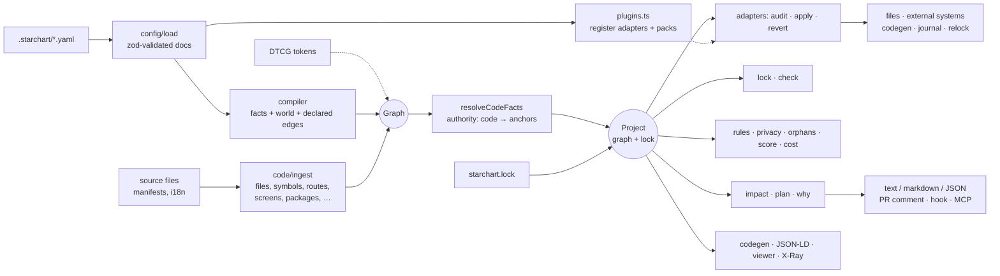
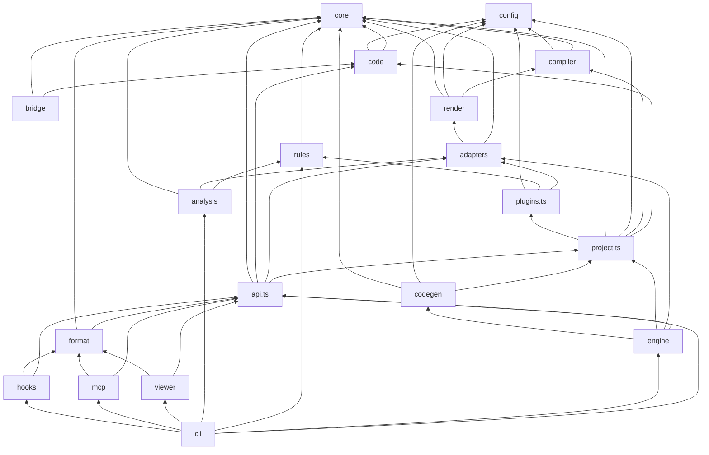

How STARCHART is built: the package layout, how data flows from YAML and source files to plans and outputs, the design decisions behind it, which modules may depend on which, what we know about performance, and how it's tested. Read this before [Contributing](Contributing).

## Repository layout

| Path | What lives there |
|---|---|
| `packages/starchart/` | The library, the CLI (`starchart` / `sc`) and the MCP server binary (`starchart-mcp`). Package name `@spz/starchart` (not on npm yet). |
| `packages/xray/` | Reality X-Ray, a Manifest V3 browser extension (plain JS, no build step). |
| `action/` | The GitHub Action (`action.yml`, a composite action). |
| `examples/pro-universe/` | The demo universe: SwiftUI app + Next.js site + Stripe + App Store, with a full chart. |
| `.github/workflows/` | `ci.yml` (typecheck, test, build, demo `check`) and `wiki.yml` (publishes `docs/wiki/` to the GitHub wiki). See [Contributing](Contributing). |

### `packages/starchart/src`

| Directory / file | Responsibility |
|---|---|
| `core/` | The graph model (`model.ts`: node kinds, layers, edge types, propagation), the `Graph` class, impact traversal and classification (`impact.ts`), rollout ordering (`order.ts`), the lockfile and drift (`lock.ts`: `buildLock`, `relockArtifacts`, `staleArtifacts`, `changedSince`). No I/O. |
| `config/` | Zod schemas for config, entities, artifacts and edges (`schema.ts`); finding the root and loading every YAML document under `.starchart/` (`load.ts`). |
| `compiler/` | YAML documents → fact and world layers plus declared edges; flattening nested facts; resolving code-authority facts once code is ingested. |
| `code/` | The code layer. File discovery and classification, a TypeScript-compiler-API parser for TS/JS, a shared lexer plus parsers for Swift, Kotlin and Go, Next.js routes, packages from manifests and lockfiles, i18n files, env/flag/event signals, `@starchart` annotations, and `git diff` → changed nodes. |
| `bridge/` | The literal scanner behind `scan` and discovery, and heuristic edge discovery. |
| `adapters/` | `fs`, `url`, `stripe`, `appstore`, the registry (`registerAdapter`, and the `canWrite(id, settings, node?)` policy that also asks the adapter's `canApply`), and shared text find-and-replace helpers. |
| `engine/` | `audit` with break detection, `apply` / `revert` / `ack` with journals (apply also runs the codegen pass for generated constants), the Future Universe `preview`, adapter context. |
| `rules/` | The invariant engine, the built-in packs (`core`, `appstore`, `privacy`, `seo`) and `registerPack` for plugin packs, the SDK privacy catalog, and a plist parser for `PrivacyInfo.xcprivacy`. |
| `analysis/` | Orphans, Reality Score (and badge), change cost. |
| `render/` | The `{{ fact \| filter }}` template engine, OG image rendering (SVG → PNG via resvg), JSON-LD. |
| `codegen/` | Facts → TypeScript, Swift and Kotlin constants. |
| `viewer/` | The self-contained HTML star chart, the local server (`serve`), the X-Ray payload. |
| `format/` | Plan and stale-report formatting: text, markdown, JSON. |
| `mcp/`, `hooks/` | The MCP server and the Claude Code `PostToolUse` hook. |
| `cli/` | Commander wiring (`main.ts`), `init` and discovery (`init.ts`), the bin entry. |
| `project.ts` | `buildProject()`: load → plugins → compile → tokens → ingest → resolve code facts → read lock. |
| `plugins.ts` | `loadPlugins(root, specifiers)`: imports each module in config `plugins:` once per process and registers its `adapters` and `packs`. Called from `buildProject`, so the CLI, MCP server, `serve` and the hook all see plugins. |
| `api.ts` | High-level operations shared by CLI, MCP, hook and Action: `planFromLock`, `planFromDiff`, `planFromSeeds`, `check`, `resolveRef`, `why`, `query`. |
| `tokens.ts`, `history.ts` | DTCG design-token import; the fact time machine over git history. |
| `index.ts` | The public library surface. See [Library API](Library-API). |

## Data flow

Every command starts with `buildProject()`, which rebuilds the whole graph in memory from the repo. There's no daemon and no persistent cache: the repo is the input, the graph is a pure function of it. Plugins listed in config are imported once per process before compiling, so their adapters and packs are registered before anything asks for them. Three commands skip code ingestion because they don't need it: `journals`, `history` and `adapters`. (`emit jsonld` always ingests code, so code-authority facts have values.)

### Plans, the lock and relocking

`starchart.lock` pins, per artifact, the value of every fact and the hash of every code node it depends on. `dependencies()` walks at most `maxCodeDepth` code hops (config `code.maxCodeDepth`, default 4). When the config sets it, the lock records it as `maxCodeDepth`, so staleness is computed with the same depth the dependencies were pinned with.

- **`buildLock(graph, previous, artifactIds?, { maxCodeDepth })`** pins the given artifacts (all of them when omitted). Full `starchart lock` uses it and resets everything.
- **`relockArtifacts(graph, previous, ids, opts)`** pins `ids` but keeps the previous value of every fact that a still-stale artifact depends on. `apply`, `ack` and partial `starchart lock <ids>` use it, so shipping one artifact doesn't make the others forget what changed.
- **`planFromLock`** (`api.ts`) seeds the impact walk from `changedSince(lock)` plus the changed dependencies of every stale artifact, then drops locked artifacts that are already in sync. That's why `plan` and `check` always agree: after an apply, `plan` keeps listing the remaining manual, review, code and retire items until they're acked or fixed.

### Inside `apply`

`apply` runs only `auto` steps, in rollout order. Each artifact goes to its adapter's `apply()`, which returns an undo record for the journal. Generated fact constants (`// @starchart generated` symbols) aren't applied one by one: the first one triggers a single codegen pass over every `codegen:` target, reported as `[codegen]` steps. Codegen output isn't journaled (it's reproducible from the facts; git undoes it), and with no targets configured those steps fail with "generated constants found but no codegen targets are configured". Finally the journal is written and the applied artifacts are relocked with `relockArtifacts`. See [Apply, Revert and Journals](Apply-Revert-and-Journals).

## Key design decisions

**Git is the database.** The chart is YAML in `.starchart/`, the state is `starchart.lock`, the undo log is `.starchart/journal/*.json`. All reviewed in PRs, all versioned. The time machine (`history`) is just `git log` over the lock. Nothing is written to the outside world without `apply`.

**Extract code, author the world.** Code nodes are always derived from source and never hand-maintained. You only declare facts, world artifacts and the occasional bridge. If a code id is wrong, you fix the code or the scope, not the YAML.

**Plan / apply split.** `plan` and `impact` never write. `apply` runs only `auto` steps, journals an undo record per adapter write, and relocks only what it applied. Everything else becomes a checklist. External adapters are read-only until `adapters.<id>.write: true`; `fs` writes by default because it only touches your repo. Write access is also per binding: an adapter can implement `canApply(node)` to refuse artifacts it can't write (App Store screenshots and IAPs), and those stay `manual` even with `write: true`.

**Fact authority.** Each fact records where truth lives: `graph` (the YAML, default), `code` (read from a symbol), or an external system name like `appstore`. Authority settles who wins and keeps sync from looping. A code-authority fact changes when the code changes, and the plan treats that like any YAML edit.

**Stable ids.** `kind:scope/name`, e.g. `symbol:ios/Entitlements.proFeatures`, `route:web/pricing`, `addon:pro.price.usd`. Ids are derived deterministically from paths and qualified names, so they're identical across machines and platforms. Renaming a scope or moving a file changes ids; there's no moniker-based identity yet (SCIP isn't integrated). See [Node IDs](Node-IDs).

**Precision over recall.** Impact is edge-typed and direction-aware (each edge type declares how change propagates), bridges are required to cross layers, confidence decays across coarse code edges and items under 0.3 are dropped, code hops are capped at 4 by default, and only surface code (screens, routes, tests, anchoring symbols) is reported unless you ask. Every line carries its "why" path. One false alarm a week and people uninstall.

**Zero infra.** One npm package, no server, no database, no account, no LLM. The viewer is a single HTML file. `serve` is optional and binds to localhost.

**JSON-LD is an export, not a runtime.** Internally it's a plain in-memory graph. schema.org vocabulary plus an `sc:` namespace show up only at the boundary (`emit jsonld`).

## Module dependency rules

Derived from the actual imports in `src/` (simplified: a few secondary edges, like `viewer` → `adapters`, are left out):

The rules to keep:

- **`core/` and `config/` import nothing else from `src/`.** `core/` does no I/O at all.
- **`code/` knows nothing about facts or the world.** It depends only on `core/` and `config/`.
- **Adapters don't import the engine.** They receive an `AdapterContext` (root, graph, settings, env, fetch, previous fact values, dryRun) and return diffs or an `ApplyResult` with an undo record. The interface is `id`, `capabilities`, `audit()`, and optional `apply()`, `revert()`, `canApply(node)` and `list()`. See [Writing an Adapter](Writing-an-Adapter).
- **Plugins go through the registries.** `plugins.ts` only calls `registerAdapter` and `registerPack`; built-in packs can't be replaced.
- **Only `cli/` sees everything.** Integrations (MCP, hook, Action) go through `api.ts` so they all compute the same plan.
- **Everything the outside needs is re-exported from `index.ts`.**

## Performance

What we can state from measurements:

- **Ingest.** A synthetic tree of 2,000 source files (1,200 TS, 800 Swift) ingests into 16,418 nodes and 30,800 edges. On an Apple M3 Max running Node 22 under heavy unrelated load (load average around 50), three runs took 3.1–4.1 s. That's a pessimistic ceiling, not a benchmark; an idle machine is faster. A controlled benchmark isn't published yet.
- **Concurrency.** File reads during ingest run 32 at a time; `audit` checks 4 artifacts at a time.
- **Limits.** Code files over 2 MB and text files over 1 MB are skipped.
- **No incremental cache.** Every command re-ingests. The design target in [PLAN.md](https://github.com/space-pirate-zero/starchart/blob/main/PLAN.md) is under 1 s for `impact` on a warm cache and under 5 s on a PR in CI; content-hash caching is how we intend to get there.

## Testing strategy

- **Vitest**, configured in `packages/starchart/vitest.config.ts` to run `src/**/*.test.ts` and `test/**/*.test.ts` with a 20 s timeout. Tests are colocated with the code they cover: 30 test files under `src/` plus 2 under `test/`.
- **Fixtures.** `src/code/__fixtures__/universe/` is a multi-language mini-repo (Next.js, SwiftUI, Compose/Gradle, Go, `.xcstrings`, `strings.xml`, `Package.resolved`, `libs.versions.toml`) used by the ingest, parser and diff tests. `src/rules/fixtures/` holds a privacy-manifest app and a rules file.
- **End-to-end.** `test/e2e.test.ts` copies `examples/pro-universe` to a temp dir and runs the real CLI in-process (`run([... "-C", dir, "-q", ...])`), capturing stdout. It covers: in sync as committed; a price change planned across code, facts and world (asserting the class of each item); apply → check → revert from the journal (file contents and the PNG header); privacy drift and the unbound EUR price; `why` from a Swift file to a screenshot; JSON-LD and the Reality Score; and `init --discover` on a stripped copy. `test/regressions.test.ts` pins fixes that came out of documenting the tool (plan/check agreement after apply, per-binding writes, codegen in apply, plugins, CLI polish).
- **Adapters without the network.** Stripe, App Store and url tests inject `fetch` through the adapter context, so the suite never touches external APIs.
- **CI** (`.github/workflows/ci.yml`) runs on Ubuntu and macOS with Node 22: `pnpm install --frozen-lockfile`, `pnpm typecheck`, `pnpm test`, `pnpm build`, then `starchart -C examples/pro-universe check` to prove the committed demo is in sync.
- PLAN.md reports 278 tests at v0.1.0.

## See also

- [Three-Layer Model](Three-Layer-Model)
- [Impact Analysis](Impact-Analysis)
- [Library API](Library-API)
- [Contributing](Contributing)
- [Roadmap](Roadmap)
