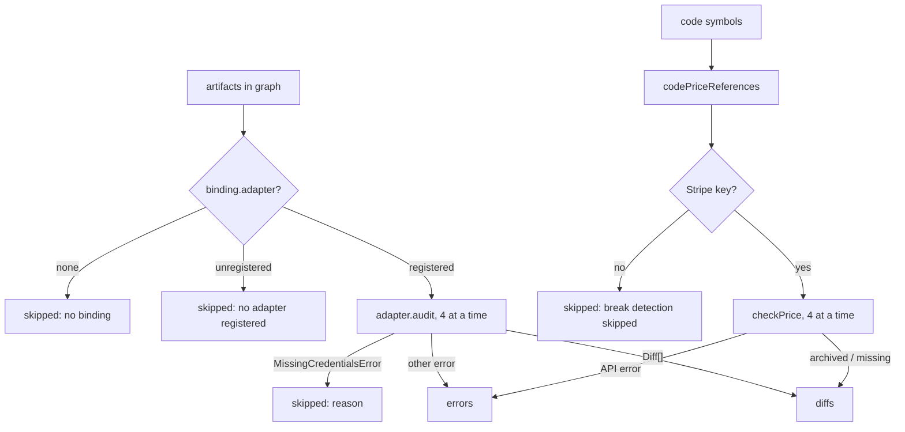

`starchart check` compares the graph with the lockfile. `starchart audit` compares the graph with **reality**: it asks every bound artifact's adapter whether the live file, page or API still matches the facts, and it checks that Stripe price ids your code holds still exist and are active. This page covers how `auditProject` works, concurrency, skips versus errors, break detection for code, exit codes, real output from the demo (including the honest "no credentials" version), and scheduling audits as reality tests.

Source: [`engine/audit.ts`](https://github.com/space-pirate-zero/starchart/blob/main/packages/starchart/src/engine/audit.ts).

## check vs audit

| | `starchart check` | `starchart audit` |
|---|---|---|
| Compares | graph ↔ `starchart.lock` | graph ↔ live files, pages, APIs |
| Network | none | yes (url, stripe, appstore) |
| Credentials | none | optional; missing ones skip |
| Question answered | "Did a fact or code change since we last synced?" | "Does the world actually show what the chart says?" |
| Typical use | PR gate | nightly job, pre-release, after deploy |

## Usage

`@space-pirate-zero/starchart` is not on npm yet. Examples assume `starchart` is an alias for the built CLI (`alias starchart="node /path/to/starchart/packages/starchart/dist/cli/bin.js"`, see [Getting Started](Getting-Started)); once published it will be `npx @space-pirate-zero/starchart audit`.

```bash
starchart audit                                   # everything
starchart audit --ids web:live-pricing            # only these artifacts or code symbols
starchart audit -f markdown                       # report for a PR comment or issue
starchart audit -f json                           # machine-readable report
```

| Option | Default | Meaning |
|---|---|---|
| `--ids <ids...>` | all | Limit to these artifact ids and/or code symbol ids (break detection is filtered by symbol id) |
| `-f, --format <format>` | `text` | `text`, `markdown` or `json` |

## How auditProject works



1. **Collect.** Every node with `kind: artifact` (optionally filtered by `--ids`). No binding → skipped (`no binding`). Unknown adapter → skipped (`no adapter "youtube" is registered`).
2. **Audit.** Runnable artifacts are sorted by id and audited through a pool with **at most 4 in flight** (`CONCURRENCY = 4`). Each call gets its own `AdapterContext` with the lock's fact values as `previousValues`.
3. **Classify the outcome.**
   - Returned diffs → `diffs`, and the artifact is `checked`.
   - `MissingCredentialsError` → `skipped` with the adapter's message. No key isn't a failure.
   - Any other throw → `errors` with the message. That includes a url artifact whose site is unreachable or answers 5xx (a 404/410 is a `break` diff instead; see [Adapter url](Adapter-url)).
4. **Break detection** for code (below).
5. Sort diffs by artifact then fact, and sort `checked` and `skipped`.

```ts
export interface AuditReport {
  diffs: Diff[];
  errors: { artifact: string; adapter: string; error: string }[];
  /** Artifacts (and code symbols) that were actually checked. */
  checked: string[];
  skipped: { artifact: string; reason: string }[];
}
```

Diff kinds (`stale`, `missing`, `mismatch`, `break`) are defined on [Adapters Overview](Adapters-Overview#diff-kinds).

### Skipped vs errors

| Bucket | Means | Affects exit code |
|---|---|---|
| `skipped` | Couldn't check, by design: no binding, no adapter, no credentials | no |
| `errors` | Tried and failed: bad config, invalid JSON, network down, API 401/500, a thrown bug | **yes** (exit 1) |
| `diffs` | Checked and found drift | **yes** (exit 1) |

An artifact the adapter deliberately ignores (App Store screenshot or IAP bindings, or any App Store binding without `field`) returns `[]` and counts as **checked**, not skipped. In the demo, `appstore:iap/pro-monthly` and `appstore:screenshots/6.9/03` sit in `checked` although nothing was compared. That is a known limitation: for those two, "checked" only means the adapter ran.

A skip means "not verified". If a CI audit should prove Stripe is in sync, make sure the key is there, or the Stripe artifacts will be quietly skipped. The summary line shows the skip count. Watch it.

## Break detection for code

The worst drift isn't a stale number on a page. It's checkout code pointing at a Stripe price that was archived last Tuesday. Audit hunts for that specifically.

`codePriceReferences(graph)` builds a map of Stripe price id → code symbols:

1. **Literal price ids.** Any code-layer node whose value matches `^price_[A-Za-z0-9]+$`, such as `export const PRICE_PRO_MONTHLY = "price_1NebulaPro499"`.
2. **Symbols that anchor a Stripe artifact.** A code symbol with an outgoing `anchors` edge straight to an artifact bound to `stripe` with a `binding.price` is the code's handle on that price, so the price is added. In the demo that is `PRICE_PRO_MONTHLY`, via `// @starchart anchors stripe:price/pro-monthly`.

Then, if a Stripe key is configured, each distinct price is fetched once (4 at a time) with `checkPrice`. For every referencing symbol:

- Price exists and is active → symbol is `checked`, no diff.
- Price archived → `break`: `Stripe price price_x is ARCHIVED; referenced by <call sites>`
- Price 404 → `break`: `Stripe price price_x does not exist; referenced by …`
- Other API error → `errors`

"Referenced by" lists the locations of nodes with a `references` edge into the symbol. `where` is the symbol's own `file:line`.

Anchoring a *fact* is not enough. A symbol that anchors something a Stripe artifact mirrors, such as `PRO_NAME = "Nebula Pro"` anchoring `addon:pro.name`, is not a price reference and is not flagged when the price dies.

The same anchor shows up in impact analysis. When a fact the Stripe artifact mirrors changes, the anchoring symbol is classified `code` with the reason `holds this artifact's external id; update it if the id changes`: a replacement price gets a new id, and that constant has to follow. See [Impact Analysis](Impact-Analysis).

With no key, every referencing symbol is skipped with `break detection skipped: Stripe secret key not found: …`.

## Output: the demo, no credentials

Straight from a fresh copy of `examples/pro-universe`, with no Stripe or App Store variables set and no network route to the placeholder domain:

```text
$ starchart audit
? missing web:og-pro apps/web/public/og/pro.png  rendered output not found: apps/web/public/og/pro.png
error web:live-pricing [url] https://nebula.example.com/pricing: request failed: fetch failed
skip  appstore:listing/description: App Store Connect credentials missing: ASC_KEY_ID, ASC_ISSUER_ID, ASC_PRIVATE_KEY_PATH or ASC_PRIVATE_KEY
skip  privacy:appstore-label: no binding
skip  reel:spring-2026: no adapter "youtube" is registered
skip  stripe:price/pro-monthly: Stripe secret key not found: set the STRIPE_SECRET_KEY environment variable
skip  symbol:web/lib/stripe#PRICE_PRO_MONTHLY: break detection skipped: Stripe secret key not found: set the STRIPE_SECRET_KEY environment variable
7 checked · 1 diff(s) · 1 error(s) · 5 skipped
$ echo $?
1
```

That's what you'll see too (with `ASC_KEY_ID` and `ASC_ISSUER_ID` exported, the App Store skip lists only the private key). One real finding: the OG image has never been rendered (run `starchart apply`). One error: the placeholder site doesn't resolve. That's an error, not a `break`, because an unreachable network says nothing about the page. Five honest skips. Only one symbol is up for break detection: `PRICE_PRO_MONTHLY`.

The same run as `-f markdown`:

```text
**STARCHART audit:** 7 checked · 1 diff(s) · 1 error(s) · 5 skipped

| Kind | Artifact | Where | Finding |
|---|---|---|---|
| missing | `web:og-pro` | apps/web/public/og/pro.png | rendered output not found: apps/web/public/og/pro.png |

| Artifact | Adapter | Error |
|---|---|---|
| `web:live-pricing` | url | https://nebula.example.com/pricing: request failed: fetch failed |
```

Skips are counted in the summary line but not listed in the markdown report.

## Output: after a price change

Change `addon:pro.price.usd` from `4.99` to `5.99` in `.starchart/entities/pro.yaml` and audit again. The fs artifacts now report stale text with file and line (skip lines trimmed):

```text
! stale  email:onboarding-day-3 marketing/emails/onboarding-day-3.md:3  still shows old value 4.99; expected 5.99
! stale  web:messages-en apps/web/messages/en.json:4  still shows old value 4.99; expected 5.99
? missing web:og-pro apps/web/public/og/pro.png  rendered output not found: apps/web/public/og/pro.png
! stale  web:pricing-page apps/web/app/pricing/page.tsx:8  still shows old value 4.99; expected 5.99
error web:live-pricing [url] https://nebula.example.com/pricing: request failed: fetch failed
…
7 checked · 4 diff(s) · 1 error(s) · 5 skipped
```

JSON for two of the diffs (trimmed):

```json
{
  "diffs": [
    {
      "artifact": "email:onboarding-day-3",
      "fact": "addon:pro.price.usd",
      "kind": "stale",
      "expected": 5.99,
      "actual": 4.99,
      "message": "still shows old value 4.99; expected 5.99",
      "where": "marketing/emails/onboarding-day-3.md:3"
    },
    {
      "artifact": "web:og-pro",
      "kind": "missing",
      "message": "rendered output not found: apps/web/public/og/pro.png",
      "where": "apps/web/public/og/pro.png"
    }
  ],
  …
}
```

## Output: an archived price (simulated Stripe)

We can't ship you a live Stripe account, so this run calls `auditProject` from the library on a demo copy, passing a fake `fetch` that answers every price request with `active: false` (and fails everything else) plus `env: { STRIPE_SECRET_KEY: "sk_test_dummy" }`. The adapter code and break detection are the real ones:

```text
break stripe:price/pro-monthly stripe:price/price_1NebulaPro499   price price_1NebulaPro499 is archived
break symbol:web/lib/stripe#PRICE_PRO_MONTHLY apps/web/lib/stripe.ts:4   Stripe price price_1NebulaPro499 is ARCHIVED; referenced by apps/web/app/api/checkout/route.ts:3
missing web:og-pro apps/web/public/og/pro.png   rendered output not found: apps/web/public/og/pro.png
error web:live-pricing [url] https://nebula.example.com/pricing: request failed: fetch failed
9 checked · 3 diff(s) · 1 error(s) · 3 skipped
```

The second line is the one that matters: checkout imports a dead price. `PRO_NAME` and the iOS `proUSD` constant hold a name and an amount, not the price id, so they stay out of it. The CLI prints the same diffs with its `✗ break` prefix.

## Exit codes

| Code | When |
|---|---|
| `0` | No diffs and no errors (skips allowed) |
| `1` | At least one diff or one error |
| `2` | The command itself failed: no `.starchart/` found, invalid config, bad arguments (`starchart: no .starchart/ found in /private/tmp or any parent. Run "starchart init".`) |

## Scheduling audits as reality tests

Unit tests prove your code does what you think. Audits prove the world does. Run them on a schedule, the way you'd run a smoke test.

A nightly GitHub Actions workflow. Until `@space-pirate-zero/starchart` is on npm, build STARCHART from source in the job (the [GitHub Action](GitHub-Action) handles PR impact comments; audits run the CLI directly):

```yaml
# .github/workflows/reality.yml
name: reality
on:
  schedule: [{ cron: "17 6 * * *" }]   # daily, 06:17 UTC
  workflow_dispatch:
jobs:
  audit:
    runs-on: ubuntu-latest
    steps:
      - uses: actions/checkout@v4
      - uses: actions/setup-node@v4
        with: { node-version: 22 }
      - uses: pnpm/action-setup@v4
        with: { version: 10 }        # STARCHART pins pnpm 10 in its packageManager field
      - name: Build STARCHART from source
        run: |
          git clone --depth 1 https://github.com/space-pirate-zero/starchart.git "$RUNNER_TEMP/starchart"
          cd "$RUNNER_TEMP/starchart" && pnpm install && pnpm build
      - name: Audit                     # exits 1 on any diff or error, failing the job
        run: node "$RUNNER_TEMP/starchart/packages/starchart/dist/cli/bin.js" audit
        env:
          STRIPE_SECRET_KEY: ${{ secrets.STRIPE_READONLY_KEY }}   # restricted, read-only
          ASC_KEY_ID: ${{ secrets.ASC_KEY_ID }}
          ASC_ISSUER_ID: ${{ secrets.ASC_ISSUER_ID }}
          ASC_PRIVATE_KEY: ${{ secrets.ASC_PRIVATE_KEY }}
```

Once the package is published, the two middle steps collapse to `npx @space-pirate-zero/starchart audit`.

Notes:

- Audit never writes, whatever the `write` settings say. A read-only restricted Stripe key is all it needs.
- Pass secrets as env vars. Config values are not `${ENV}`-interpolated.
- Remember that skips don't fail the job. If you depend on Stripe being verified, check `skipped` in the JSON.
- A flaky network fails the job too (url fetch failures are errors). That is on purpose: an audit that couldn't look proves nothing.
- `audit -f markdown` gives a report you can post to an issue or job summary.
- A plain cron works the same: `17 6 * * * cd /srv/app && starchart audit || notify-team`.
- `starchart score --audit` folds live audit results into the [Reality Score](Reality-Score).
- After a deploy, `starchart audit --ids web:live-pricing` confirms the page caught up, then `starchart ack web:live-pricing` re-pins it.

## See also

- [Adapters Overview](Adapters-Overview)
- [Adapter Stripe](Adapter-Stripe)
- [Lockfile and Drift](Lockfile-and-Drift)
- [Reality Score](Reality-Score)
- [GitHub Action](GitHub-Action)
