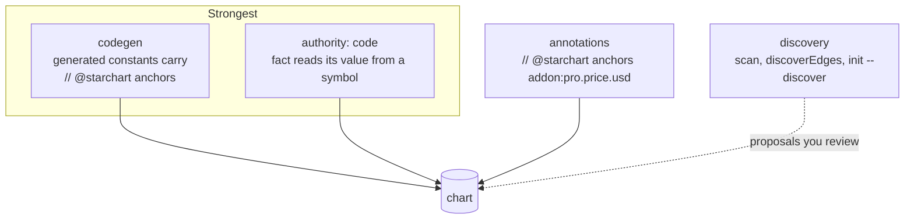

Bridges are the edges that cross from the code layer into the fact layer: a Swift constant that holds a price, a route that publishes a page, a screen that a screenshot captures. Without them, code changes never reach the world and world changes never reach code. This page covers the four ways a bridge gets into the chart (codegen, annotations, `authority: code`, and auto-discovery), then the machinery behind discovery: the literal scanner (`starchart scan`), the edge heuristics (`discoverEdges` / `applyDiscovered`), and `starchart init --discover`, with real output from the demo.

Source: [`bridge/`](https://github.com/space-pirate-zero/starchart/blob/main/packages/starchart/src/bridge/) and [`cli/init.ts`](https://github.com/space-pirate-zero/starchart/blob/main/packages/starchart/src/cli/init.ts).

## Bridge edge types

| Edge | Direction | Propagation | Typical source |
|---|---|---|---|
| `anchors` | code symbol / i18n key → fact | both ways | annotation, codegen, `authority: code`, discovery |
| `displays` | code → fact | a fact change impacts the code | annotation or YAML |
| `captures` | artifact → screen | a screen change impacts the artifact | YAML (`captures: screen:ios/Paywall`) |
| `publishes` | route → artifact | a route change impacts the artifact | YAML (`publishedBy: route:web/pricing`) |
| `emits` | code → event | a code change impacts the event | extracted from `track("…")` calls |

See [Edge Types](Edge-Types) for every edge and its propagation rule.

## Four ways to bridge



| Way | Who writes it | Edge origin | Confidence | What it buys you |
|---|---|---|---|---|
| [Codegen](Codegen) | `starchart codegen` | `annotation` | 1 | Constants generated from facts. Changes classify `auto`; no drift possible |
| [`authority: code`](Code-Authority-Facts) | you, in YAML | `declared` | 1 | The code is the source of truth; the fact copies the symbol's literal value |
| [Annotations](Annotations) | you, in a comment | `annotation` | 1 | Mark an existing hardcoded value; changes classify `code` ("update or switch to codegen") |
| Discovery | STARCHART proposes, you accept | `discovered` | 0.4–0.9 | Finds the bridges you forgot |

### authority: code, in one example

```yaml
# .starchart/entities/pro.yaml
facts:
  features: { authority: code, source: { symbol: ios/Entitlements.proFeatures } }
```

After code ingestion, `resolveCodeFacts()` copies `symbol:ios/Entitlements.proFeatures`'s literal value into `addon:pro.features`, adds `symbol --anchors--> fact` (origin `declared`), and recomputes container facts. An unknown symbol yields the warning `fact addon:pro.features: code symbol symbol:ios/Entitlements.proFeatures not found`. With `skipCode`, such facts have no value.

## The literal scanner (`starchart scan`)

`scanLiterals(root, graph, opts)` finds every place a fact's value appears as text, and tells you whether the chart already accounts for it.

```ts
export interface ScanOptions {
  roots?: string[];     // root-relative dirs (default: every code scope dir, else ".")
  exclude?: string[];   // extra globs, relative to each root
}
export async function scanLiterals(root: string, graph: Graph, opts?: ScanOptions): Promise<LiteralOccurrence[]>
```

### Which facts are searched

Only **leaf facts** with a value (no other fact is `partOf` them). Then `searchText(fact)` decides the needle:

| Value | Searched? |
|---|---|
| fact id ends in `.status` | never |
| string shorter than 3 chars, with leading/trailing whitespace, or containing a newline | no |
| string in the generic list: `active inactive enabled disabled draft live test prod production staging archived retired deprecated pending default none null true false yes off free paid basic standard plus monthly yearly annual annually weekly daily month year week day usd eur gbp name title description price value type status new all app web ios android` (case-insensitive) | no |
| any other string | yes, verbatim |
| integer with fewer than 4 digits (`12`, `-500`) | no: too common |
| integer with 4+ digits (`1999`, `2026`) | yes |
| any finite decimal (`4.99`) | yes |
| booleans, arrays, objects | no |

That is why `addon:pro.billing = "monthly"` is never reported.

### Token-boundary rules

All needles compile into one regex (longest first), and a hit only counts as a whole token:

- If the needle starts with a letter/digit/underscore, the character before must not be one (`Nebula` does not match inside `SuperNebula`).
- Same for the end (`Nebula` does not match inside `Nebulas`). Unicode letters count.
- Numbers: `4.99` does not match inside `14.99`, `1.4.99`, `4.995` or `4.99.1`.
- Longest wins at one position: text `Nebula Pro` is reported for `addon:pro.name`, not also for `app:nebula.name`.

### Which files

| Setting | Value |
|---|---|
| Roots | `opts.roots`, else `config.content` (CLI), else each code scope directory, else `.` |
| Extensions | `ts tsx js jsx mdx md html json yaml yml swift kt strings xml xcstrings txt css` |
| Excluded dirs | `.starchart`, `node_modules`, `dist`, `.git`, `build`, `.next`, `DerivedData`, `Pods` (any depth); dotfiles |
| Excluded lockfiles | `package-lock.json`, `pnpm-lock.yaml`, `yarn.lock`, `npm-shrinkwrap.json`, `bun.lock`, `Package.resolved`, `Gemfile.lock`, `Cargo.lock`, `composer.lock`, `Podfile.lock`, `gradle.lockfile`, `starchart.lock` |
| Size | files over 2,000,000 bytes and files with a NUL byte are skipped |
| Import lines | a line that starts with `import`, `@testable import`, `package`, `using`, `from X import`, or `export … from "…"` is skipped. `import Nebula` names a module, not your product |

Go files are not scanned (`.go` is not in the list). Neither is Kotlin script or Gradle.

### When an occurrence is `bound`

An occurrence of fact **F** in file **P** is bound when any of these hold, where "related" means F itself or any fact above or below it along `partOf` (so `addon:pro.price` covers `addon:pro.price.usd`, but `addon:pro.price.usd` does **not** cover its sibling `…eur`):

1. P is a generated file (`@starchart generated` in the first five lines, or a file/symbol node with `meta.generated`).
2. A node located in P has an `anchors` edge to a related fact.
3. An artifact bound to P (`binding: { adapter: fs, path: P }`, or `meta.template: P`) `embeds`, `renders` or `mirrors` a related fact.

### Real output

```text
$ starchart scan
unbound apps/ios/Resources/Localizable.xcstrings:6  Nebula Pro (addon:pro.name)  "en" : { "stringUnit" : { "state" : "translated", "value" : "Unlock Nebula Pro" } },
unbound apps/ios/Resources/Localizable.xcstrings:7  Nebula Pro (addon:pro.name)  "ja" : { "stringUnit" : { "state" : "translated", "value" : "Nebula Pro を解放" } }
unbound apps/ios/Sources/Core/Pricing.swift:5  4.99 (addon:pro.price.eur)  static let proUSD = 4.99
unbound apps/web/app/page.tsx:4  Nebula (app:nebula.name)  <h1>Nebula</h1>
unbound apps/web/app/page.tsx:5  Nebula Pro (addon:pro.name)  <p>Plan your orbit. Upgrade to Nebula Pro for themes and sync across every device.</p>
unbound apps/web/app/pricing/page.tsx:8  4.99 (addon:pro.price.eur)  <p className="price">$4.99 / month</p>
unbound apps/web/lib/pricing.ts:3  4.99 (addon:pro.price.eur)  export const PRO_PRICE_USD = 4.99;
unbound apps/web/lib/pricing.ts:3  4.99 (addon:pro.price.usd)  export const PRO_PRICE_USD = 4.99;
unbound apps/web/messages/en.json:4  4.99 (addon:pro.price.eur)  "cta": "Get Nebula Pro for $4.99/month"
$ echo $?
1
```

A few things to notice:

- Two facts share the value `4.99` (USD and EUR), so every `4.99` is reported once per fact. `Pricing.swift:5` is bound for USD (it is annotated) but not for EUR.
- `PRO_PRICE_USD` in `lib/pricing.ts` has no annotation. That is a real gap: a price change would miss it.
- `marketing/` is not scanned, because the demo has no `content:` setting and `marketing/` is not a code scope. Add `content: [apps, marketing]` to the config to include it.

`--all` also lists bound occurrences (and then always exits 0):

```text
$ starchart scan --all
…
bound   apps/ios/Sources/Core/ProductID.swift:5  nebula_pro_monthly (addon:pro.productId)  static let proMonthly = "nebula_pro_monthly"
bound   apps/ios/Sources/Core/StarchartFacts.swift:12  Nebula Pro (addon:pro.name)  public static let name: String = "Nebula Pro"
…
bound   apps/web/messages/en.json:3  Nebula Pro (addon:pro.name)  "title": "Go further with Nebula Pro",
…
```

`-f json` prints `LiteralOccurrence[]`: `{ factId, value, file, line, column, text, bound }` (`text` is the trimmed line, cut at 160 chars). `scan` exits 1 when it prints any unbound occurrence.

## Edge discovery (`discoverEdges`)

`discoverEdges(graph, occurrences?)` proposes bridges the chart does not have yet. It returns `DiscoveredEdge[]` (a `GraphEdge` plus a human `reason`), sorted by confidence. Edges that already exist are skipped, and duplicates keep the highest confidence.

```ts
export type DiscoveredEdge = GraphEdge & { reason: string };
export function discoverEdges(graph: Graph, occurrences?: LiteralOccurrence[]): DiscoveredEdge[]
export function applyDiscovered(graph: Graph, edges: DiscoveredEdge[], minConfidence = 0.8): GraphEdge[]
```

### Heuristic 1: symbol literal equals a fact value → `anchors`

Only **distinctive** fact values take part: strings of 4+ chars (trimmed) not in the generic list; **non-integer** numbers; arrays of 2+ strings. Integers never match here.

A symbol "resembles" a fact when its qualified name and the fact key share a meaningful word: both are split on camelCase, snake_case, kebab-case and dots; words shorter than 3 chars and `the and for get set value values key keys data info item items list static const default` are dropped.

| Facts with that value | Name resembles? | Confidence |
|---|---|---|
| exactly one | yes | **0.9** |
| exactly one | no | 0.6 |
| several, and exactly one resembles | the one that does | **0.9** |
| several, and exactly one resembles | the others | 0.4 |
| several, and several (or none) resemble | yes | 0.75 |
| several, and several (or none) resemble | no | 0.4 |

### Heuristic 2: unbound literal inside an fs-bound file → artifact `embeds` fact

For each **unbound** occurrence from `scanLiterals`, every artifact whose fs binding path is that file gets `embeds` → the fact, confidence **0.7**.

### Heuristic 3: localized copy containing a fact value → i18n `anchors` fact

Every `i18n:` node's per-locale strings are matched with the same needles and token rules as the scanner. Each hit proposes `i18n --anchors--> fact`, confidence **0.6**.

### Real output

From the library (there is no CLI command that prints these yet):

```ts
import { buildProject, scanLiterals, discoverEdges } from "@space-pirate-zero/starchart";
const project = await buildProject("./pro-universe");
const edges = discoverEdges(project.graph, await scanLiterals(project.root, project.graph));
```

```text
0.9  anchors symbol:web/lib/pricing#PRO_FEATURES -> addon:pro.features | PRO_FEATURES = ["Themes","iCloud sync"] equals addon:pro.features and the names match
0.75 anchors symbol:ios/Pricing.proUSD -> addon:pro.price.eur | proUSD = 4.99 equals addon:pro.price.eur and the names match (2 facts share this value)
0.75 anchors symbol:web/lib/pricing#PRO_PRICE_USD -> addon:pro.price.usd | PRO_PRICE_USD = 4.99 equals addon:pro.price.usd and the names match (2 facts share this value)
…
0.7  embeds web:landing-hero -> addon:pro.name | "Nebula Pro" appears unbound at apps/web/app/page.tsx:5
0.7  embeds web:pricing-page -> addon:pro.price.eur | "4.99" appears unbound at apps/web/app/pricing/page.tsx:8
0.6  anchors i18n:ios/paywall.title -> addon:pro.name | en copy for paywall.title contains "Nebula Pro"
0.6  anchors i18n:web/pricing.cta -> addon:pro.price.usd | en copy for pricing.cta contains "4.99"
```

The first line is a genuine find: `PRO_FEATURES` in the web code duplicates a fact that iOS owns. The 0.75 lines show the weakness of the name test: the word `pro` is in the entity id, so almost every `pro…` symbol "resembles" almost every `addon:pro.*` fact. Treat anything below 0.9 as a lead, not a fact.

### Applying proposals

`applyDiscovered(graph, edges, minConfidence = 0.8)` adds every proposal at or above the threshold that is not already present, moves `reason` into `edge.meta.reason`, keeps `origin: "discovered"`, and returns what it added. It mutates the in-memory graph only. To make a bridge permanent, write it down: an annotation in code, or an `edges:` entry in YAML.

## `starchart init --discover`

`init --discover` builds the chart from code, proposes facts, artifacts and bridges, and writes them to `.starchart/proposals/discovered.yaml`. On a fresh repo it also scaffolds `config.yaml`; on an existing chart it keeps your config (no `--force` needed) and only rewrites `proposals/discovered.yaml`.

### Fact heuristics (`discoverChart`)

Every non-generated symbol with a literal value, in id order. The name tested is the symbol's short label (`proUSD`, not `Pricing.proUSD`):

| Pattern | Rule | Proposed |
|---|---|---|
| Stripe price id | string matching `^price_[A-Za-z0-9]{6,}$` | artifact `stripe:price/<slug of name>` with `binding: { adapter: stripe, price }` and `symbol --anchors--> artifact` |
| Price | non-integer number and the name matches `/price\|cost\|amount\|usd\|eur\|gbp\|monthly\|yearly\|annual/i` | fact `price`, or `price.<cur>` when the name contains `usd eur gbp jpy cad aud` |
| Product id | string matching `^[a-z0-9]+([._-][a-z0-9]+)+$` and the name matches `/product\|sku\|iap\|subscription\|plan\|entitlement/i` | fact `productId` |
| Feature list | array of 2+ strings and the name matches `/feature\|entitlement\|perk\|benefit\|unlock/i` | fact `features` with `authority: code, source: { symbol }` |

Proposed facts live under one entity, `offer:main` (typed `schema:Offer`, labeled "Discovered offer — rename me"). Price and product-id facts get an `anchors` edge from their symbol; a `features` fact does not (it already reads from the symbol).

**Value dedupe:** one fact per distinct value per base key. A second constant holding the same value does not create `price2`; it becomes another `anchors` edge to the first fact. Only a different value gets a suffixed key (`price2`, `productId2`).

### Content artifact proposals

Next, the proposed facts are overlaid on the graph and the literal scanner runs over the **whole repo** (`roots: ["."]`), not just code scopes, because marketing copy and emails live elsewhere. Every file with an unbound occurrence of an `offer:main.*` fact becomes an fs artifact, provided:

- its extension is one of `tsx jsx mdx md html json xcstrings strings xml txt yaml yml`;
- it is not the file a fact was discovered in.

Id: `content:<path without extension>`, with `embeds` listing the facts found.

### Real output

On a copy of the demo with `.starchart/` and the lock deleted:

```text
$ starchart init --discover
✓ wrote .starchart/config.yaml
  scope ios → apps/ios
  scope web → apps/web
✓ charted 88 nodes / 145 edges from code
✓ proposed 2 facts, 4 artifacts, 4 bridges → .starchart/proposals/discovered.yaml
  review it, rename ids, delete what's wrong, move it into .starchart/, then run: starchart lock
```

```yaml
# Proposed by `starchart init --discover`. Everything here is a guess: review, rename, delete.
# This file is ignored until you move it into .starchart/ (e.g. .starchart/entities/offer.yaml).
# Where each proposal came from:
#   offer:main.features ← apps/ios/Sources/Core/Entitlements.swift:5
#   offer:main.price.usd ← apps/ios/Sources/Core/Pricing.swift:5
#   stripe:price/price-pro-monthly ← apps/web/lib/stripe.ts:4

entities:
  - id: offer:main
    type:
      - schema:Offer
    label: Discovered offer — rename me
    facts:
      features:
        authority: code
        source:
          symbol: ios/Entitlements.proFeatures
      price:
        usd: 4.99
artifacts:
  - id: stripe:price/price-pro-monthly
    label: Stripe price referenced at apps/web/lib/stripe.ts:4
    binding:
      adapter: stripe
      price: price_1NebulaPro499
  - id: content:apps/web/app/pricing/page
    binding:
      adapter: fs
      path: apps/web/app/pricing/page.tsx
    embeds:
      - offer:main.price.usd
  - id: content:apps/web/messages/en
    binding:
      adapter: fs
      path: apps/web/messages/en.json
    embeds:
      - offer:main.price.usd
  - id: content:marketing/emails/onboarding-day-3
    binding:
      adapter: fs
      path: marketing/emails/onboarding-day-3.md
    embeds:
      - offer:main.price.usd
edges:
  - from: symbol:ios/Pricing.proUSD
    to: offer:main.price.usd
    type: anchors
  - from: symbol:web/lib/pricing#PRO_FEATURES
    to: offer:main.features
    type: anchors
  - from: symbol:web/lib/pricing#PRO_PRICE_USD
    to: offer:main.price.usd
    type: anchors
  - from: symbol:web/lib/stripe#PRICE_PRO_MONTHLY
    to: stripe:price/price-pro-monthly
    type: anchors
```

What happened, and what did not:

- `Pricing.proUSD` (4.99, name has `usd`) → `price.usd`. `PRO_PRICE_USD` holds the same value, so it anchors the same fact instead of creating `price2`.
- `Entitlements.proFeatures` → `features` (code authority). `PRO_FEATURES` has the same list, so it anchors it.
- `ProductID.proMonthly = "nebula_pro_monthly"` was **not** proposed: its label `proMonthly` does not match the product-name pattern (`ProductID` is the enum, not the constant).
- The generated `StarchartFacts.swift` / `starchart-facts.ts` constants were skipped.
- The email under `marketing/` was found because discovery scans the whole repo.
- The "4 bridges" count is every `anchors` edge in the file: three into facts, one into the Stripe price artifact.

### Two things to know before you trust it

1. **Proposals are inert until you move them.** The loader skips `.starchart/proposals/**`, so nothing in `discovered.yaml` touches the chart. Right after `init --discover`, `starchart check` prints `✓ every artifact is in sync`: the chart is still empty. Edit the file, move it into `.starchart/` (for example `.starchart/entities/offer.yaml`), then `starchart lock`.
2. **Re-running overwrites it.** A second `init --discover` rewrites `proposals/discovered.yaml` from scratch, so move your edited copy out of `proposals/` first. Once the moved file is part of the chart, its bridges count as bound, and the next run proposes less.

## Limitations

- Heuristic, no LLM. Everything is a proposal.
- `discoverEdges` / `applyDiscovered` are library-only. `starchart scan` shows occurrences, but no CLI command prints or applies discovered edges.
- `discoverEdges` heuristic 1 does not skip generated symbols, so generated constants get proposed as anchors for sibling facts that share their value.
- Integer values (years, cents, counts) never produce `anchors` proposals, and short integers are never scanned.
- `discoverChart` proposes a single entity (`offer:main`) per repo.

## See also

- [Annotations](Annotations)
- [Code Authority Facts](Code-Authority-Facts)
- [Codegen](Codegen)
- [Code Ingestion](Code-Ingestion)
- [Getting Started](Getting-Started)
