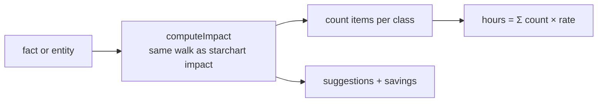

The change-cost advisor answers the question every refactor argument really comes down to: what does it cost us to change this value, and what would make it cheaper? For every fact and entity, `starchart cost` runs the same impact walk as `starchart impact`, weights each impacted item by class into estimated person-hours, and suggests the changes that would cut the cost most (codegen, templates, bindings, write access). This page covers the algorithm, the default hours table, how suggestions are built, real output from the demo, and how to use it to pick your next refactor. Source: [`analysis/cost.ts`](https://github.com/space-pirate-zero/starchart/blob/main/packages/starchart/src/analysis/cost.ts).

## Usage

```bash
starchart cost                           # top 15 facts/entities by hours
starchart cost -n 5                      # top 5
starchart cost addon:pro.price.usd       # specific ids
starchart cost -f json                   # CostReport[] (also limited by --top)
```

With no ids, it costs every entity plus every leaf fact (facts with no child facts), except the generated `<entity>.status` facts. Ids that don't exist are skipped silently, and the command exits 0. `-f` accepts only `text` or `json`; `-f markdown` is rejected by the argument parser (exit 1).

## Algorithm



For each id:

1. Run `computeImpact(graph, [id], { canWrite })`. `canWrite` comes from your config, so an adapter with `write: true` turns its `manual` items into `auto`, but only for artifacts the adapter's `canApply(node)` accepts (App Store screenshots and IAPs stay `manual`). See [Impact Analysis](Impact-Analysis) for how items are classified.
2. Count items per class (`byClass`). `impacted` is the total, including `info` items.
3. `hours = Σ byClass[class] × rate[class]`, rounded to two decimals.
4. `hardcoded` = the number of `code` items (non-generated code literals that anchor the fact).
5. `mediaBurnIns` = the number of `manual` items reached through `embeds` whose node is a `schema:ImageObject` or `schema:VideoObject`.
6. Build suggestions (below).

Reports are sorted by hours (highest first), then id.

## DEFAULT_HOURS

| Class | Hours per item | Meaning |
|---|---:|---|
| `auto` | 0.05 | STARCHART applies it. Someone glances at the diff. |
| `code` | 0.25 | A hardcoded literal to update by hand. |
| `test` | 0.1 | A test to run. |
| `review` | 0.5 | Someone reads it and decides (`describes`, `promotes`, `derivedFrom`, …). |
| `manual` | 1.5 | A human updates an external system, re-shoots a screenshot, or re-edits a video. |
| `retire` | 0.5 | Take down an expired or retired-dependent artifact. |
| `break` | 1 | Something will break (for example, code referencing an archived Stripe price). |
| `info` | 0 | Informational only. |

These are rough, deliberately round numbers for ranking, not estimates for invoices. Library callers can override them: `changeCost(graph, ids, { hours: { manual: 3 } })`. There is no CLI flag for custom rates.

## Suggestions

Suggestions are built in this order. Each one that applies also adds its **savings** to a running total:

| Condition | Suggestion | Savings |
|---|---|---|
| `code` items reached **directly from a fact** > 0 | `N hardcoded code anchor(s): generate constants with \`starchart codegen\` to make these auto` | N × (code − auto) |
| media burn-ins > 0 | `N image(s)/video(s)/media asset(s) embed(s) this value: bind it/them to a template (renders) to regenerate automatically` | N × (manual − auto) |
| other `manual` items with **no binding** (not media, not `captures`) | `N artifact(s) has/have no binding: bind it/them so STARCHART can audit and update it/them` | none |
| other `manual` items whose adapter **can write that artifact** | `N manual update(s) in <adapters>: enable write access for this adapter/these adapters to sync automatically` | N × (manual − auto) |
| savings > 0 and hours > 0 | `Doing this cuts the change cost from <hours> to <hours − savings>` | |

In the summary line, costs under an hour print as minutes (`45 min`), otherwise as hours with up to two decimals (`1.75 h`).

A few details:

- `captures` items ("screen changed; re-capture") never get a suggestion. There's no automation for re-shooting screens yet.
- The bind suggestion adds no savings. Binding makes an artifact auditable, but it still needs an adapter that can write.
- The codegen suggestion only counts `code` items whose last hop starts at a fact. Codegen emits fact constants, so a symbol reached through an artifact (like a Stripe price-id constant that `anchors` a Stripe price) can't be generated and isn't counted. `hardcoded` in the JSON still counts every `code` item.
- The write-access suggestion only counts items whose adapter is registered, declares `capabilities.write`, implements `apply()`, and (if it has one) returns true from `canApply(node)`. So `url` artifacts, unregistered adapters (like the demo's `youtube`), and App Store screenshots and IAPs (App Store bindings without a `field`) are never listed. Those stay manual no matter what you set.

## Real output from the demo

From a temp copy of `examples/pro-universe`, where Stripe and App Store are read-only (the default for external adapters):

```text
$ starchart cost
████████████████████   9.4h  addon:pro.price.usd (21 impacted)
      → 1 hardcoded code anchor: generate constants with `starchart codegen` to make these auto
      → 1 image embeds this value: bind it to a template (renders) to regenerate automatically
      → 2 manual updates in appstore, stripe: enable write access for these adapters to sync automatically
      → Doing this cuts the change cost from 9.4 h to 4.85 h
████████████           5.7h  addon:pro.name (16 impacted)
      → 1 hardcoded code anchor: generate constants with `starchart codegen` to make these auto
      → 2 manual updates in appstore, stripe: enable write access for these adapters to sync automatically
      → Doing this cuts the change cost from 5.7 h to 2.6 h
███████████            5.0h  addon:pro.productId (12 impacted)
      → 1 hardcoded code anchor: generate constants with `starchart codegen` to make these auto
      → Doing this cuts the change cost from 4.95 h to 4.75 h
█████████              4.5h  addon:pro.features (13 impacted)
      → 1 hardcoded code anchor: generate constants with `starchart codegen` to make these auto
      → Doing this cuts the change cost from 4.45 h to 4.25 h
███████                3.1h  addon:pro.price.eur (9 impacted)
███                    1.6h  addon:pro.billing (7 impacted)
███                    1.5h  addon:pro (4 impacted)
█                      0.0h  app:nebula (0 impacted)
…
```

The bar is scaled to the most expensive row (20 blocks). The hours column is rounded to one decimal, and the summary line uses two, which is why `addon:pro.productId` shows `5.0h` next to `4.95 h`.

The JSON for the top fact (`starchart cost addon:pro.price.usd -f json`, trimmed to the object) shows the math:

```json
{
  "id": "addon:pro.price.usd",
  "impacted": 21,
  "byClass": { "auto": 6, "code": 2, "test": 1, "review": 1, "manual": 5, "retire": 1, "break": 0, "info": 5 },
  "hours": 9.4,
  "hardcoded": 2,
  "mediaBurnIns": 1,
  "suggestions": [
    "1 hardcoded code anchor: generate constants with `starchart codegen` to make these auto",
    "1 image embeds this value: bind it to a template (renders) to regenerate automatically",
    "2 manual updates in appstore, stripe: enable write access for these adapters to sync automatically",
    "Doing this cuts the change cost from 9.4 h to 4.85 h"
  ]
}
```

Hours: 6 × 0.05 + 2 × 0.25 + 1 × 0.1 + 1 × 0.5 + 5 × 1.5 + 1 × 0.5 = **9.4**. Savings: 1 × 0.2 (codegen) + 1 × 1.45 (template) + 2 × 1.45 (write access) = 4.55, so 9.4 → **4.85 h**.

What those items are (from `starchart impact addon:pro.price.usd`):

- **2 code:** `symbol:ios/Pricing.proUSD` hardcodes the price in Swift. `symbol:web/lib/stripe#PRICE_PRO_MONTHLY` is the Stripe price-id constant, reached because it anchors `stripe:price/pro-monthly`, which mirrors the price ("holds this artifact's external id; update it if the id changes"). The generated `StarchartFacts` constants are already `auto`. Only `Pricing.proUSD` counts toward the codegen suggestion: codegen emits fact constants, so the Stripe id constant would need its own fact (for example a `stripePriceId` fact) before codegen could own it.
- **1 media burn-in:** App Store screenshot `appstore:screenshots/6.9/03` has the price burned in.
- **4 other manual:** the Stripe price and the App Store description can be written once you enable writes, so they're the 2 in the write-access suggestion. The App Store IAP (`appstore:iap/pro-monthly`, no `field`) and the live pricing URL (`url` adapter) can't be written by any adapter, so they're left out.
- **1 retire:** the expired `reel:spring-2026`.

## Using it to decide what to refactor

Read the top of the list as a refactor backlog, ranked by pain:

1. **Hardcoded anchors → codegen.** Each `code` item is a literal a human must find and edit. Add a `codegen:` target for the entity, replace the literal with the generated constant, and those items become `auto` (0.25 → 0.05 h each). They also stop tripping `anchor-matches`. See [Codegen](Codegen).
2. **Burned-in media → templates.** Every image that embeds a value costs a designer 1.5 h per change. Turn it into a template artifact with `renders: { template: …, with: [facts] }`, like the demo's `web:og-pro`, and `starchart apply` regenerates it. For a store screenshot that captures a real screen, the honest fix is often to keep the price out of the screenshot.
3. **Unbound artifacts → bind them.** No binding means no audit and no updates. This saves no hours by itself, but it's the prerequisite for step 4.
4. **Read-only adapters → enable writes, deliberately.** External adapters are read-only unless you opt in with `adapters.stripe.write: true` (or `appstore`). Once enabled, those `manual` items become `auto`, and `starchart apply` syncs them with a journal you can revert. This is a trust decision, not a free win. Read [Apply, Revert and Journals](Apply-Revert-and-Journals) first, STARCHART only suggests adapters that can actually write the artifact, so `url` checks and App Store IAPs never show up here.
5. **Re-run `starchart cost`** after each step. The demo's price goes from 9.4 h to 4.85 h with steps 1, 2 and 4. What's left is mostly work no adapter can do: the IAP, the live-page check, the review item, and the expired reel.

Facts with many `review` items (lots of `describes`) are a copy-sprawl signal. Consider whether all those pages need to talk about the value at all.

## See also

- [Impact Analysis](Impact-Analysis)
- [Codegen](Codegen)
- [Apply, Revert and Journals](Apply-Revert-and-Journals)
- [Adapters Overview](Adapters-Overview)
- [Orphans](Orphans)
