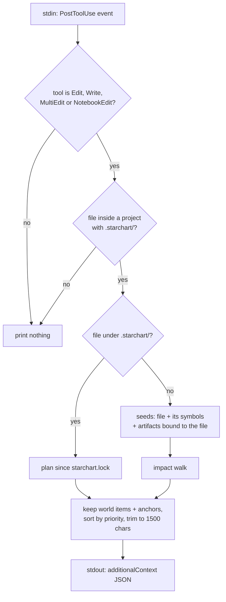

The Claude Code hook puts STARCHART in the agent's loop without the agent having to ask. Every time Claude Code edits a file, a `PostToolUse` hook runs `starchart hook claude`, works out that file's cross-layer blast radius, and injects a short summary into the conversation: "you just changed the price the App Store screenshot shows". This page covers what the hook matches, how it picks seeds, how the context is built and trimmed to 1500 characters, the exact `settings.json` snippet, the output JSON with real examples, failure behavior and performance. Source: [`hooks/claude.ts`](https://github.com/space-pirate-zero/starchart/blob/main/packages/starchart/src/hooks/claude.ts).

## Setup

Add this to `.claude/settings.json` in your project (it's also returned by `claudeHookSettingsSnippet()` in the library):

```json
{
  "hooks": {
    "PostToolUse": [
      {
        "matcher": "Edit|Write|MultiEdit|NotebookEdit",
        "hooks": [{ "type": "command", "command": "npx @space-pirate-zero/starchart hook claude" }]
      }
    ]
  }
}
```

Use the scoped name. The unscoped `starchart` package on npm is unrelated, so bare `npx starchart` runs the wrong thing.

Install the package as a dev dependency (`npm i -D @space-pirate-zero/starchart`) so `npx` resolves your local copy instead of fetching it on every edit. The hook runs after every edit, so a cold download adds up fast.

The matcher covers all four edit tools. For `NotebookEdit` the hook reads `tool_input.notebook_path` instead of `tool_input.file_path`.

## What it does



1. **Parse the event.** The event must be `PostToolUse` (or have no `hook_event_name`). The tool must be `Edit`, `Write`, `MultiEdit` or `NotebookEdit`. The path comes from `tool_input.file_path` or `tool_input.notebook_path`. A relative path resolves against the event's `cwd`.
2. **Find the project.** It walks up from the file's directory to the nearest `.starchart/`, falling back to the event `cwd`. Files outside the project root are ignored.
3. **Build the project** from disk (YAML, code, lock), just like the CLI. Plugins listed under `plugins:` in `config.yaml` are loaded too, so custom adapters decide write access (and therefore `auto` vs `manual`) the same way they do in `starchart plan`. Code-ingest warnings are not printed; stdout carries only the hook payload.
4. **Pick seeds:**
   - **An edit under `.starchart/`** (facts, artifacts, rules YAML) reports everything that changed since `starchart.lock`, the same as `starchart plan`.
   - **Any other file** seeds with the file node and every symbol it contains. Fact, entity and artifact matches from suffix resolution are dropped. It also seeds with every **artifact bound to the file** (`binding.path` or `binding.file` equals the file's project-relative path). For a bound artifact, the header also names the artifact and up to 6 facts it `embeds` or `renders`, with a nudge to change the facts in `.starchart/` instead of hand-editing values.
5. **Filter.** Only items that matter beyond code are kept: world artifacts, plus anything reached through an `anchors` edge (facts and constants on the other side of a code/fact bridge). Plain code-to-code impact is left out. The agent can already see the code.
6. **Sort** by class priority: `break`, `manual`, `auto`, `review`, `code`, `retire`, `test`, `info`. Ties are broken by impact depth, then id.
7. **Trim.** Lines are added until a budget runs out. The budget is 1500 minus the header, footer and test line, minus 40. The remaining items become `…and N more.` The whole string is then hard-capped at **1500 characters** (`HOOK_CONTEXT_LIMIT`).

If nothing relevant is impacted, the hook prints nothing. The exception is a bound artifact, which still gets its "managed values" header.

### Context format

```text
STARCHART: editing <file> impacts <N> items beyond code (<counts by class>):
<symbol> <class> <id> — <reason> (<short why-path>)
…and N more.
Tests to run: <up to 5 test ids>
Run `starchart impact <file>` (or `starchart plan`) for the full blast radius.
```

Why-paths of more than three hops are shortened to `first -edge→ … -edge→ last`, and the edited file is shown by its base name. The class symbols match the CLI: `✗` break/retire, `!` manual, `~` auto, `?` review, `⌘` code, `✓` test, `·` info.

## Output JSON

On stdout, one line:

```json
{"hookSpecificOutput":{"hookEventName":"PostToolUse","additionalContext":"…"}}
```

Claude Code adds `additionalContext` to the conversation after the tool result. Empty output means "nothing to say".

## Real examples

All from a temp copy of `examples/pro-universe`, run as:

```bash
echo '{"hook_event_name":"PostToolUse","tool_name":"Edit","tool_input":{"file_path":"'"$PWD"'/apps/ios/Sources/Core/Pricing.swift"},"cwd":"'"$PWD"'"}' \
  | npx @space-pirate-zero/starchart hook claude
```

**Editing a Swift file with a hardcoded price:**

```json
{"hookSpecificOutput":{"hookEventName":"PostToolUse","additionalContext":"STARCHART: editing apps/ios/Sources/Core/Pricing.swift impacts 15 items beyond code (5 manual, 6 auto, 1 review, 1 code, 1 retire, 1 info):\n! manual appstore:listing/description — adapter \"appstore\" cannot write (symbol:ios/Pricing.proUSD -anchors→ addon:pro.price.usd -embeds→ appstore:listing/description)\n! manual appstore:screenshots/6.9/03 — value is burned into media (symbol:ios/Pricing.proUSD -anchors→ addon:pro.price.usd -embeds→ appstore:screenshots/6.9/03)\n! manual stripe:price/pro-monthly — update in stripe (adapter is read-only) (symbol:ios/Pricing.proUSD -anchors→ addon:pro.price.usd -mirrors→ stripe:price/pro-monthly)\n! manual web:live-pricing — adapter \"url\" cannot write (symbol:ios/Pricing.proUSD -anchors→ addon:pro.price.usd -embeds→ web:live-pricing)\n! manual appstore:iap/pro-monthly — update in appstore (adapter is read-only) (symbol:ios/Pricing.proUSD -anchors→ addon:pro.price.usd -partOf→ addon:pro.price -mirrors→ appstore:iap/pro-monthly)\n~ auto email:onboarding-day-3 — replace embedded value (symbol:ios/Pricing.proUSD -anchors→ addon:pro.price.usd -embeds→ email:onboarding-day-3)\n…and 9 more.\nTests to run: test:ios/Tests/PaywallTests.swift\nRun `starchart impact apps/ios/Sources/Core/Pricing.swift` (or `starchart plan`) for the full blast radius."}}
```

Decoded, that's what the agent reads:

```text
STARCHART: editing apps/ios/Sources/Core/Pricing.swift impacts 15 items beyond code (5 manual, 6 auto, 1 review, 1 code, 1 retire, 1 info):
! manual appstore:listing/description — adapter "appstore" cannot write (symbol:ios/Pricing.proUSD -anchors→ addon:pro.price.usd -embeds→ appstore:listing/description)
! manual appstore:screenshots/6.9/03 — value is burned into media (symbol:ios/Pricing.proUSD -anchors→ addon:pro.price.usd -embeds→ appstore:screenshots/6.9/03)
…
…and 9 more.
Tests to run: test:ios/Tests/PaywallTests.swift
Run `starchart impact apps/ios/Sources/Core/Pricing.swift` (or `starchart plan`) for the full blast radius.
```

**Editing a file that is itself a world artifact** (the pricing page is bound with `adapter: fs`):

```json
{"hookSpecificOutput":{"hookEventName":"PostToolUse","additionalContext":"STARCHART: editing apps/web/app/pricing/page.tsx (world artifact web:pricing-page). It carries facts addon:pro.price.usd; change the facts in .starchart/ rather than hand-editing values."}}
```

**Editing the chart itself** (after changing the USD price from 4.99 to 5.99 in `.starchart/entities/pro.yaml`):

```text
STARCHART: fact edits in .starchart/entities/pro.yaml (vs starchart.lock) impact 15 items beyond code (5 manual, 6 auto, 1 review, 2 code, 1 retire):
! manual appstore:iap/pro-monthly — update in appstore (adapter is read-only) (addon:pro.price -mirrors→ appstore:iap/pro-monthly)
! manual appstore:listing/description — adapter "appstore" cannot write (addon:pro.price.usd -embeds→ appstore:listing/description)
…
~ auto symbol:ios/StarchartFacts.AddonPro.Price.usd — regenerate fact constants (codegen) (addon:pro.price.usd -anchors→ symbol:ios/StarchartFacts.AddonPro.Price.usd)
…and 6 more.
Tests to run: test:ios/Tests/PaywallTests.swift
Run `starchart plan` for the full blast radius.
```

**A code file with only a bridge:** `apps/web/lib/stripe.ts` holds the Stripe price id:

```text
STARCHART: editing apps/web/lib/stripe.ts impacts 1 item beyond code (1 review):
? review stripe:price/pro-monthly — impacted via anchors (symbol:web/lib/stripe#PRICE_PRO_MONTHLY -anchors→ stripe:price/pro-monthly)
Run `starchart impact apps/web/lib/stripe.ts` (or `starchart plan`) for the full blast radius.
```

## Failure behavior

A hook must never break the agent, so every failure is silent. Malformed JSON, a missing `.starchart/`, a config error (including a plugin that fails to load) or a build error all produce **empty stdout and exit code 0**. The same goes for events that don't apply (a `Read` call, a file outside the project).

To see what went wrong, set `STARCHART_HOOK_DEBUG=1`. The error and its stack are then returned as the context itself, truncated to 1500 characters:

```bash
echo '{bad' | STARCHART_HOOK_DEBUG=1 npx @space-pirate-zero/starchart hook claude
```

```text
{"hookSpecificOutput":{"hookEventName":"PostToolUse","additionalContext":"STARCHART hook error (debug): SyntaxError: Expected property name or '}' in JSON at position 1 (line 1 column 2)\n    at JSON.parse (<anonymous>)\n …"}}
```

Set it in the hook command (`STARCHART_HOOK_DEBUG=1 npx @space-pirate-zero/starchart hook claude`, or the `node …/bin.js hook claude` form) while you're setting things up, then remove it.

## Performance

The hook builds the whole project (YAML, code ingestion, lockfile) **on every invocation**. There's no daemon or cache. On the small demo, one run takes roughly 0.8–2.5 s wall clock depending on the machine (about 0.7 s CPU). On a large codebase, expect each edit to take noticeably longer, since the cost grows with the code layer. If it gets in the way:

- Narrow `code.scopes` / `code.exclude` in `config.yaml` so ingestion reads less (see [Configuration](Configuration)).
- Tighten the `matcher`, or use the [MCP Server](MCP-Server) on demand instead.

## Library use

```ts
import { runClaudeHook, claudeHookSettingsSnippet } from "@space-pirate-zero/starchart";

const stdout = await runClaudeHook(eventJson, { cwd: "/path/to/project", env: process.env }); // "" or the JSON line
```

`runClaudeHook` never throws. It returns `""` on failure, or the debug payload when `env.STARCHART_HOOK_DEBUG === "1"`.

## See also

- [MCP Server](MCP-Server)
- [Impact Analysis](Impact-Analysis)
- [Artifacts and Bindings](Artifacts-and-Bindings)
- [Configuration](Configuration)
