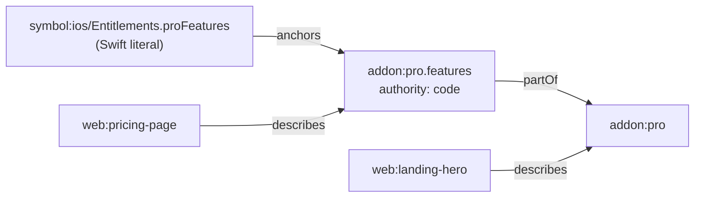

Some facts are born in code. The list of features Pro unlocks is decided by an `Entitlements` enum, not by a YAML file, and copying it into YAML would just create a second thing to drift. `authority: code` flips the direction: the fact **reads** its value from a code symbol on every run. This page covers the syntax, the short symbol form, how resolution works after ingest, the `anchors` bridge it creates, what happens when the symbol can't be found, and what a code PR that edits the symbol looks like. Source: `compileProject`, `normalizeSymbol` and `resolveCodeFacts` in [`compiler/compile.ts`](https://github.com/space-pirate-zero/starchart/blob/main/packages/starchart/src/compiler/compile.ts), and `buildProject` in [`project.ts`](https://github.com/space-pirate-zero/starchart/blob/main/packages/starchart/src/project.ts).

## Syntax

A code-authority fact is a fact spec with `authority: code` and `source.symbol`:

```yaml
id: addon:pro
facts:
  features: { authority: code, source: { symbol: ios/Entitlements.proFeatures } }
```

- `source.symbol` is **required**. Without it the load fails: `fact addon:pro.features has authority "code" but no source.symbol` (exit code 2).
- `value` is optional and gets overwritten once the symbol resolves. You can leave it out.

### Short and long symbol forms

`normalizeSymbol` adds the `symbol:` prefix if it's missing, so these are equivalent:

```yaml
source: { symbol: ios/Entitlements.proFeatures }
source: { symbol: "symbol:ios/Entitlements.proFeatures" }
```

The rest of the id follows the normal per-language format ([Node IDs](Node-IDs#symbols-per-language)): `ios/Pricing.proUSD` (Swift), `web/lib/pricing#PRO_FEATURES` (TS), `android/Pricing.PRO_USD` (Kotlin), `api/internal/pricing.ProUSD` (Go). The scope name comes first.

## Resolution after ingest

`buildProject` runs these steps in order:

1. **Compile** the YAML. The fact node is created with `authority: "code"`, the given `source`, and `value` from YAML (usually `undefined`). A pending entry `{ factId, symbol }` is recorded.
2. **Import design tokens**, if configured.
3. **Ingest code** and merge the code layer into the graph.
4. **`resolveCodeFacts`**, for each pending fact:
   - look up the symbol node by id;
   - if found, copy the symbol's literal `value` into the fact and add `symbol --anchors--> fact` with `origin: "declared"`;
   - if not found, record it as unresolved.
5. **`recomputeContainers`** rebuilds every container fact from its leaves, so a container over a code fact gets the right value.
6. **Warn** about unresolved facts.

The value comes from the symbol's extracted literal. The ingestor reads string, number and boolean literals, arrays of them and simple object literals. A symbol whose initialiser isn't a literal (a function call, a computed expression) has no `value`. The anchors edge is still added, but the fact keeps its YAML `value` (or stays empty).

After resolution, the demo's fact looks like this (`starchart node addon:pro.features`):

```text
{
  "id": "addon:pro.features",
  "kind": "fact",
  "authority": "code",
  "source": {
    "symbol": "ios/Entitlements.proFeatures"
  },
  …
  "value": [
    "Themes",
    "iCloud sync"
  ]
}
  --partOf--> addon:pro
  <--describes-- appstore:listing/description
  <--describes-- web:pricing-page
  <--anchors-- symbol:ios/StarchartFacts.AddonPro.features
  <--anchors-- symbol:web/lib/starchart-facts#ADDON_PRO_FEATURES
  <--anchors-- symbol:ios/Entitlements.proFeatures
```

`source.symbol` keeps whatever you wrote (the short form here). The edge uses the normalised id.

## The anchors bridge

The resolved fact gets `symbol:ios/Entitlements.proFeatures --anchors--> addon:pro.features`. `anchors` propagates in **both** directions, so:

- editing the Swift array changes the symbol hash → impact flows into the fact → out to everything that embeds, describes or mirrors it;
- the lockfile's dependency walk crosses the same edge, so artifacts that depend on `addon:pro.features` also pin `symbol:ios/Entitlements.proFeatures`'s hash.



## Unresolved symbols

If the symbol isn't in the code layer (typo, renamed, file excluded, scope misnamed), the fact keeps its YAML `value` (usually none) and every command warns on stderr:

```text
warn fact addon:pro.features: code symbol symbol:ios/Entitlements.proFeatures not found
```

The warning doesn't change exit codes. It does change hashes: the fact's value goes from the array to `undefined` (hashed like `null`), so `starchart check` reports every dependent as stale. Renaming the Swift constant to `allFeatures` without updating the YAML gives:

```text
warn fact addon:pro.features: code symbol symbol:ios/Entitlements.proFeatures not found
  ✗ stale     appstore:listing/description
                changed: addon:pro.features
…
```

When ingestion is skipped (`journals`, `history`, `adapters`), code facts are never resolved and there's no warning. Their `value` stays whatever the YAML says. `emit jsonld` always ingests code, so code-authority facts like `addon:pro.features` export with their `sc:value`; `--code` only decides whether code nodes themselves go into the full export ([JSON-LD and SEO](JSON-LD-and-SEO)).

## What happens on a code PR

A teammate adds a feature in Swift:

```swift
enum Entitlements {
    static let proFeatures = ["Themes", "iCloud sync", "Widgets"]
}
```

Nobody touched `.starchart/`. `starchart plan` still sees the change, from two sides: the symbol's hash moved (it's pinned in `lock.code`), and the fact's value moved (pinned in `lock.facts`):

```text
Change: addon:pro.features  ["Themes","iCloud sync"] → ["Themes","iCloud sync","Widgets"]
Change: symbol:ios/Entitlements.proFeatures  "67931739280ac34c" → "3043a3a49728dca7"

  ! manual  appstore:screenshots/6.9/03                        captures   screen changed; re-capture
  ~ auto    symbol:ios/StarchartFacts.AddonPro.features        anchors    regenerate fact constants (codegen)
  ~ auto    symbol:web/lib/starchart-facts#ADDON_PRO_FEATURES  anchors    regenerate fact constants (codegen)
  ? review  appstore:listing/description                       describes  describes this semantically
  ? review  web:pricing-page                                   describes  describes this semantically
  ? review  email:onboarding-day-3                             describes  describes this semantically
  ? review  web:landing-hero                                   describes  describes this semantically
  ✗ retire  reel:spring-2026                                   promotes   expired 2026-06-30
  ✓ tests   test:ios/Tests/PaywallTests.swift                  tests      run these tests

Order: appstore:listing/description → appstore:screenshots/6.9/03 → symbol:ios/StarchartFacts.AddonPro.features → symbol:web/lib/starchart-facts#ADDON_PRO_FEATURES → email:onboarding-day-3 → web:landing-hero → web:pricing-page → reel:spring-2026

Plan: 1 manual · 2 auto · 4 review · 1 retire · 1 tests
(3 informational items hidden; use --verbose)
```

And `starchart check` fails CI (exit 1) until someone handles it:

```text
…
  ✗ stale     web:landing-hero
                changed: addon:pro.features
                changed: symbol:ios/Entitlements.proFeatures
  ✗ stale     web:pricing-page
                changed: addon:pro.features
                changed: symbol:ios/Entitlements.proFeatures

Check: 6 stale
```

The fix loop:

1. `starchart apply` regenerates the web and iOS fact constants (the two `auto` items) in one [codegen](Codegen) pass, and pushes any `auto` artifacts:

   ```text
   ✓ symbol:ios/StarchartFacts.AddonPro.features [codegen] regenerated apps/web/lib/starchart-facts.ts; regenerated apps/ios/Sources/Core/StarchartFacts.swift
   ✓ symbol:web/lib/starchart-facts#ADDON_PRO_FEATURES [codegen] regenerated apps/web/lib/starchart-facts.ts; regenerated apps/ios/Sources/Core/StarchartFacts.swift
   …
   ```

2. Update the App Store listing copy and the pricing page wording (`review`), re-shoot screenshot 3 (`manual`), retire the reel, then `starchart ack <ids…>`. Until then `plan` keeps listing them.
3. Commit the updated `starchart.lock` with the PR.

With the [GitHub Action](GitHub-Action), the same blast radius lands as a PR comment via `impact --diff`.

## Code authority vs annotations

| | `authority: code` | `@starchart anchors` annotation |
|---|---|---|
| Where the truth lives | the code symbol | the YAML fact |
| Fact value | read from code on every run | written in YAML |
| Edge created | `symbol --anchors--> fact`, origin `declared` | `symbol --anchors--> fact`, origin `annotation` |
| Code symbol in a plan | the thing that changed | classed `code`: update the literal or switch to codegen |

Use code authority when engineers own the value (entitlements, feature lists, limits). Use annotations when marketing or product owns it and code just has to keep up.

## See also

- [Facts and Entities](Facts-and-Entities)
- [Annotations](Annotations)
- [Codegen](Codegen)
- [Lockfile and Drift](Lockfile-and-Drift)
- [Git Diff Impact](Git-Diff-Impact)
