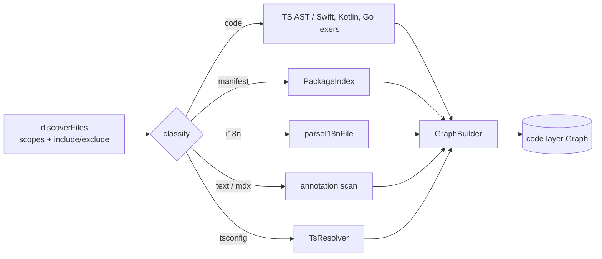

The code layer is the bottom of the chart: files, symbols with their literal values, screens, routes, packages, env vars, feature flags, analytics events, localization keys and tests, plus the edges between them. STARCHART builds it on every run from your source tree, with no build step, no compiler plugin and no index server. This page covers what gets extracted per language and per artifact kind, how names are resolved, how nodes are hashed, which files are scanned, how generated files are treated, what it costs, and where the edges are fuzzy.

Source: [`packages/starchart/src/code/`](https://github.com/space-pirate-zero/starchart/blob/main/packages/starchart/src/code/) (entry point [`ingest.ts`](https://github.com/space-pirate-zero/starchart/blob/main/packages/starchart/src/code/ingest.ts)).

## The pipeline



`buildProject()` runs this after compiling your YAML, merges the result into the chart, then resolves [code-authority facts](Code-Authority-Facts) against the new symbols. Pass `skipCode: true` (the CLI does this for `journals`, `history` and `adapters`) to skip it entirely. `emit jsonld` always ingests code, so code-authority facts get their values; its `--code` flag only decides whether code nodes appear in the full export.

Ingest problems (unknown `@starchart` verb, an annotation with no target, parse failures, unreadable or oversized files, unparseable manifests or catalogs) are collected by `lastIngestWarnings()` and copied into `project.warnings`, so every CLI command prints them on stderr as `warn …`. `-q` hides them:

```text
$ starchart check
warn apps/web/lib/x.ts:1: unknown @starchart edge type "frobnicates"
✓ every artifact is in sync
$ starchart -q check
✓ every artifact is in sync
```

## Scopes, include and exclude

Code lives in named **scopes**, configured in `.starchart/config.yaml`:

```yaml
code:
  scopes:
    web: apps/web
    ios: apps/ios
  include: ["**/*"]          # optional; default is every file
  exclude: ["**/fixtures/**"]
  maxCodeDepth: 4            # optional; consecutive code hops during impact and in the lock's dependency walk (default 4)
```

| Rule | Behavior |
|---|---|
| No scopes configured | One scope `app` rooted at `.` |
| Scope name | Prefixes every code node id: `file:web/…`, `symbol:ios/…` |
| Nested scopes | The most specific (longest) directory wins; each file belongs to exactly one scope |
| `include` / `exclude` globs | Matched relative to each scope directory. Root-relative patterns that start with the scope directory also work (`apps/web/legacy/**`) |
| Always excluded | `node_modules`, `dist`, `build`, `.git`, `.next`, `DerivedData`, `Pods`, `.starchart` (any depth), whatever the config says |
| Dotfiles and dot-directories | Skipped (`dot: false`) |
| Symlinks | Not followed |

`starchart init` fills in scopes for you by looking (up to three directories deep) for `package.json`, `Package.swift` / `Package.resolved` / `*.xcodeproj`, `build.gradle(.kts)` and `go.mod`. See [Configuration](Configuration).

## How files are classified

| Role | Files | What happens |
|---|---|---|
| code | `.ts .tsx .js .jsx .mjs .cjs .mts .cts`, `.swift`, `.kt`, `.go` | Parsed. `.d.ts`, `.d.mts`, `.d.cts` and `.min.js` are ignored |
| manifest | `package.json`, `Package.resolved`, `Package.swift`, `project.pbxproj`, `build.gradle`, `build.gradle.kts`, `libs.versions.toml`, `go.mod` | Packages |
| i18n | `*.xcstrings`; `*.strings` inside a `.lproj/`; `res/values*/strings.xml`; `*.json` under a `locales/`, `locale/`, `i18n/`, `messages/`, `lang/` or `translations/` directory | Localization keys |
| tsconfig | `tsconfig.json`, `jsconfig.json` | Path mapping for import resolution |
| mdx | `.mdx` | Always a file node; also a route candidate |
| text | `.md .html .htm .yaml .yml .css .scss .sass .less .xml .toml .vue .svelte .astro .sql .graphql .gql .py .rb .sh .txt .plist .properties .gradle` | Scanned for `@starchart` annotations only. Becomes a file node only if it has one |

Any other `.json` file, and every unlisted extension, is ignored.

**Tests** are code files that match: `*.test.*` / `*.spec.*` or a `__tests__/` directory (TS/JS); `*Test.swift` / `*Tests.swift` or a directory ending in `Tests` (Swift); `*Test.kt` / `*Tests.kt` or `src/test|androidTest|testDebug|testRelease/` (Kotlin); `*_test.go` (Go). Tests become `test:` nodes instead of `file:` nodes and their declarations are not charted as symbols.

## Per language

### TypeScript and JavaScript (TypeScript AST)

Parsed with the real TypeScript compiler API (`ts.createSourceFile`), one file at a time. No type checker, no program.

| Extracted | Details |
|---|---|
| Symbols | Top-level functions, classes, interfaces, type aliases, namespaces, enums, `const`/`let`/`var` (including destructured names), `export default <expr>` |
| Members | Class members (methods, properties, accessors, `constructor`), enum members (with auto-increment values), properties of an object literal assigned to a top-level variable |
| Literal values | `const` initializers that are pure literals: strings, no-substitution templates, numbers (incl. `1_000`, negatives), booleans, and arrays/objects of those. `as`, `satisfies`, `!` and parentheses are unwrapped. `readonly` class property initializers. Object-literal member values under a `const` |
| Imports | `import … from`, `import x = require()`, `export … from`, `export * from`, `export * as ns from` |
| References | Every identifier that refers to a top-level declaration or an imported binding, plus `X.member` and `X.Y` qualified names |

Symbol ids: `symbol:<scope>/<path without extension>#<qname>`, e.g. `symbol:web/lib/pricing#PRO_PRICE_USD`, `symbol:web/lib/starchart-facts#ADDON_PRO.price`.

TypeScript files never produce screens automatically. Use an annotation: `// @starchart screen Checkout`.

### Swift, Kotlin and Go (lexers)

No tree-sitter, no SourceKit, no Kotlin compiler. A small forgiving lexer ([`lexer.ts`](https://github.com/space-pirate-zero/starchart/blob/main/packages/starchart/src/code/lexer.ts)) understands comments (nested block comments too), strings (multi-line, raw, Swift `\( )` and Kotlin `${ }` interpolation), and bracket matching. A declaration scanner then walks the token stream.

| | Swift | Kotlin | Go |
|---|---|---|---|
| Types | `struct` `class` `enum` `protocol` `actor` (`extension` members attach to the extended type) | `class` `interface` `object` (`companion object` members hoist into the owner) | `type` |
| Members | `func` `let` `var` `init` `subscript` `typealias` `deinit`, enum `case`s | `fun` `val` `var` `typealias`, enum entries | `func`, methods (`Recv.Method`), `const`, `var` |
| Literal values | `let` and enum raw values. A `String` enum case without a raw value gets its name as value | `val` and single-argument enum entries | `const` and `var` |
| Literal forms | strings, numbers, booleans, `[a, b]`, `["k": v]` | strings, numbers, booleans, `listOf`/`arrayOf`/`setOf`/`mutableListOf`/…, `mapOf(k to v)`, `emptyList()` | strings, numbers, booleans, `[]T{…}`, `[N]T{…}`, `map[K]V{…}` |
| Symbol id | `symbol:ios/Pricing.proUSD` | `symbol:android/Paywall.PRICE` | `symbol:api/internal/billing.PriceID` (namespace = package dir relative to the scope, or the package name at the scope root) |
| Screens | Top-level `struct X: View` (or `SwiftUI.View`); name loses a trailing `View`/`Screen` | `@Composable fun XScreen(…)`; name loses `Screen` | none |
| Imports | module names (`import RevenueCat`) | full import paths | import paths with aliases |

Swift `var` and Kotlin `var` never carry a value (they are mutable). Overloads that share an id collapse into one symbol with several line `ranges` and a combined hash; if their values differ the value is dropped.

## Per artifact kind

### Files and symbols

Every parsed or annotated file becomes `file:<scope>/<rel>` (or `test:<scope>/<rel>`) with `meta: { path, scope, scopeDir, lang, generated? }`. Each symbol gets `file --contains--> symbol`, and members get `parent --references--> member` (with `meta.member: true`).

Real output from the demo:

```text
$ starchart node symbol:ios/Pricing.proUSD
{
  "id": "symbol:ios/Pricing.proUSD",
  "kind": "symbol",
  "label": "proUSD",
  "location": {
    "file": "apps/ios/Sources/Core/Pricing.swift",
    "line": 5,
    "endLine": 5
  },
  "hash": "20bc1f157ce5a99f",
  "value": 4.99,
  "meta": {
    "kind": "let",
    "qname": "Pricing.proUSD",
    "scope": "ios",
    "lang": "swift",
    "static": true,
    "parent": "symbol:ios/Pricing"
  },
  "layer": "code"
}
  --anchors--> addon:pro.price.usd
  <--contains-- file:ios/Sources/Core/Pricing.swift
  <--references-- symbol:ios/PaywallView.body
  <--references-- symbol:ios/Pricing
```

The `anchors` edge comes from a `// @starchart anchors addon:pro.price.usd` comment above the constant. Annotation targets are node ids containing a colon (`addon:pro.price.usd`) or dotted ids without one, such as design-token ids (`// @starchart anchors tokens.color.brand.primary`). A target that looks like an id but names no node is not warned about; the edge just leads nowhere. See [Annotations](Annotations).

### Screens

```text
$ starchart node screen:ios/Paywall
{
  "id": "screen:ios/Paywall",
  "kind": "screen",
  "label": "Paywall",
  "hash": "3298c1c584b4d89b",
  "location": {
    "file": "apps/ios/Sources/Paywall/PaywallView.swift",
    "line": 4,
    "endLine": 17
  },
  "meta": {
    "scope": "ios"
  },
  "layer": "code"
}
  --references--> symbol:ios/PaywallView
  <--captures-- appstore:screenshots/6.9/03
  <--captures-- reel:spring-2026
  <--tests-- test:ios/Tests/PaywallTests.swift
```

A screen copies the hash of the symbol it wraps, so any change to `PaywallView` makes the screenshots that `capture` it stale.

### Routes (Next.js)

A scope is treated as Next.js when it contains a `next.config.{js,mjs,cjs,ts,mts}` **or** a `package.json` in that scope declares `next`. Router roots are `app/`, `src/app/`, `pages/` and `src/pages/`, relative to the scope root and to every directory holding a `next.config.*`.

| Router | Route file | URL rules |
|---|---|---|
| App Router | `page.(tsx\|jsx\|ts\|js\|mdx\|md)` | Directory segments form the URL. `(group)` segments are dropped. `@slot` segments are dropped. Any segment starting with `_` (private folder) means no route. Dynamic segments stay literal: `app/blog/[slug]/page.tsx` → `/blog/[slug]` |
| App Router API | `route.(ts\|js\|tsx\|jsx\|mjs)` | Same URL rules; `meta.api: true` |
| Pages Router | any `.tsx .jsx .ts .js .mdx .md` not starting with `_` | Path without extension; a trailing `index` is dropped; `pages/api/**` is `meta.api: true` |

Test files never define routes. Route id: `route:<scope>/<url without leading slash>`; the root route is `route:web/`.

Each route `serves` the symbols that implement it, following re-exports:

| Route | Served exports |
|---|---|
| App Router API (`route.ts`) | `GET` `POST` `PUT` `PATCH` `DELETE` `HEAD` `OPTIONS` |
| Pages, and Pages Router API | `default`, `metadata`, `generateMetadata` |
| Nothing found (or `.mdx`) | the file node |

```text
$ starchart node route:web/pricing
{
  "id": "route:web/pricing",
  "kind": "route",
  "label": "/pricing",
  "hash": "1f061885d61c7365",
  "location": {
    "file": "apps/web/app/pricing/page.tsx",
    "line": 1
  },
  "meta": {
    "scope": "web",
    "url": "/pricing",
    "router": "app",
    "path": "apps/web/app/pricing/page.tsx"
  },
  "layer": "code"
}
  --publishes--> web:pricing-page
  --serves--> symbol:web/app/pricing/page#PricingPage
```

The `publishes` edge comes from `publishedBy: route:web/pricing` on the artifact in YAML. `route:web/api/checkout` in the demo serves `symbol:web/app/api/checkout/route#POST`.

### Packages

| Package manager | Manifests | Id | Notes |
|---|---|---|---|
| npm | `package.json` (`dependencies`, `devDependencies`, `peerDependencies`, `optionalDependencies`) | `pkg:npm/<name>` | `meta.dev: true` for devDependencies. A bare import of an undeclared package still creates the node, with `meta.declared: false`. Node builtins, `node:` and `#` imports are skipped |
| SwiftPM | `Package.resolved` (v1 `object.pins`, and v2/v3 `pins` with `identity`/`location`), `Package.swift` (`.package(url:, from:/exact:/branch:/revision:/"x"..<)`), `project.pbxproj` (`XCRemoteSwiftPackageReference`) | `pkg:swift/<identity>` | Identity = lowercased last URL segment without `.git`. Version = `state.version`, else `branch`, else `revision` |
| Gradle | `build.gradle`, `build.gradle.kts` (string notation `"group:artifact:version"` under `implementation`, `api`, `compileOnly`, `runtimeOnly`, `testImplementation`, `androidTestImplementation`, `debugImplementation`, `releaseImplementation`, `kapt`, `ksp`, `annotationProcessor`, `testRuntimeOnly`, `coreLibraryDesugaring`, `compile`, `testCompile`, `classpath`, incl. `platform()` / `enforcedPlatform()`); `libs.versions.toml` `[libraries]` (string, `module =`, `group` + `name`, `version`, `version.ref`) | `pkg:gradle/<group>:<artifact>` | `meta.dev: true` for `test*`, `androidTest*`, `debug*` configurations |
| Go | `go.mod` (`module`, single and block `require`) | `pkg:go/<module path>` | `// indirect` → `transitive: true`, `direct` unset |

Every package node carries `meta: { ecosystem, version, direct?, transitive?, dev?, url?, manifests, scope }` and a hash of its version, so a version bump shows up in `plan`.

**direct vs transitive.** Manifest declarations are direct. For Swift, a pin that appears **only** in `Package.resolved` is marked `transitive: true` when the same scope also declares packages in `Package.swift` or `project.pbxproj` and does not declare this one. With no declaring manifest (the demo ships only `Package.resolved`), every pin counts as direct:

```text
$ starchart node pkg:swift/sentry-cocoa
{
  "id": "pkg:swift/sentry-cocoa",
  "kind": "package",
  "label": "sentry-cocoa",
  "hash": "b19ce066d2833fdc",
  "meta": {
    "ecosystem": "swift",
    "version": "8.50.0",
    "direct": true,
    "url": "https://github.com/getsentry/sentry-cocoa.git",
    "manifests": [
      "apps/ios/Package.resolved"
    ],
    "scope": "ios"
  },
  "layer": "code"
}
  <--dependsOn-- file:ios/Sources/Core/Telemetry.swift
```

**Import → package edges** (`file --dependsOn--> pkg`):

| Language | Matching |
|---|---|
| TS/JS | Resolved import that is not a local file → `pkg:npm/<package name>` (scoped names keep `@scope/name`) |
| Swift | Apple frameworks (`SwiftUI`, `Foundation`, `StoreKit`, …) are ignored. Then, in order: the explicit product map from `Package.swift` `.product(name:, package:)` and pbxproj `XCSwiftPackageProductDependency`; a built-in alias table for modules whose names differ from their repo (`Sentry*` → `sentry-cocoa`, `RevenueCat*` → `purchases-ios`, `Firebase*` → `firebase-ios-sdk`, `Stripe*`, `PostHog*`, `Amplitude*`, `Mixpanel*`, `Datadog*`, `Lottie`, `Segment`, …); an exact match on normalized identity/repo/owner names (also trying the module name without a `SwiftUI`/`UI`/`Core`/`Kit`/`Swift`/`SDK` suffix); finally a fuzzy substring match (≥ 4 chars). Packages in the same scope are preferred |
| Kotlin | Longest Gradle `group` prefix of the import path. `kotlin.*`, `java.*`, `javax.*`, `android.*` are ignored |
| Go | Longest `require` module prefix. Imports inside your own `module` resolve to your code instead |

That alias table is why `import Sentry` in `Telemetry.swift` lands on `pkg:swift/sentry-cocoa`, and `import RevenueCat` on `pkg:swift/purchases-ios`.

### Env vars, feature flags and analytics events

These are the exact call patterns from [`signals.ts`](https://github.com/space-pirate-zero/starchart/blob/main/packages/starchart/src/code/signals.ts) and the language scanners. Only a **string literal** first argument counts (the Swift, Kotlin and Go scanners also accept a labeled first argument such as `key: "x"` or `key = "x"`, and the literal must be followed by `)` or `,`). A dynamic key is invisible.

**Feature flags** (`flag:<key>`, edge `readsFlag`). Any call whose final name is one of:

`isFeatureEnabled` `isFeatureFlagEnabled` `useFeatureFlagEnabled` `useFeatureFlag` `useFeatureFlagPayload` `useFeatureFlagVariantKey` `getFeatureFlag` `getFeatureFlagPayload` `variation` `boolVariation` `stringVariation` `intVariation` `doubleVariation` `numberVariation` `jsonVariation` `jsonValueVariation` `checkGate` `useGate` `getFeatureValue` `useFeatureIsOn` `useFeatureValue`

(PostHog, LaunchDarkly, Statsig, GrowthBook, Unleash.)

**Analytics events** (`event:<name>`, edge `emits`). Any call named `track`, `capture`, `logEvent` or `trackEvent`, whatever the receiver: `posthog.capture("pro_checkout_started")`, `analytics.track("x")`, `Analytics.logEvent("x")`.

Keys must be 1–200 characters, not padded with whitespace, and contain no newline or tab.

**Env vars** (`env:<NAME>`, edge `readsEnv`), name must match `^[A-Za-z_][A-Za-z0-9_]*$`:

| Language | Patterns |
|---|---|
| TS/JS | `process.env.NAME`, `process.env["NAME"]`, `import.meta.env.NAME`, `const { NAME } = process.env` (also `import.meta.env`) |
| Swift | `….environment["NAME"]` (e.g. `ProcessInfo.processInfo.environment["NAME"]`), `getenv("NAME")` |
| Kotlin | `getenv("NAME")` (e.g. `System.getenv("NAME")`) |
| Go | `Getenv("NAME")`, `LookupEnv("NAME")` (e.g. `os.Getenv`) |

The edge starts at the innermost symbol containing the call (or the file, at top level), with `meta: { file, line }`:

```text
$ starchart node env:STRIPE_SECRET_KEY
{
  "id": "env:STRIPE_SECRET_KEY",
  "kind": "env",
  "label": "STRIPE_SECRET_KEY",
  "layer": "code"
}
  <--readsEnv-- symbol:web/lib/stripe#stripe
```

Test files contribute no signals.

### Localization

**Catalogs** become `i18n:<scope>/<key>` nodes whose value is `{ locale: string }`, merged across every file that defines the key, with `meta.locations` listing each file, line and locale.

| Format | Locale | Notes |
|---|---|---|
| `.xcstrings` | each `localizations` entry | `stringUnit.value`, else the `other` variation (or the first). A key without a source-language entry gets the key itself as its source value |
| `.strings` | the `xx.lproj` directory (`base` otherwise) | `"key" = "value";` with `//` and `/* */` comments |
| Android `strings.xml` | `values-xx` / `values-xx-rYY` → `xx-YY` / `values-b+sr+Latn` → `sr-Latn`; plain `values` → `default` | `<string name="…">`, entities and CDATA decoded, `\n`/`\'` unescaped |
| JSON catalogs | file stem if it looks like a locale (`en.json`), else the parent directory (`en/common.json`), else the stem | Nested objects flatten to dotted keys (`pricing.cta`) |

**References** from code (`symbol --references--> i18n`), only when the key exists in a catalog of the same scope:

| Language | Patterns |
|---|---|
| TS/JS | `t("k")`, `$t("k")`, `i18n.t("k")`, `i18next.t("k")`; next-intl `const t = useTranslations("ns")` / `await getTranslations("ns")` (or `{ namespace: "ns" }`) then `t("k")`, `t.rich/markup/raw/has("k")` → `ns.k`; `formatMessage({ id: "k" })`; `<Trans i18nKey="k">`; `<FormattedMessage id="k">`. A key written `ns:key` also references `key` |
| Swift | First unlabeled string argument of `Text`, `Button`, `Label`, `Toggle`, `Link`, `navigationTitle`, `LocalizedStringKey`, `LocalizedStringResource`, `NSLocalizedString`, `Section`, `Picker`, `TextField`, `Menu` (when followed by `)` or `,`); `String(localized: "k")` |
| Kotlin | `R.string.key` |
| Go | none |

```text
$ starchart query --kind i18n
i18n     i18n:ios/paywall.title = {"en":"Unlock Nebula Pro","ja":"Nebula Pro を解放"}
i18n     i18n:web/pricing.cta = {"en":"Get Nebula Pro for $4.99/month"}
i18n     i18n:web/pricing.title = {"en":"Go further with Nebula Pro"}
```

`Text("paywall.title")` in `PaywallView.swift` gives `symbol:ios/PaywallView.body --references--> i18n:ios/paywall.title`.

### Tests

| Language | How a test links to code |
|---|---|
| TS/JS | Each named/default import of a local module is resolved (through re-exports) to a symbol → `test --tests--> symbol`. Namespace imports, or imports that resolve to nothing, fall back to `test --tests--> file` |
| Swift / Kotlin | Name references inside the test file, resolved like any other reference, with the reference's confidence (0.8, or 0.6 for `.member`) |
| Go | Package-local and imported-package references, confidence 0.9 |

A test that hits a symbol wrapped by a screen also `tests` the screen. In [Impact Analysis](Impact-Analysis), tests always classify as `test` ("run these tests").

## Resolution

### TS/JS: real module resolution, no type checker

`TsResolver` resolves each import specifier to a root-relative file:

1. Relative specifiers (`./`, `../`) against the importing file.
2. Otherwise the nearest `tsconfig.json` / `jsconfig.json` up the directory tree: `compilerOptions.paths` (one `*` wildcard per pattern, targets tried in order), then `baseUrl`. Relative `extends` chains are followed (up to 8 levels). Package `extends` (`"extends": "@tsconfig/next"`) are not.
3. Candidates are tried as-is, with `.js`→`.ts` style swaps, with every extension (`.ts .tsx .mts .cts .js .jsx .mjs .cjs .mdx`), then as a directory with `index.<ext>`.

Symbol-level edges then follow the module graph:

| Construct | Resolved to |
|---|---|
| `import { A } from "./m"` | `A` in `m`, following `export { A } from`, `export * from` (not for `default`), and `export { local as A }` |
| `import * as ns from "./m"` + `ns.A` | `A` in `m` |
| `import X from "./m"` + `X.member` | the member of the resolved symbol when it exists, else the symbol |
| Same-file `Foo.bar` | the `bar` member of `Foo` |

References to an ancestor of the referring symbol are dropped (no self-loops).

### Swift, Kotlin, Go: name-based

There is no semantic index. References are dotted name chains (`Pricing.proUSD`, `.proMonthly`, `self.title`) resolved against every symbol in the **same scope and language**:

| Chain | Resolution | Confidence |
|---|---|---|
| `Type.member…` | innermost enclosing type first, then global type names, walking nested types | 0.8 |
| bare `name` | members of the enclosing types, then top-level declarations (all matches) | 0.8 |
| `self.x` / `this.x` | member of the enclosing type chain | 0.8 |
| `.member` (Swift implicit member) | only when exactly one **static** member has that name | 0.6 |
| Go `pkg.Name` | via import alias → your own module directory → that package | 0.9 |
| Go `Name` | same package | 0.9 |

Confidence rides on the edge and decays during impact (see [Impact Analysis](Impact-Analysis)). Two types with the same simple name in one scope will cross-link. That is the price of skipping a compiler.

## Hashing

Every code node has a 16-hex-char SHA-1 hash, and the [lockfile](Lockfile-and-Drift) pins those hashes.

| Node | Hash input |
|---|---|
| TS/JS symbol | the declaration's source text with every whitespace run collapsed to one space |
| Swift / Kotlin / Go symbol | the declaration's token values joined by spaces (whitespace and comments never count) |
| Overloads / same id in several files | hash of the combined hashes |
| file / test | the raw file text (any byte change moves it) |
| route | the route file's raw hash |
| screen | the hash of the symbol it wraps |
| package | its version |
| i18n key | its merged `{ locale: value }` map |

Reformatting a file, re-indenting a Swift type or moving a function down ten lines does not change symbol hashes, so it does not make artifacts stale. Changing a value or a body does. A comment inside a TS declaration does count (it is part of the declaration text).

## Generated files

A file whose **first five lines** contain `@starchart generated` is marked `meta.generated: true`, and so is every symbol in it. [Codegen](Codegen) output carries that marker. Consequences:

- An `anchors` edge into a generated symbol classifies as `auto` ("regenerate fact constants (codegen)") instead of `code`, and `starchart apply` regenerates the `codegen:` targets for it.
- `starchart scan` treats every literal in a generated file as bound.
- `starchart init --discover` never proposes facts from generated constants.

## Limits and performance

| Limit | Value |
|---|---|
| Code files and manifests | skipped above 2,000,000 bytes. A skipped code file prints `warn <path>: skipped (unreadable, binary or larger than 2000000 bytes)` on stderr; a skipped manifest is silent |
| Text / annotation-only files | skipped above 1,000,000 bytes |
| Binary files | anything containing a NUL byte is skipped |
| File reads | 32 in parallel |

Parsing is per file and single-pass, with no type checker. On an Apple M3 Max, ingesting a synthetic 2,000-file tree (1,200 TS + 800 Swift) produced 16,418 nodes and 30,800 edges in about 1.5–2.2 s via `ingestCode()` from the built package. The whole layer is rebuilt on every command; there is no cache.

## Limitations

- **Name-based resolution for Swift, Kotlin and Go.** No SCIP, SourceKit or Kotlin compiler yet. Overloaded simple names, protocol extensions and shadowing can produce wrong or missing `references` edges. Kotlin extension functions get a dotted qname (`List.foo`) and are not matched to receivers.
- **Dynamic keys are invisible.** `track(eventName)`, `process.env[key]`, `t(\`pricing.${plan}\`)` produce nothing.
- **Signal matching is by function name only.** Any `track("x")` or `variation("x")` counts, even from an unrelated library.
- **Gradle** only reads string coordinates and version catalogs. Map notation (`group: "x", name: "y"`) and `libs.foo` accessor calls do not create packages from `build.gradle` (the catalog itself does).
- **tsconfig** `extends` pointing at an npm package is ignored.
- **Next.js** only. No Remix, SvelteKit, Nuxt or Astro routes. Dynamic and catch-all segments are kept verbatim (`[slug]`, `[...all]`).
- **Swift `var` / Kotlin `var`** never carry values, so they cannot back a [code-authority fact](Code-Authority-Facts).
- `@starchart generated`, `@starchart id` and `@starchart ignore` are recognized marker verbs, but `id` and `ignore` currently have no effect.

## Secret redaction

Literal values are what make code-authority facts and drift checks work, but a hardcoded credential must never reach the viewer HTML, `emit graph`, the MCP server or `serve`. Since 0.1.1 the ingestor withholds a symbol's value (and sets `meta.redacted: true`) when:

- its name looks secret: `secret`, `password`/`passwd`/`pwd`, `passphrase`, `token`, `apiKey`/`api_key`, `privateKey`, `credential`, `authKey`, `accessKey`, `signingKey`, `clientSecret`, `webhookSecret`, `dsn`; or
- any string in the value looks like a credential: Stripe `sk_`/`rk_` keys and `whsec_` secrets, GitHub tokens, AWS access key ids, Google API keys, Slack tokens, Anthropic/OpenAI keys, npm tokens, PEM private keys, JWTs, and URLs with embedded `user:password@`.

Identifiers that aren't secrets keep their values: Stripe `price_…` ids, product ids, prices, feature lists. The symbol's hash is still recorded, so drift detection works on redacted symbols too.

## See also

- [Annotations](Annotations)
- [Node IDs](Node-IDs)
- [Git Diff Impact](Git-Diff-Impact)
- [Bridges and Discovery](Bridges-and-Discovery)
- [Code Authority Facts](Code-Authority-Facts)
