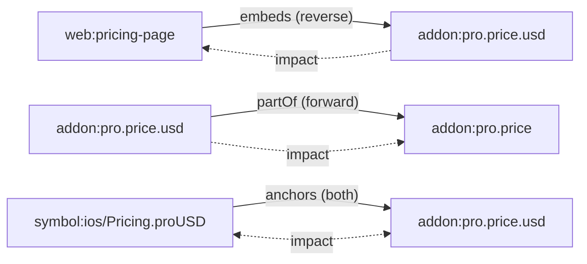

Edges are typed, directed relationships. There are 22 edge types (`EDGE_TYPES` in [`core/model.ts`](https://github.com/space-pirate-zero/starchart/blob/main/packages/starchart/src/core/model.ts)). This page lists every one with its layer, propagation direction, meaning, an example and who creates it. It also covers how duplicate edges merge (`Graph.addEdge` in [`core/graph.ts`](https://github.com/space-pirate-zero/starchart/blob/main/packages/starchart/src/core/graph.ts)) and how confidence decays during traversal ([`core/impact.ts`](https://github.com/space-pirate-zero/starchart/blob/main/packages/starchart/src/core/impact.ts)).

## Direction convention

**`from` depends on `to`.** `web:pricing-page --embeds--> addon:pro.price.usd` reads "the pricing page depends on the USD price". Impact flows against the arrow, from the changed `to` back to the dependent `from`.

Each type declares how change crosses it (`PROPAGATION`):

| Propagation | A change to… | …impacts |
|---|---|---|
| `reverse` (default) | `to` | `from` |
| `forward` | `from` | `to` |
| `both` | either end | the other end |
| `none` | — | nothing; structural or ordering only |



## Every edge type

"Creator" says where the edge normally comes from: **declared** (YAML: artifact fields, entity `of:`, nested facts, `edges:`), **extracted** (code ingestor), **annotation** (`@starchart <type>` comments), **discovered** (bridge proposals). Any type can also be declared in an `edges:` section.

### Code layer

| Type | Propagation | Meaning | Example | Creator |
|---|---|---|---|---|
| `imports` | reverse | File imports file (TS/JS module resolution). | `file:web/app/pricing/page.tsx --imports--> file:web/lib/pricing.ts` | extracted |
| `references` | reverse | Symbol uses symbol; parent type → member (`meta.member`); screen → its symbol; code → i18n key. | `symbol:ios/PaywallView.body --references--> symbol:ios/Pricing.proUSD` | extracted |
| `dependsOn` | reverse | File depends on a package. | `file:web/lib/stripe.ts --dependsOn--> pkg:npm/stripe` | extracted |
| `tests` | reverse | Test covers a symbol, screen or file. | `test:ios/Tests/PaywallTests.swift --tests--> symbol:ios/PaywallView` | extracted |
| `serves` | reverse | Route is served by a symbol (`default`, `GET`, …) or file. | `route:web/pricing --serves--> symbol:web/app/pricing/page#PricingPage` | extracted |
| `readsEnv` | reverse | Code reads an environment variable. | `symbol:ios/Telemetry.start --readsEnv--> env:SENTRY_DSN` | extracted |
| `readsFlag` | reverse | Code reads a feature flag. | `… --readsFlag--> flag:new-paywall` | extracted |
| `contains` | none* | File contains a symbol or i18n key. | `file:ios/Sources/Core/Pricing.swift --contains--> symbol:ios/Pricing.proUSD` | extracted |

\* `contains` is `none` in the table, but the traversal adds a special case: a changed symbol impacts its containing file at confidence **0.8**, so the coarse file-level `imports` graph still sees symbol edits. The lock's dependency walk also treats a file as depending on the symbols it contains.

### Bridges

| Type | Propagation | Meaning | Example | Creator |
|---|---|---|---|---|
| `anchors` | **both** | A code literal holds a fact value (or points at an artifact). Either side changing impacts the other. | `symbol:ios/Pricing.proUSD --anchors--> addon:pro.price.usd` | annotation; declared (`authority: code` resolution, `edges:`); discovered |
| `displays` | reverse | Code or a text file shows a fact on screen. | `file:web/public/banner.html --displays--> addon:pro.price.usd` | annotation, declared |
| `captures` | reverse | Artifact shows a screen. | `appstore:screenshots/6.9/03 --captures--> screen:ios/Paywall` | declared (`captures:`) |
| `publishes` | **forward** | Route publishes an artifact; route changes impact the artifact. | `route:web/pricing --publishes--> web:pricing-page` | declared (`publishedBy:`) |
| `emits` | **forward** | Code emits an analytics event; code changes impact the event. | `symbol:web/app/pricing/page#PricingPage --emits--> event:pro_checkout_started` | extracted |

### World layer

| Type | Propagation | Meaning | Example | Creator |
|---|---|---|---|---|
| `embeds` | reverse | The fact value appears literally in the artifact. | `web:pricing-page --embeds--> addon:pro.price.usd` | declared; discovered |
| `renders` | reverse | The artifact is generated from a template using the fact. | `web:og-pro --renders--> addon:pro.name` | declared |
| `describes` | reverse | Semantic description; wording may need review. | `web:landing-hero --describes--> addon:pro` | declared |
| `promotes` | reverse | Marketing claim about the target. | `reel:spring-2026 --promotes--> addon:pro` | declared |
| `mirrors` | reverse | A copy of the value in an external system. | `stripe:price/pro-monthly --mirrors--> addon:pro.price.usd` | declared |
| `derivedFrom` | reverse | Built from another artifact; also a design-token alias → its target. | `web:og-pro-de --derivedFrom--> web:og-pro`, `tokens.color.button --derivedFrom--> tokens.color.brand.primary` | declared (artifact `derivedFrom:`, token aliases) |
| `after` | none | Roll out `from` after `to`. | `web:live-pricing --after--> web:pricing-page` | declared |
| `blocks` | none | `from` must finish before `to`. | `web:pricing-page --blocks--> stripe:price/pro-monthly` | declared |

### Fact layer

| Type | Propagation | Meaning | Example | Creator |
|---|---|---|---|---|
| `partOf` | **forward** | Fact belongs to its parent fact or entity; entity belongs to its `of:` entity. A child change impacts the parent. | `addon:pro.price.usd --partOf--> addon:pro.price` | declared (nested facts, `of:`, tokens) |

Forward `partOf` is what makes `describes addon:pro` work: change any fact under `addon:pro`, and the change climbs to the entity and reaches everything that describes or promotes it.

`derivedFrom` shows up between facts too: the design-token importer adds `alias --derivedFrom--> target` for every token whose `$value` is exactly `{path}`. Change the target and impact reaches everything bound to the alias:

```text
  ~ auto  web:button-css              embeds       replace embedded value
      why: tokens.color.brand.primary --derivedFrom--> tokens.color.button --embeds--> web:button-css  (confidence 1)
```

That run used a scratch token file and artifact on a copy of the demo (the demo has no tokens). See [Design Tokens](Design-Tokens).

## Which edge decides the class

The **last hop** into a world artifact picks its class. `renders` → `auto`, `captures` → `manual`, `describes`/`promotes`/`derivedFrom`/`publishes`/`emits` → `review`, `embeds`/`mirrors` depend on media type and adapter. Code nodes reached via `anchors` are `code` (or `auto` if generated); when the hop comes from an artifact, the reason says the symbol holds that artifact's external id. Full table: [Impact Analysis](Impact-Analysis#classification-rules).

## Origins and merging duplicates

Every edge can carry an `origin`: `declared`, `annotation`, `extracted` or `discovered`. The code ingestor sets `extracted` (and `annotation` for comment directives), the compiler sets `declared`. `discovered` edges are *proposals* from `discoverEdges()` and `init --discover`. They are not added to the live graph by `buildProject`. Once you accept them into YAML they load as `declared`.

When the same `(from, type, to)` edge is added twice, `Graph.addEdge` merges:

- **Confidence:** `max(existing ?? 1, new ?? 1)`. A missing confidence counts as 1, so merging a 0.6 edge with an unscored one yields 1.
- **Origin:** the stronger wins, ranked `declared` (3) > `annotation` (2) > `extracted` (1) > `discovered` (0).
- **Other fields** (`meta`): the newer edge's fields overwrite the older ones.

## Confidence

Edge confidence is 0..1; declared and extracted edges default to 1. The ingestor lowers it where resolution is name-based:

| Source | Confidence |
|---|---|
| Swift/Kotlin `references` and `tests` edges resolved by type or member name | 0.8 |
| Swift/Kotlin implicit-member (`.foo`) reference with a unique static match | 0.6 |
| Go `references` and `tests` edges | 0.9 |
| Member edges (type → its member), TS references, imports, contains | 1 (unset) |
| Annotation edges and annotated screens | 1 |
| `edges:` entries with `confidence:` | as written, including `0` |

During impact traversal, path confidence is the product along the path:

```text
confidence(next) = confidence(current) × edge.confidence × DECAY[edge.type]
```

The per-hop decay table (`DECAY`) only applies to coarse code edges. Every other type decays by 1.

| Edge type | Decay per hop |
|---|---|
| `references` | 0.95 |
| `readsEnv` | 0.9 |
| `readsFlag` | 0.9 |
| `imports` | 0.85 |
| `dependsOn` | 0.7 |
| `contains` (symbol → file special case) | edge confidence forced to 0.8 |
| everything else | 1 |

Paths below `minConfidence` (default 0.3) are pruned, so an edge declared with `confidence: 0` is kept in the graph but never carries impact in `impact` or `plan`. `why` runs with `minConfidence: 0` and still finds the path (`class review · confidence 0 · …`). Real example: the price reaches the paywall test at 0.58 = 1 (anchors) × 0.8×0.95 (name-resolved Swift reference) × 1×0.95 (member edge `PaywallView → body`) × 0.8 (Swift test edge):

```text
addon:pro.price.usd --anchors--> symbol:ios/Pricing.proUSD --references--> symbol:ios/PaywallView.body --references--> symbol:ios/PaywallView --tests--> test:ios/Tests/PaywallTests.swift
class test · confidence 0.58 · run these tests
```

## See also

- [Impact Analysis](Impact-Analysis)
- [Three-Layer Model](Three-Layer-Model)
- [Annotations](Annotations)
- [Bridges and Discovery](Bridges-and-Discovery)
- [Node IDs](Node-IDs)
