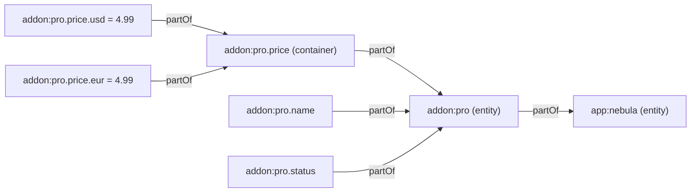

Facts are the canonical values in your chart. Entities are the things that own them. This page covers how an entity document compiles into nodes, how nested facts become leaf and container facts joined by `partOf`, the implicit `.status` fact, the fact-spec form (`value`, `authority`, `source`, `description`), what `authority` means, `of:` for entity hierarchies, the metadata fields (`owners`, `tags`, `validThrough`), and how container values are recomputed. The compiler lives in [`compiler/compile.ts`](https://github.com/space-pirate-zero/starchart/blob/main/packages/starchart/src/compiler/compile.ts); the schema in [`config/schema.ts`](https://github.com/space-pirate-zero/starchart/blob/main/packages/starchart/src/config/schema.ts).

## Entity documents

An entity doc is a YAML mapping (or an item under `entities:`). Fields, from the `EntityDoc` schema:

| Field | Type | Required | Becomes |
|---|---|---|---|
| `id` | string | yes | node id, kind `entity`, layer `fact` |
| `kind` | `"entity"` | no | marks the doc as an entity (see the gotcha below) |
| `type` | string or list | no | `types` (JSON-LD types, e.g. `schema:Offer`) |
| `label` | string | no | `label` |
| `of` | string | no | `partOf` edge from this entity to the parent entity |
| `status` | string | no | `status` on the entity, **and** an implicit `<id>.status` fact |
| `owners` | list of strings | no | `owners` on the entity and on every fact under it |
| `validThrough` | string | no | `validThrough` on the entity |
| `tags` | list of strings | no | `tags` |
| `facts` | mapping | no (default `{}`) | fact nodes (below) |
| `meta` | mapping | no | `meta` (the compiler adds `meta.file`) |

> **Gotcha.** The loader treats a standalone mapping as an entity only if it has `kind: entity` or a `facts` key. A doc like `id: brand:nebula` with just a `label` is loaded as an **artifact**. Add `kind: entity` (or put it under `entities:`) when an entity has no facts yet.

## Facts become nodes

Every key under `facts` becomes a fact node with id `<parent>.<key>`, and gets a `partOf` edge to its parent. Three shapes are recognised, checked in this order:

1. **Fact spec**: a mapping whose keys are all in `{value, authority, source, description}` and that contains at least one of `value`, `authority` or `source`. It becomes a leaf with that `value`, `authority` (default `graph`) and `source`. A string `description` is stored in the node's `meta.description`.
2. **Nested mapping**: any other non-empty object. It becomes a **container** fact, and each of its keys recurses.
3. **Anything else** (string, number, boolean, list, null): a leaf with that value and `authority: graph`.

From the demo's `pro.yaml`:

```yaml
facts:
  name: Nebula Pro
  price:
    usd: 4.99
    eur: 4.99
  productId: { value: nebula_pro_monthly, authority: appstore }
  features: { authority: code, source: { symbol: ios/Entitlements.proFeatures } }
```



The result, as `starchart query --prefix addon:pro` prints it:

```text
entity   addon:pro
fact     addon:pro.name = "Nebula Pro"
fact     addon:pro.price = {"usd":4.99,"eur":4.99}
fact     addon:pro.price.usd = 4.99
fact     addon:pro.price.eur = 4.99
fact     addon:pro.billing = "monthly"
fact     addon:pro.productId = "nebula_pro_monthly"
fact     addon:pro.features = ["Themes","iCloud sync"]
fact     addon:pro.status = "active"
```

Lists are leaves. `features: [Themes, iCloud sync]` is one fact whose value is an array, not two facts.

### Shape edge cases

The spec detection is purely key-based, so a few shapes surprise people:

| YAML | What you get |
|---|---|
| `seats: { value: 5, description: "Included seats" }` | leaf `seats = 5` |
| `limits: { value: 10, storage: 100 }` | container `limits` with leaves `limits.value` and `limits.storage` (`storage` is not a spec key) |
| `note: { description: "just text" }` | container `note` with a leaf `note.description` (a spec needs `value`, `authority` or `source`) |
| `price: { value: 4.99 }` | leaf `price = 4.99`, not a container with a `value` child |

`description` lands in `meta.description`, so `starchart node` shows it:

```text
{
  "id": "plan:team.seats",
  "kind": "fact",
  "value": 5,
  "authority": "graph",
  "meta": {
    "file": ".starchart/extra.yaml",
    "entity": "plan:team",
    "description": "Included seats"
  },
  "layer": "fact"
}
```

The JSON-LD export doesn't include `meta`, so descriptions don't appear there ([Vocabulary](Vocabulary)).

## The implicit `.status` fact

If an entity has a top-level `status` and its `facts` do not already define `status`, the compiler adds `<entity>.status` as a regular leaf fact with that value. Why: retiring something is a change like any other. Flip `status: active` to `status: retired`, and `starchart plan` sees `addon:pro.status` move:

```text
Change: addon:pro.status  "active" → "retired"

  ~ auto    symbol:ios/StarchartFacts.AddonPro.status        anchors    regenerate fact constants (codegen)
  ~ auto    symbol:web/lib/starchart-facts#ADDON_PRO_STATUS  anchors    regenerate fact constants (codegen)
  ✗ retire  email:onboarding-day-3                           describes  depends on a retired entity
  ✗ retire  reel:spring-2026                                 promotes   expired 2026-06-30
  ✗ retire  web:landing-hero                                 describes  depends on a retired entity
```

The entity node's `status` field is what the `retire` rule checks. See [Impact Analysis](Impact-Analysis).

## Authority

`authority` says where the truth for a fact lives. The compiler only gives meaning to two values; anything else is recorded for tools and adapters to read.

| Value | Meaning | What STARCHART does |
|---|---|---|
| `graph` (default) | The YAML is the truth. | Uses `value` as written. |
| `code` | A code symbol is the truth. | Requires `source.symbol`; after ingest, copies the symbol's literal value into the fact and adds `symbol --anchors--> fact`. A missing `source.symbol` is a hard `ConfigError`. See [Code Authority Facts](Code-Authority-Facts). |
| any other string (`appstore`, `stripe`, …) | An external system is the truth. | Stored as-is. The value you write is the expected value; audits compare it with the live system. |

`source` is a free-form mapping (`symbol`, `file`, `adapter`, …) stored on the node. Only `source.symbol` is interpreted by the compiler, and only for `authority: code`. Design tokens set `source: { file: <tokens file> }`.

Containers have no `authority`; only leaves do.

## `of:` entity hierarchies

`of: app:nebula` adds `addon:pro --partOf--> app:nebula`. `partOf` propagates forward, so any fact change under `addon:pro` also reaches `app:nebula` and anything that `describes` or `promotes` the app. The SEO renderer uses the same edge to list add-on offers inside the app's `SoftwareApplication` markup ([JSON-LD and SEO](JSON-LD-and-SEO)).

If `of` names an entity that doesn't exist, `buildProject` prints a dangling-reference warning.

## Owners, tags, validThrough

- **`owners`** is copied from the entity onto every fact under it. Rules (the `core` pack checks ownership) and the viewer read them.
- **`tags`** is stored on the entity. When nodes merge, tag lists merge too.
- **`validThrough`** is stored on the entity. The impact classifier checks `validThrough` on **artifacts**, not entities. An expired entity does not retire its dependents; an expired artifact does. The SEO renderer uses entity `validThrough` for `priceValidUntil`.

## How container values are recomputed

A container's value is the object assembled from its children, keyed by the last segment of each child's id. It's computed twice:

1. **At compile time**, `flattenFacts` returns the assembled value of each nested mapping and stores it on the container.
2. **After code ingest**, `resolveCodeFacts` fills in `authority: code` leaves and then calls `recomputeContainers`. That walks every entity's incoming `partOf` fact edges recursively and rewrites each container's `value` from its leaves. This is how a container over a code fact gets the right value.

Entity nodes never get a `value`, even though they're the root of the walk.

The lockfile hashes containers like any other fact. Change `addon:pro.price.usd` and both `addon:pro.price.usd` and `addon:pro.price` show up in `starchart plan`:

```text
Change: addon:pro.price  {"usd":4.99,"eur":4.99} → {"usd":5.99,"eur":4.99}
Change: addon:pro.price.usd  4.99 → 5.99
```

> **Heads-up:** with `skipCode` (library callers, and the CLI's `journals`, `history` and `adapters` commands), ingest doesn't run, so `authority: code` facts have no value and containers are not recomputed. `starchart emit jsonld` always ingests code, with or without `--code`.

## See also

- [Authoring YAML](Authoring-YAML)
- [Code Authority Facts](Code-Authority-Facts)
- [Design Tokens](Design-Tokens)
- [Node IDs](Node-IDs)
- [Lockfile and Drift](Lockfile-and-Drift)
