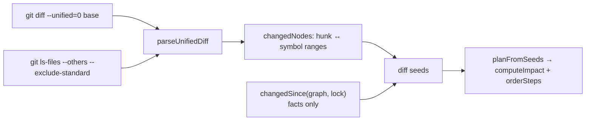

`starchart impact --diff <base>` answers the PR question: "this diff touches which pages, listings, prices and screenshots?" It maps every changed line to the code nodes it lands in, adds any fact values that moved since `starchart.lock`, and runs the normal cross-layer impact walk from there. This page explains how hunks become nodes, how untracked and deleted files are handled, how diff seeds combine with fact changes, how to use it in pull requests, and shows a real run.

Source: [`code/diff.ts`](https://github.com/space-pirate-zero/starchart/blob/main/packages/starchart/src/code/diff.ts) and `planFromDiff` in [`api.ts`](https://github.com/space-pirate-zero/starchart/blob/main/packages/starchart/src/api.ts).

## Pipeline



## Step 1: what git is asked

`changedNodesFromDiff(root, codeConfig, graph, base)` runs two commands in the project root (via `execFile`, no shell):

```bash
git -c core.quotePath=false diff --unified=0 --no-color --no-ext-diff --no-renames --relative <base> --
git -c core.quotePath=false ls-files --others --exclude-standard
```

| Flag | Why |
|---|---|
| `--unified=0` | Hunks carry exact changed line ranges, no context lines |
| `--no-renames` | A rename is a delete plus an add, so both ends are seen |
| `--relative` | Paths come out relative to the project root even inside a monorepo |
| `core.quotePath=false` + unquoting | Non-ASCII paths (`café.swift`) survive; C-style quoted paths are decoded too |
| `<base> --` | Compares the **working tree** (staged and unstaged) with `base` |

`base` is any revision git accepts: `HEAD`, `main`, `origin/main`, a SHA, or a range such as `main...HEAD` (then git compares commits and working-tree edits are ignored). Untracked files that are not gitignored are always added as whole-file changes.

## Step 2: hunks to nodes

Each file in the diff becomes a `FileChange`:

| Field | Source |
|---|---|
| `ranges` | `@@ -a,b +c,d @@` with `d > 0`: new-file lines `c … c+d-1` were added or modified |
| `gaps` | `d = 0`: lines were deleted between new-file line `c` and `c+1` |
| `whole` | `new file mode`, `Binary files …`, or untracked |
| `deleted` | `deleted file mode` or `+++ /dev/null` (the old path is kept) |

Then, per change:

1. **File node.** The matching `file:` / `test:` node. If the file is not in the graph (deleted, or brand new and not yet ingested) and it classifies as code or MDX in some scope, the id is computed anyway (`file:<scope>/<rel>` or `test:…`). Files outside every scope, and non-code files (Markdown, YAML, images) that carry no annotations, produce nothing.
2. **Deleted files** stop there: the file id is a seed, its old symbols are gone from the graph.
3. **Symbols.** Every symbol located in the file whose line range (or each of its overload `ranges`) overlaps a changed range. A gap counts when it falls inside a symbol (`start ≤ gap < end`). A `whole` change seeds every symbol in the file. Containers overlap too: editing `Entitlements.proFeatures` also seeds the enclosing `Entitlements` enum.
4. **Localization keys.** For catalog files, each key "owns" the lines from its own line up to the next key. Keys whose span overlaps a hunk are seeds. If a catalog changed but no key span matched (say, a reformat at the top of the file), **every** key in that file is seeded.

Seeds are de-duplicated and sorted.

## Step 3: combining with fact changes

`planFromDiff(project, base, extra?)`:

```ts
export async function planFromDiff(project: Project, base: string, extra?: ImpactOptions): Promise<Plan>
```

1. Diff seeds from step 2 (ids only, no before/after).
2. Plus every **fact** whose value differs from `starchart.lock` (`changedSince(graph, lock)` filtered to `kind === "fact"`), with its locked `before` and current `after`. Code-hash drift from the lock is deliberately left out; the diff already says which code moved.
3. De-duplicated, then `planFromSeeds()`: impact walk, classification, rollout ordering.

Why step 2 matters: editing a constant that backs a [code-authority fact](Code-Authority-Facts), or a value in `.starchart/entities/*.yaml`, changes a fact. Those YAML edits never appear as code nodes, but the plan still carries them, with their old and new values.

## Real example

A temp copy of the demo, committed, then one Swift line changed:

```bash
D=$(mktemp -d)/u && cp -R examples/pro-universe $D && cd $D
git init -q && git add -A && git commit -qm "chart the universe"
# add a Pro feature in code
sed -i '' 's/\["Themes", "iCloud sync"\]/["Themes", "iCloud sync", "Widgets"]/' apps/ios/Sources/Core/Entitlements.swift
```

```text
$ git diff --unified=0
diff --git a/apps/ios/Sources/Core/Entitlements.swift b/apps/ios/Sources/Core/Entitlements.swift
index 6be7fc3..2e35395 100644
--- a/apps/ios/Sources/Core/Entitlements.swift
+++ b/apps/ios/Sources/Core/Entitlements.swift
@@ -5 +5 @@ enum Entitlements {
-    static let proFeatures = ["Themes", "iCloud sync"]
+    static let proFeatures = ["Themes", "iCloud sync", "Widgets"]
```

```text
$ starchart impact --diff HEAD
Change: file:ios/Sources/Core/Entitlements.swift
Change: symbol:ios/Entitlements
Change: symbol:ios/Entitlements.proFeatures
Change: addon:pro.features  ["Themes","iCloud sync"] → ["Themes","iCloud sync","Widgets"]

  ! manual  appstore:screenshots/6.9/03                        captures   screen changed; re-capture
  ~ auto    symbol:ios/StarchartFacts.AddonPro.features        anchors    regenerate fact constants (codegen)
  ~ auto    symbol:web/lib/starchart-facts#ADDON_PRO_FEATURES  anchors    regenerate fact constants (codegen)
  ? review  appstore:listing/description                       describes  describes this semantically
  ? review  web:pricing-page                                   describes  describes this semantically
  ? review  email:onboarding-day-3                             describes  describes this semantically
  ? review  web:landing-hero                                   describes  describes this semantically
  ✗ retire  reel:spring-2026                                   promotes   expired 2026-06-30
  ✓ tests   test:ios/Tests/PaywallTests.swift                  tests      run these tests

Order: appstore:listing/description → appstore:screenshots/6.9/03 → symbol:ios/StarchartFacts.AddonPro.features → symbol:web/lib/starchart-facts#ADDON_PRO_FEATURES → email:onboarding-day-3 → web:landing-hero → web:pricing-page → reel:spring-2026

Plan: 1 manual · 2 auto · 4 review · 1 retire · 1 tests
(3 informational items hidden; use --verbose)
```

Read it top to bottom:

- One hunk at line 5 seeded the file, the `proFeatures` constant and its enclosing `Entitlements` enum.
- `addon:pro.features` is a code-authority fact sourced from that constant, so its value moved relative to the lock. It joins the seeds with its before/after values.
- The screenshot is `manual` through the **code** path: `proFeatures` is referenced by `PaywallView.body`, which is the `Paywall` screen the screenshot `captures`.
- The two generated constants are `auto`: `starchart apply` regenerates the `codegen:` targets for them (or run `starchart codegen` yourself).

The same run as a PR comment (`-f markdown`), trimmed:

```text
$ starchart impact --diff HEAD -f markdown
## 🌌 STARCHART blast radius

**4 changes:**

- `file:ios/Sources/Core/Entitlements.swift`
- `symbol:ios/Entitlements`
- `symbol:ios/Entitlements.proFeatures`
- `addon:pro.features` `["Themes","iCloud sync"]` → `["Themes","iCloud sync","Widgets"]`

| | Class | Count |
|---|---|---:|
| ! | Manual | 1 |
| ~ | Auto-fixable | 2 |
| ? | Needs review | 4 |
| ✗ | Retire | 1 |
| ✓ | Tests to run | 1 |

<details open><summary><b>! Manual</b> (1)</summary>

| Artifact | Via | Reason | Why |
|---|---|---|---|
| `appstore:screenshots/6.9/03` | captures | screen changed; re-capture | <code>symbol:ios/Entitlements.proFeatures --references--&gt; symbol:ios/PaywallView.body --references--&gt; symbol:ios/PaywallView --references--&gt; screen:ios/Paywall --captures--&gt; appstore:screenshots/6.9/03</code> |

</details>
…
### Rollout order

1. `appstore:listing/description` (review)
2. `appstore:screenshots/6.9/03` (manual)
…
---
<sub>Charted by <b>STARCHART</b> · run <code>starchart plan</code> locally for details</sub>
```

`break` and `manual` sections render open; the rest collapse. Each class section is capped at 50 rows. `-f json` gives the stable `PlanJson` structure (`changes`, `items` with `why` and `path`, `steps`, `cycles`, `summary`).

Committing on a branch and diffing against the merge base works the same way:

```text
$ starchart impact --diff main...HEAD | head -4
Change: file:ios/Sources/Core/Entitlements.swift
Change: symbol:ios/Entitlements
Change: symbol:ios/Entitlements.proFeatures
Change: addon:pro.features  ["Themes","iCloud sync"] → ["Themes","iCloud sync","Widgets"]
```

## Using it on pull requests

The bundled [GitHub Action](GitHub-Action) runs exactly this:

```bash
npx --yes "@space-pirate-zero/starchart@latest" impact --diff "origin/${base}" --format markdown > "$RUNNER_TEMP/starchart.md"
```

and posts the result as a sticky comment. That needs `@space-pirate-zero/starchart` on npm, and it isn't published yet, so the Action won't run today. Until it is, build STARCHART from source in the job:

```yaml
- uses: actions/checkout@v4
  with: { fetch-depth: 0 }          # the base branch must exist locally
- uses: pnpm/action-setup@v4
  with: { version: 10 }
- uses: actions/setup-node@v4
  with: { node-version: 22 }
- run: git fetch origin main
- run: |
    git clone --depth 1 https://github.com/space-pirate-zero/starchart.git "$RUNNER_TEMP/starchart"
    cd "$RUNNER_TEMP/starchart" && pnpm install && pnpm build
- run: node "$RUNNER_TEMP/starchart/packages/starchart/dist/cli/bin.js" impact --diff origin/main -f markdown > blast-radius.md
- run: node "$RUNNER_TEMP/starchart/packages/starchart/dist/cli/bin.js" check   # optional: fail on lockfile drift
```

Once the package is published, the two `node …/bin.js` lines become `npx @space-pirate-zero/starchart impact …` and `npx @space-pirate-zero/starchart check`. Never bare `npx starchart`: that unscoped npm package is someone else's.

Notes:

- `impact --diff` **never fails the build** on findings; it exits 0 whatever the plan says. Gate with `starchart check` (exit 1 on stale artifacts) or `starchart rules`.
- Shallow clones break the diff. Fetch the base ref.
- A bad base is a hard error (exit 2): `starchart: git core.quotePath=false diff … nosuchref -- failed: fatal: bad revision 'nosuchref'`.
- Seeds are code nodes, so `--all-code` is often useful in review to see every impacted symbol, not just the surface (screens, routes, tests, anchors).

## Library use

```ts
import { buildProject, changedNodesFromDiff, planFromDiff, formatPlanMarkdown } from "@space-pirate-zero/starchart";

const project = await buildProject(process.cwd());
const ids = await changedNodesFromDiff(project.root, project.loaded.config.code, project.graph, "origin/main");
const plan = await planFromDiff(project, "origin/main", { includeCode: "all" });
console.log(formatPlanMarkdown(plan, { title: "Blast radius", maxItems: 20 }));
```

The [MCP server](MCP-Server) exposes the same thing as `starchart_diff_impact`.

## Limitations

- Only files inside a configured code scope map to nodes. A changed Markdown email or a YAML artifact file is not a seed by itself (YAML **fact** edits still arrive through the lock comparison).
- Renames are delete + add, so a moved file's symbols get new ids and old pins read as removed.
- A diff that only touches lines outside every symbol (imports, blank lines between declarations) seeds just the file node, which rarely reaches the world layer. That is by design.
- The git error message prints `core.quotePath=false` as if it were a subcommand argument (cosmetic: only `-c` is filtered from the echo).

## See also

- [Impact Analysis](Impact-Analysis)
- [Code Ingestion](Code-Ingestion)
- [Lockfile and Drift](Lockfile-and-Drift)
- [GitHub Action](GitHub-Action)
- [CLI Reference](CLI-Reference)
