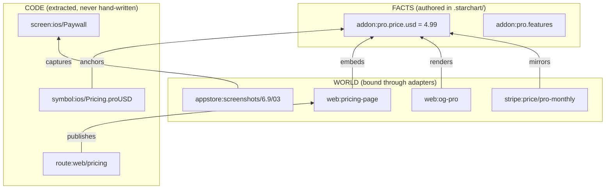

```text
  ·      ✦          ·        ★            ·          ✦         ·       ·
███████╗████████╗ █████╗ ██████╗  ██████╗██╗  ██╗ █████╗ ██████╗ ████████╗
██╔════╝╚══██╔══╝██╔══██╗██╔══██╗██╔════╝██║  ██║██╔══██╗██╔══██╗╚══██╔══╝
███████╗   ██║   ███████║██████╔╝██║     ███████║███████║██████╔╝   ██║
╚════██║   ██║   ██╔══██║██╔══██╗██║     ██╔══██║██╔══██║██╔══██╗   ██║
███████║   ██║   ██║  ██║██║  ██║╚██████╗██║  ██║██║  ██║██║  ██║   ██║
╚══════╝   ╚═╝   ╚═╝  ╚═╝╚═╝  ╚═╝ ╚═════╝╚═╝  ╚═╝╚═╝  ╚═╝╚═╝  ╚═╝   ╚═╝
☠ EVERY DEPENDENCY. CODE TO COSMOS. ────────── A SPACE PIRATE ZERO JOINT ☠
     ·         ·         ✦           ·          ★          ·         ·
```

**Every dependency. Code to cosmos.** This is the STARCHART wiki: what the tool is, why it exists, what it looks like on a real change, and a map of every page. Start here, then jump to [Getting Started](Getting-Started) or the [Pro Universe tutorial](Tutorial-Pro-Universe).

## What STARCHART is

STARCHART is a dependency graph for everything your product touches, not just your code. It charts three layers (code, facts and world) and the bridges between them, so a price, a product id or a Swift view is connected to the website, the OG image, the App Store listing, the Stripe price and the promo reel that depend on it. Change anything on any layer and STARCHART tells you what else is now wrong, explains why, fixes what it can, and turns the rest into a checklist.



Arrows point the way you read them in YAML ("the page embeds the price", "the screenshot captures the paywall"). Impact mostly flows against them: change the price and the page, the OG image and the Stripe price light up; change the paywall screen and the screenshot goes stale. (`anchors` works both ways, and `publishes` runs with the arrow.) See [Three-Layer Model](Three-Layer-Model) and [Edge Types](Edge-Types).

## What a change looks like

This is real output from the bundled demo after bumping `addon:pro.price.usd` from 4.99 to 5.99 in `.starchart/entities/pro.yaml` (a temp copy of `examples/pro-universe`):

```text
$ starchart plan
Change: addon:pro.price  {"usd":4.99,"eur":4.99} → {"usd":5.99,"eur":4.99}
Change: addon:pro.price.usd  4.99 → 5.99

  ! manual  appstore:iap/pro-monthly                            mirrors    update in appstore (adapter is read-only)
  ! manual  appstore:listing/description                        embeds     adapter "appstore" cannot write
  ! manual  appstore:screenshots/6.9/03                         embeds     value is burned into media
  ! manual  stripe:price/pro-monthly                            mirrors    update in stripe (adapter is read-only)
  ! manual  web:live-pricing                                    embeds     adapter "url" cannot write
  ~ auto    email:onboarding-day-3                              embeds     replace embedded value
  ~ auto    symbol:ios/StarchartFacts.AddonPro.Price.usd        anchors    regenerate fact constants (codegen)
  ~ auto    symbol:web/lib/starchart-facts#ADDON_PRO_PRICE_USD  anchors    regenerate fact constants (codegen)
  ~ auto    web:messages-en                                     embeds     replace embedded value
  ~ auto    web:og-pro                                          renders    regenerate from template
  ~ auto    web:pricing-page                                    embeds     replace embedded value
  ? review  web:landing-hero                                    describes  describes this semantically
  ⌘ code    symbol:ios/Pricing.proUSD                           anchors    hardcoded value anchors this fact; update or switch to codegen
  ⌘ code    symbol:web/lib/stripe#PRICE_PRO_MONTHLY             anchors    holds this artifact's external id; update it if the id changes
  ✗ retire  reel:spring-2026                                    embeds     expired 2026-06-30
  ✓ tests   test:ios/Tests/PaywallTests.swift                   tests      run these tests

Order: stripe:price/pro-monthly → appstore:iap/pro-monthly → appstore:listing/description → … → web:live-pricing → reel:spring-2026

Plan: 5 manual · 6 auto · 1 review · 2 code · 1 retire · 1 tests
(4 informational items hidden; use --verbose)
```

One YAML edit. Sixteen things across code, stores, payments, web, email and video. `starchart apply` then rewrites the pricing page, the web copy and the email, re-renders the OG PNG, regenerates the two codegen constants, journals an undo record and relocks. The Stripe and App Store items stay manual because external writes are opt-in, and `plan` keeps listing them (in step with `starchart check`) until someone does the work and runs `starchart ack`.

## Why

Code has dependency graphs. The world around your code doesn't, and nothing connects the two.

- `dependency-cruiser`, Nx and Bazel know `PaywallView.swift` references `Pricing.swift`. They have no idea App Store screenshot 3 shows that paywall, that the website says "$4.99", or that a promo reel burned the price into a video.
- Marketing tools know the website. They have no idea `ProductID.proMonthly` in the iOS app has to match an App Store product and a Stripe price.

So you change the Pro add-on and play whack-a-mole across code, copy, stores, images and video. Something always gets missed. STARCHART makes the misses a build failure instead of a customer email.

## Features

### Chart

- **Three-layer graph** of code, facts and world, joined by typed edges. [Three-Layer Model](Three-Layer-Model) · [Facts and Entities](Facts-and-Entities) · [Artifacts and Bindings](Artifacts-and-Bindings)
- **Code layer extracted automatically**: TS/JS, Swift, Kotlin, Go, Next.js routes, SwiftUI/Compose screens, packages, env, flags, events, i18n and tests. [Code Ingestion](Code-Ingestion)
- **Bridges** from code to facts with `@starchart` annotations, code-authority facts and discovery. [Annotations](Annotations) · [Code-Authority Facts](Code-Authority-Facts) · [Bridges and Discovery](Bridges-and-Discovery)
- **Viewer**: a self-contained interactive star chart, plus a local server. [Viewer and Serve](Viewer-and-Serve)

### Check

- **Cross-layer impact** with a "why" path on every line. [Impact Analysis](Impact-Analysis) · [Git Diff Impact](Git-Diff-Impact)
- **Lockfile drift**: `starchart check` fails CI when an artifact is stale. [Lockfile and Drift](Lockfile-and-Drift)
- **Live audit and break detection** against your site, Stripe and App Store Connect. [Audit and Break Detection](Audit-and-Break-Detection)
- **Rules and packs** (core, appstore, privacy, seo), including privacy-manifest drift. [Rules Engine](Rules-Engine) · [Rule Packs](Rule-Packs) · [Privacy Drift](Privacy-Drift)
- **Orphans, Reality Score, change cost.** [Orphans](Orphans) · [Reality Score](Reality-Score) · [Change Cost](Change-Cost)

### Fix

- **Plan / apply / revert** with journals and a relock. [Apply, Revert and Journals](Apply-Revert-and-Journals) · [Rollout Ordering](Rollout-Ordering)
- **Codegen**: facts become TS, Swift and Kotlin constants that can't drift. [Codegen](Codegen)
- **Future Universe preview** of a plan as HTML. [Future Universe Preview](Future-Universe-Preview)
- **JSON-LD** schema.org blocks from the same facts. [JSON-LD and SEO](JSON-LD-and-SEO)

### Integrate

- **Claude Code hook**: every file an agent edits gets its world impact injected back. [Claude Code Hook](Claude-Code-Hook)
- **MCP server** for any agent. [MCP Server](MCP-Server)
- **GitHub Action**: a sticky PR comment with the blast radius. [GitHub Action](GitHub-Action)
- **Reality X-Ray** browser extension. [Reality X-Ray](Reality-X-Ray)
- **Plugins**: custom adapters and rule packs load from `plugins:` in config, so the CLI, MCP server and hook all see them. [Writing an Adapter](Writing-an-Adapter) · [Rule Packs](Rule-Packs)

## Quick start

Install it in your project from npm:

```bash
npm i -D @space-pirate-zero/starchart
```

Always use the scoped name `@space-pirate-zero/starchart`: the unscoped `starchart` package on npm belongs to someone else. Once it's installed locally, `npx starchart` runs your copy:

```bash
npx starchart init --discover
```

```bash
npx starchart lock
```

`init` writes `.starchart/config.yaml` and detects your code scopes. `--discover` proposes facts, artifacts and bridges in `.starchart/proposals/discovered.yaml`, which the loader ignores until you review it and move it into `.starchart/` (for example `.starchart/entities/offer.yaml`). `lock` pins every artifact to today's facts and code. Commit `.starchart/` and `starchart.lock`. No install? `npx @space-pirate-zero/starchart <command>` does the same thing. Full walkthrough: [Getting Started](Getting-Started).

## Where to go next

| Section | Pages |
|---|---|
| **Guides** | [Getting Started](Getting-Started) · [Tutorial: Pro Universe](Tutorial-Pro-Universe) · [FAQ and Troubleshooting](FAQ-and-Troubleshooting) |
| **Concepts** | [Three-Layer Model](Three-Layer-Model) · [Facts and Entities](Facts-and-Entities) · [Artifacts and Bindings](Artifacts-and-Bindings) · [Edge Types](Edge-Types) · [Node IDs](Node-IDs) · [Impact Analysis](Impact-Analysis) · [Lockfile and Drift](Lockfile-and-Drift) · [Rollout Ordering](Rollout-Ordering) |
| **Authoring** | [Configuration](Configuration) · [Authoring YAML](Authoring-YAML) · [Annotations](Annotations) · [Code-Authority Facts](Code-Authority-Facts) · [Design Tokens](Design-Tokens) · [Vocabulary](Vocabulary) |
| **Code layer** | [Code Ingestion](Code-Ingestion) · [Git Diff Impact](Git-Diff-Impact) · [Bridges and Discovery](Bridges-and-Discovery) |
| **Commands & API** | [CLI Reference](CLI-Reference) · [Library API](Library-API) · [Codegen](Codegen) · [JSON-LD and SEO](JSON-LD-and-SEO) · [Time Machine](Time-Machine) |
| **Adapters & engine** | [Adapters Overview](Adapters-Overview) · [Adapter: fs](Adapter-fs) · [Adapter: url](Adapter-url) · [Adapter: Stripe](Adapter-Stripe) · [Adapter: App Store Connect](Adapter-App-Store-Connect) · [Writing an Adapter](Writing-an-Adapter) · [Audit and Break Detection](Audit-and-Break-Detection) · [Apply, Revert and Journals](Apply-Revert-and-Journals) · [Future Universe Preview](Future-Universe-Preview) · [Viewer and Serve](Viewer-and-Serve) · [Reality X-Ray](Reality-X-Ray) |
| **Rules & analysis** | [Rules Engine](Rules-Engine) · [Rule Packs](Rule-Packs) · [Privacy Drift](Privacy-Drift) · [Orphans](Orphans) · [Reality Score](Reality-Score) · [Change Cost](Change-Cost) |
| **Integrations** | [MCP Server](MCP-Server) · [Claude Code Hook](Claude-Code-Hook) · [GitHub Action](GitHub-Action) |
| **Project** | [Architecture](Architecture) · [Contributing](Contributing) · [Security](Security) · [Roadmap](Roadmap) |

STARCHART is a Space Pirate Zero project, licensed Apache-2.0. Source: [space-pirate-zero/starchart](https://github.com/space-pirate-zero/starchart).

## See also

- [Getting Started](Getting-Started)
- [Tutorial: Pro Universe](Tutorial-Pro-Universe)
- [Three-Layer Model](Three-Layer-Model)
- [CLI Reference](CLI-Reference)

```text
        ·              ✦                ·
    ★               _________               ·
                .-'           '-.
     ·         /                 \         ✦
              |   .---.   .---.   |
              |   ( ✦ )   ( ✦ )   |
      ✦        \  '---'   '---'  /        ·
                '.     /_\     .'
                  |'|'|'|'|'|'|
                  '-._______.-'
                        ·
      \\\\\\                         //////
           >=======   S P Z   =======<
      //////                         \\\\\\
            ·           ★           ·
```
