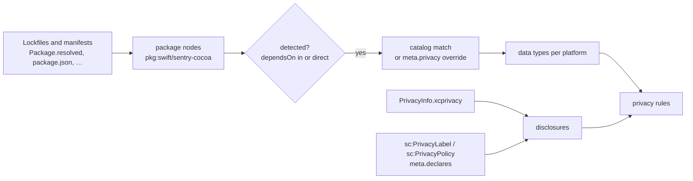

Privacy drift is the gap between what your SDKs actually collect and what your disclosures say they collect. Someone adds Sentry to the iOS app. Now your `PrivacyInfo.xcprivacy` and your App Store privacy label are both wrong, and nothing tells you until App Review or a regulator does. STARCHART catches it in the PR. This page explains how SDKs are detected from the code layer, lists the full SDK catalog, covers where disclosures are read from (manifests, store labels, privacy policies) and what the three `privacy` rules enforce. It then walks through real `starchart privacy` output from the demo and how to fix each finding, and ends with the known limitations.

## How it works



1. [Code ingestion](Code-Ingestion) turns lockfiles and manifests into `package` nodes (`pkg:<type>/<name>`) and adds `file --dependsOn--> package` edges where code imports them.
2. Each detected package is matched against the catalog (or its per-package override), which gives the Apple data types it collects and which platforms it ships on.
3. Disclosures are collected from every `*.xcprivacy` file in the repo and from `sc:PrivacyLabel` / `sc:PrivacyPolicy` artifacts.
4. The three rules compare the two per platform.

## SDK detection

A node counts as a package when `kind` is `package` or its id starts with `pkg:`. It is **detected** when either:

- some code node depends on it (an incoming `dependsOn` edge), or
- it is a declared, direct dependency (`meta.declared === true`, `meta.direct === true` or `meta.transitive === false`).

So a dependency listed in `package.json` counts even if no file imports it yet. In the demo, `@sentry/nextjs` is listed but unused, and it is still detected. Transitive-only pins (for example, `Package.resolved` entries the project never declares) are not.

Catalog package patterns use `*` as a wildcard and match case-insensitively. One package can match more than one catalog entry, and each match is reported.

### Platform scoping

Every detection is scoped to platforms from the package's type (the `pkg:<type>/` prefix) and name. A disclosure only has to cover SDKs on its own platforms.

| Package id | Platforms |
|---|---|
| `pkg:swift/…`, `pkg:cocoapods/…`, `pkg:carthage/…` | ios |
| `pkg:gradle/…`, `pkg:maven/…` | android |
| `pkg:pub/…` | ios, android |
| `pkg:npm/…` with `react-native`, `expo`, `capacitor`, `cordova` or `ionic` in the name | ios, android |
| `pkg:npm/…` with `node` as a name segment, or `server` anywhere in the name | server |
| any other `pkg:npm/…` | web |
| any other package type (go, cargo, …) | server |
| an id that isn't `pkg:<eco>/<name>` | ios, android, web, server |

### First-party analytics events

If the code layer has any `event` nodes (analytics calls like `track("pro_checkout_started")`), STARCHART adds a synthetic detection `app-events` (package `event:*`) collecting `ProductInteraction`. Its platforms come from the emitting files' extensions: `.swift/.m/.mm` → ios, `.kt/.kts/.java` → android, `.ts/.tsx/.js/.jsx/.mjs/.cjs/.vue/.svelte` → web, `.go/.py/.rb/.rs` → server. An unknown emitter means all platforms. This is skipped entirely when any detected SDK already collects `ProductInteraction`, on any platform.

## The catalog

The catalog lives in [`rules/packs/privacy-catalog.ts`](https://github.com/space-pirate-zero/starchart/blob/main/packages/starchart/src/rules/packs/privacy-catalog.ts). Data types use Apple's `NSPrivacyCollectedDataType` short names.

- **Default** types are enforced: every applicable disclosure must declare them.
- **Optional** types are only collected when you use a feature (`identify()`, `sendDefaultPii`, session replay). They show up in `starchart privacy` output but are not enforced.
- **Tracking** is Apple's ATT sense: data linked with third-party data for advertising.

| SDK (`id`) | Packages | Default data types | Optional | Tracking |
|---|---|---|---|---|
| Sentry (`sentry`) | `pkg:npm/@sentry/*`<br>`pkg:swift/sentry-cocoa`<br>`pkg:cocoapods/Sentry`<br>`pkg:gradle/io.sentry:*` | `CrashData`, `PerformanceData`, `OtherDiagnosticData` | `DeviceID` (when sendDefaultPii is enabled) | no |
| PostHog (`posthog`) | `pkg:npm/posthog-js`<br>`pkg:npm/posthog-node`<br>`pkg:npm/posthog-react-native`<br>`pkg:swift/posthog-ios`<br>`pkg:cocoapods/PostHog`<br>`pkg:gradle/com.posthog:*`<br>`pkg:gradle/com.posthog.android:*` | `ProductInteraction`, `DeviceID` | `UserID` (when identify() is called) | no |
| Firebase Analytics (`firebase-analytics`) | `pkg:npm/firebase`<br>`pkg:npm/@firebase/analytics`<br>`pkg:npm/@react-native-firebase/analytics`<br>`pkg:swift/firebase-ios-sdk`<br>`pkg:cocoapods/FirebaseAnalytics`<br>`pkg:gradle/com.google.firebase:firebase-analytics*` | `ProductInteraction`, `DeviceID`, `CoarseLocation` | — | no |
| Firebase Crashlytics (`firebase-crashlytics`) | `pkg:npm/@react-native-firebase/crashlytics`<br>`pkg:cocoapods/FirebaseCrashlytics`<br>`pkg:gradle/com.google.firebase:firebase-crashlytics*` | `CrashData`, `DeviceID` | — | no |
| Amplitude (`amplitude`) | `pkg:npm/@amplitude/*`<br>`pkg:npm/amplitude-js`<br>`pkg:swift/amplitude-swift`<br>`pkg:swift/amplitude-ios`<br>`pkg:cocoapods/Amplitude*`<br>`pkg:gradle/com.amplitude:*` | `ProductInteraction`, `DeviceID` | `UserID` (when setUserId() is called) | no |
| Mixpanel (`mixpanel`) | `pkg:npm/mixpanel`<br>`pkg:npm/mixpanel-browser`<br>`pkg:npm/mixpanel-react-native`<br>`pkg:swift/mixpanel-swift`<br>`pkg:swift/mixpanel-iphone`<br>`pkg:cocoapods/Mixpanel*`<br>`pkg:gradle/com.mixpanel.android:*` | `ProductInteraction`, `DeviceID` | `UserID` (when identify() is called) | no |
| Segment (`segment`) | `pkg:npm/@segment/analytics-next`<br>`pkg:npm/@segment/analytics-node`<br>`pkg:npm/@segment/analytics-react-native`<br>`pkg:npm/analytics-node`<br>`pkg:swift/analytics-swift`<br>`pkg:swift/analytics-ios`<br>`pkg:gradle/com.segment.analytics.kotlin:*`<br>`pkg:gradle/com.segment.analytics.android:*` | `ProductInteraction`, `DeviceID` | `UserID` (when identify() is called) | no |
| RevenueCat (`revenuecat`) | `pkg:swift/purchases-ios`<br>`pkg:cocoapods/RevenueCat`<br>`pkg:npm/react-native-purchases`<br>`pkg:npm/@revenuecat/*`<br>`pkg:gradle/com.revenuecat.purchases:*` | `PurchaseHistory`, `UserID`, `DeviceID` | — | no |
| Facebook SDK (`facebook`) | `pkg:swift/facebook-ios-sdk`<br>`pkg:cocoapods/FBSDK*`<br>`pkg:npm/react-native-fbsdk-next`<br>`pkg:gradle/com.facebook.android:*` | `DeviceID`, `ProductInteraction`, `AdvertisingData` | — | **yes** |
| Google Mobile Ads (`google-mobile-ads`) | `pkg:swift/google-mobile-ads`<br>`pkg:swift/swift-package-manager-google-mobile-ads`<br>`pkg:cocoapods/Google-Mobile-Ads-SDK`<br>`pkg:npm/react-native-google-mobile-ads`<br>`pkg:gradle/com.google.android.gms:play-services-ads*` | `DeviceID`, `AdvertisingData`, `CoarseLocation` | — | **yes** |
| Stripe (`stripe`) | `pkg:swift/stripe-ios`<br>`pkg:swift/stripe-ios-spm`<br>`pkg:cocoapods/Stripe*`<br>`pkg:npm/@stripe/stripe-js`<br>`pkg:npm/@stripe/stripe-react-native`<br>`pkg:gradle/com.stripe:*` | `PaymentInfo`, `PurchaseHistory` | `EmailAddress` (when collected at checkout) | no |
| Datadog (`datadog`) | `pkg:npm/@datadog/browser-rum*`<br>`pkg:npm/@datadog/browser-logs`<br>`pkg:npm/@datadog/mobile-react-native`<br>`pkg:swift/dd-sdk-ios`<br>`pkg:cocoapods/Datadog*`<br>`pkg:gradle/com.datadoghq:*` | `CrashData`, `PerformanceData`, `OtherDiagnosticData` | `ProductInteraction` (RUM action tracking / session replay) | no |
| Bugsnag (`bugsnag`) | `pkg:npm/@bugsnag/*`<br>`pkg:swift/bugsnag-cocoa`<br>`pkg:cocoapods/Bugsnag*`<br>`pkg:gradle/com.bugsnag:*` | `CrashData`, `OtherDiagnosticData` | `DeviceID` | no |
| LogRocket (`logrocket`) | `pkg:npm/logrocket`<br>`pkg:npm/@logrocket/*`<br>`pkg:swift/logrocket-ios`<br>`pkg:cocoapods/LogRocket`<br>`pkg:gradle/com.logrocket:*` | `ProductInteraction`, `OtherUsageData` | `CrashData` | no |

Catalog notes from the source:

- **Firebase Analytics:** the umbrella `firebase` and `firebase-ios-sdk` packages are assumed to include Analytics. Override them if you only use other Firebase products.
- **Segment:** destinations configured in Segment may collect more. Declare them as separate packages or override.
- **LogRocket:** session replay records user interactions.
- The server-side npm packages `posthog-node`, `@segment/analytics-node` and `analytics-node` map to the `server` platform (the name contains `node`), so only a privacy policy covers them.

Only these 14 SDKs are in the catalog. Anything else collects nothing as far as STARCHART knows, until you add a [per-package override](#per-package-overrides).

### Data type names

STARCHART works in Apple short names. The manifest key is the short name with `NSPrivacyCollectedDataType` in front. Each type also maps to a Google Play Data Safety category, which is used when reporting against Android labels.

| Short name | Manifest key | Play Data Safety category |
|---|---|---|
| `Name` | `NSPrivacyCollectedDataTypeName` | Personal info: Name |
| `EmailAddress` | `NSPrivacyCollectedDataTypeEmailAddress` | Personal info: Email address |
| `PhoneNumber` | `NSPrivacyCollectedDataTypePhoneNumber` | Personal info: Phone number |
| `PhysicalAddress` | `NSPrivacyCollectedDataTypePhysicalAddress` | Personal info: Address |
| `UserID` | `NSPrivacyCollectedDataTypeUserID` | Personal info: User IDs |
| `DeviceID` | `NSPrivacyCollectedDataTypeDeviceID` | Device or other IDs |
| `PaymentInfo` | `NSPrivacyCollectedDataTypePaymentInfo` | Financial info: User payment info |
| `PurchaseHistory` | `NSPrivacyCollectedDataTypePurchaseHistory` | Financial info: Purchase history |
| `PreciseLocation` | `NSPrivacyCollectedDataTypePreciseLocation` | Location: Precise location |
| `CoarseLocation` | `NSPrivacyCollectedDataTypeCoarseLocation` | Location: Approximate location |
| `Contacts` | `NSPrivacyCollectedDataTypeContacts` | Contacts: Contacts |
| `PhotosorVideos` | `NSPrivacyCollectedDataTypePhotosorVideos` | Photos and videos: Photos |
| `AudioData` | `NSPrivacyCollectedDataTypeAudioData` | Audio: Voice or sound recordings |
| `SearchHistory` | `NSPrivacyCollectedDataTypeSearchHistory` | App activity: In-app search history |
| `BrowsingHistory` | `NSPrivacyCollectedDataTypeBrowsingHistory` | Web browsing: Web browsing history |
| `OtherUserContent` | `NSPrivacyCollectedDataTypeOtherUserContent` | App activity: Other user-generated content |
| `ProductInteraction` | `NSPrivacyCollectedDataTypeProductInteraction` | App activity: App interactions |
| `AdvertisingData` | `NSPrivacyCollectedDataTypeAdvertisingData` | App activity: Other actions |
| `OtherUsageData` | `NSPrivacyCollectedDataTypeOtherUsageData` | App activity: Other actions |
| `CrashData` | `NSPrivacyCollectedDataTypeCrashData` | App info and performance: Crash logs |
| `PerformanceData` | `NSPrivacyCollectedDataTypePerformanceData` | App info and performance: Diagnostics |
| `OtherDiagnosticData` | `NSPrivacyCollectedDataTypeOtherDiagnosticData` | App info and performance: Other app performance data |

Wherever you declare types (label or policy `meta.declares`, `meta.privacy` overrides), STARCHART normalizes each entry and accepts any of:

- the full key: `NSPrivacyCollectedDataTypeCrashData`
- the short name, case-insensitive: `CrashData`, `crashdata`
- a Play category, full or short: `App info and performance: Crash logs`, `Crash logs`

Two Apple types share the Play category "Other actions", so declaring `Other actions` declares both `AdvertisingData` and `OtherUsageData`. Unknown strings are dropped silently. Double-check your spelling.

## Disclosure sources

### PrivacyInfo.xcprivacy

STARCHART finds every `**/*.xcprivacy` file under the project root, skipping `node_modules`, `Pods`, `DerivedData`, `.build`, `Carthage`, `.git` and hidden directories. Pods are ignored on purpose: third-party SDK manifests describe the SDK, not your app. Each manifest found is an **ios** disclosure.

A manifest is parsed as an XML property list:

| Key | Used for |
|---|---|
| `NSPrivacyTracking` | Tracking check (`privacy-tracking`). A missing key is treated as "not set". |
| `NSPrivacyCollectedDataTypes[].NSPrivacyCollectedDataType` | The declared types. Only recognized `NSPrivacyCollectedDataType…` keys count. |
| `…Linked`, `…Tracking`, `…Purposes` | Parsed, not enforced yet. |
| `NSPrivacyTrackingDomains`, `NSPrivacyAccessedAPITypes` | Parsed, not enforced yet. |

A manifest that fails to parse still counts as a disclosure for `privacy-disclosure-exists`. `privacy-disclosed` reports the parse error with the byte offset.

### sc:PrivacyLabel and sc:PrivacyPolicy artifacts

Store privacy labels and privacy policies have no file STARCHART can parse, so you describe them as artifacts:

```yaml
artifacts:
  - id: privacy:appstore-label
    label: App Store privacy label
    type: sc:PrivacyLabel
    meta:
      platform: ios                    # or platforms: [ios, android]
      declares: [NSPrivacyCollectedDataTypePurchaseHistory, NSPrivacyCollectedDataTypeUserID, NSPrivacyCollectedDataTypeDeviceID]
      tracking: false
    owners: ["@zero"]

  - id: web:privacy-policy
    type: sc:PrivacyPolicy
    binding: { adapter: fs, path: apps/web/app/privacy/page.mdx }
    meta:
      platform: web
      declares: [CrashData, PerformanceData, OtherDiagnosticData, DeviceID, ProductInteraction]
```

| Field | Meaning |
|---|---|
| `type` | `sc:PrivacyLabel` (store label) or `sc:PrivacyPolicy`. |
| `meta.declares` | **Required.** A list of data types in any accepted spelling. An artifact without a `declares` list is ignored completely, not treated as declaring nothing. |
| `meta.tracking` | Optional boolean. Only an explicit `false` can fail `privacy-tracking`. |
| `meta.platform` / `meta.platforms` | `ios`, `android`, `web`, `server`. Without it, platforms come from the binding: `appstore` → ios, `playstore` → android. Anything else, **including no binding**, means all four platforms. |

A label whose only platform is `android` is treated as a Play Data Safety label. Its messages use Play category names (`does not declare "App info and performance: Crash logs"`).

Set `meta.platform` on every label. An unbound label with no platform applies to web and server SDKs too.

## The three rules

Enable them with `packs: [privacy]` (the demo also runs `core`, `appstore` and `seo`). All three are listed on [Rule Packs](Rule-Packs#privacy).

| Rule | Severity | Fails when |
|---|---|---|
| `privacy-disclosed` | error | A detected SDK's **default** data type is missing from any disclosure whose platforms overlap the SDK's. Every applicable disclosure is checked, so the manifest and the label are each reported. Also: a manifest can't be parsed. |
| `privacy-tracking` | error | A tracking SDK applies to a manifest that doesn't set `NSPrivacyTracking` to `true`, or to a label or policy with `meta.tracking: false`. |
| `privacy-disclosure-exists` | warn | SDKs collect data on a platform and no disclosure of any kind covers that platform. The message names the disclosure to add, and says "collects" for one package, "collect" for several. |

The hint in `privacy-disclosure-exists` depends on the platform:

| Platform | Suggested disclosure |
|---|---|
| ios | a PrivacyInfo.xcprivacy or an App Store privacy label (sc:PrivacyLabel) |
| android | a Play Data Safety label (sc:PrivacyLabel, platform android) |
| web, server | a privacy policy (sc:PrivacyPolicy with meta.declares) |

## Per-package overrides

The catalog is a starting point. If you configure Sentry without performance monitoring, or use an SDK the catalog doesn't know, put `meta.privacy` on the package node:

| Key | Effect |
|---|---|
| `collects` | Replaces the enforced default types. |
| `optional` | Replaces the reported optional types. |
| `tracking` | Replaces the tracking flag. |

Setting any of these replaces all catalog matches for that package with one detection. Fields you leave out are taken from the first matching catalog entry, or empty and `false` for packages not in the catalog. The source column then reads `<package> meta.privacy`.

Package nodes come from code ingestion, so there's no dedicated YAML section for them. Declare a document with the package's id and a `meta` block. STARCHART merges it into the ingested package node, and the node stays `kind: package` (it isn't counted as a world artifact). This was verified on a copy of the demo:

```yaml
# .starchart/artifacts/overrides.yaml
artifacts:
  - id: pkg:swift/sentry-cocoa
    meta:
      privacy:
        collects: [CrashData]
        optional: [PerformanceData]
```

```text
sentry pkg:swift/sentry-cocoa [ios]
  collects: CrashData  (optional: PerformanceData)
```

The merge only works if the id matches an ingested package exactly. Check the id with `starchart query --kind package`.

Library users can also pass a whole custom catalog: `detectCollection(graph, myCatalog)`.

## starchart privacy

```bash
starchart privacy
```

It prints every detection (SDK id, package, platforms, a `tracking` marker, default and optional types), then the `privacy` pack's violations. There is no `--format` flag. For JSON, use `starchart rules -f json` and filter on `"pack": "privacy"`.

Exit codes: **1** when any privacy violation is an `error`, **2** when rules are invalid or a configured pack is unknown, **0** otherwise.

**Include `privacy` in `packs:`.** The command runs the same evaluation as `starchart rules` and keeps only violations with `pack === "privacy"`. If no entry in `packs:` is `privacy` (or `pack-privacy`, `@starchart/pack-privacy`), it prints the detections, then a warning instead of a verdict, and exits 0 without evaluating any rules. Real output from a copy of the demo with `privacy` removed from `packs:`:

```text
sentry pkg:npm/@sentry/nextjs [web]
  collects: CrashData, OtherDiagnosticData, PerformanceData  (optional: DeviceID)
…
sentry pkg:swift/sentry-cocoa [ios]
  collects: CrashData, OtherDiagnosticData, PerformanceData  (optional: DeviceID)

! the privacy rule pack is not enabled; add "privacy" to packs in .starchart/config.yaml to check disclosures
```

Real output from the demo (`examples/pro-universe`):

```text
sentry pkg:npm/@sentry/nextjs [web]
  collects: CrashData, OtherDiagnosticData, PerformanceData  (optional: DeviceID)
posthog pkg:npm/posthog-js [web]
  collects: DeviceID, ProductInteraction  (optional: UserID)
revenuecat pkg:swift/purchases-ios [ios]
  collects: DeviceID, PurchaseHistory, UserID
sentry pkg:swift/sentry-cocoa [ios]
  collects: CrashData, OtherDiagnosticData, PerformanceData  (optional: DeviceID)

error privacy-disclosed  pkg:swift/purchases-ios collects DeviceID but PrivacyInfo.xcprivacy (apps/ios/Resources/PrivacyInfo.xcprivacy) does not declare NSPrivacyCollectedDataTypeDeviceID  (apps/ios/Resources/PrivacyInfo.xcprivacy)
error privacy-disclosed  pkg:swift/purchases-ios collects UserID but PrivacyInfo.xcprivacy (apps/ios/Resources/PrivacyInfo.xcprivacy) does not declare NSPrivacyCollectedDataTypeUserID  (apps/ios/Resources/PrivacyInfo.xcprivacy)
error privacy-disclosed  pkg:swift/sentry-cocoa collects CrashData but privacy label privacy:appstore-label does not declare CrashData  (.starchart/artifacts/marketing.yaml)
error privacy-disclosed  pkg:swift/sentry-cocoa collects CrashData but PrivacyInfo.xcprivacy (apps/ios/Resources/PrivacyInfo.xcprivacy) does not declare NSPrivacyCollectedDataTypeCrashData  (apps/ios/Resources/PrivacyInfo.xcprivacy)
error privacy-disclosed  pkg:swift/sentry-cocoa collects OtherDiagnosticData but privacy label privacy:appstore-label does not declare OtherDiagnosticData  (.starchart/artifacts/marketing.yaml)
error privacy-disclosed  pkg:swift/sentry-cocoa collects OtherDiagnosticData but PrivacyInfo.xcprivacy (apps/ios/Resources/PrivacyInfo.xcprivacy) does not declare NSPrivacyCollectedDataTypeOtherDiagnosticData  (apps/ios/Resources/PrivacyInfo.xcprivacy)
error privacy-disclosed  pkg:swift/sentry-cocoa collects PerformanceData but privacy label privacy:appstore-label does not declare PerformanceData  (.starchart/artifacts/marketing.yaml)
error privacy-disclosed  pkg:swift/sentry-cocoa collects PerformanceData but PrivacyInfo.xcprivacy (apps/ios/Resources/PrivacyInfo.xcprivacy) does not declare NSPrivacyCollectedDataTypePerformanceData  (apps/ios/Resources/PrivacyInfo.xcprivacy)
warn  privacy-disclosure-exists  pkg:npm/@sentry/nextjs, pkg:npm/posthog-js collect CrashData, DeviceID, OtherDiagnosticData, PerformanceData, ProductInteraction on web but no disclosure exists; add a privacy policy (sc:PrivacyPolicy with meta.declares)
8 error · 1 warn · 0 info
```

What happened here:

- The demo's manifest declares only `PurchaseHistory`. RevenueCat also collects `UserID` and `DeviceID`, and Sentry adds `CrashData`, `PerformanceData` and `OtherDiagnosticData`.
- The App Store label (`platform: ios`) already lists RevenueCat's three types, but none of Sentry's.
- The web app ships Sentry and PostHog, and no disclosure covers `web` at all.
- The analytics event `pro_checkout_started` (emitted from the web pricing page) doesn't add an `app-events` detection, because PostHog already collects `ProductInteraction`.

## Fixing each finding

**1. Declare the missing types in the manifest.** Add one entry per type to `NSPrivacyCollectedDataTypes` in `apps/ios/Resources/PrivacyInfo.xcprivacy`. The message gives the exact key.

```xml
<dict>
  <key>NSPrivacyCollectedDataType</key>
  <string>NSPrivacyCollectedDataTypeCrashData</string>
  <key>NSPrivacyCollectedDataTypeLinked</key>
  <false/>
  <key>NSPrivacyCollectedDataTypeTracking</key>
  <false/>
  <key>NSPrivacyCollectedDataTypePurposes</key>
  <array><string>NSPrivacyCollectedDataTypePurposeAppFunctionality</string></array>
</dict>
```

Repeat for `UserID`, `DeviceID`, `PerformanceData` and `OtherDiagnosticData`. STARCHART only checks the type key. Set Linked, Tracking and Purposes to the truth for your app.

**2. Update the store label, then mirror it in the chart.** Change the label in App Store Connect first. That's the real disclosure. Then make the artifact say the same:

```yaml
declares: [NSPrivacyCollectedDataTypePurchaseHistory, NSPrivacyCollectedDataTypeUserID, NSPrivacyCollectedDataTypeDeviceID, CrashData, PerformanceData, OtherDiagnosticData]
```

**3. Add a disclosure for web.** Add the `web:privacy-policy` artifact shown [above](#scprivacylabel-and-scprivacypolicy-artifacts), with `platform: web` and the five web types, after the policy text actually says so.

**4. Tracking findings.** If an ATT-sense tracking SDK (Facebook, Google Mobile Ads) is detected, set `NSPrivacyTracking` to `<true/>`, list your tracking domains, and set `meta.tracking: true` on the labels. If you have configured the SDK not to track, override it with `meta.privacy.tracking: false` on the package.

**5. The catalog is wrong for you.** Override per package (see [Per-package overrides](#per-package-overrides)), don't declare data you don't collect.

After fixes 1 to 3 on a copy of the demo:

```text
sentry pkg:npm/@sentry/nextjs [web]
  collects: CrashData, OtherDiagnosticData, PerformanceData  (optional: DeviceID)
posthog pkg:npm/posthog-js [web]
  collects: DeviceID, ProductInteraction  (optional: UserID)
revenuecat pkg:swift/purchases-ios [ios]
  collects: DeviceID, PurchaseHistory, UserID
sentry pkg:swift/sentry-cocoa [ios]
  collects: CrashData, OtherDiagnosticData, PerformanceData  (optional: DeviceID)

✓ every collected data type is disclosed
```

Put `npx --yes @space-pirate-zero/starchart rules` in CI and the PR that adds an SDK fails until the disclosures catch up. See [GitHub Action](GitHub-Action#other-commands-in-ci).

## Caveats

- **The catalog is a community default, not legal advice.** It is compiled from vendor documentation and covers 14 SDKs. Vendors change what they collect, and your configuration changes it too. Review the entries you depend on and override them.
- **XML plists only.** The manifest parser handles XML property lists (`dict`, `array`, `string`, `integer`, `real`, `true`/`false`, `date`, `data`). Binary plists fail with a parse error. Convert them with `plutil -convert xml1`.
- **Every manifest must declare everything for iOS.** Each `*.xcprivacy` outside the ignored directories is checked against every iOS SDK. A manifest for an app extension that doesn't link the SDK will still be flagged.
- **Only default types are enforced.** Optional types (`identify()`, `sendDefaultPii`, session replay) are reported, not required. If you use those features, add the types to `meta.privacy.collects`.
- **Linked, purposes, tracking domains and required-reason APIs** are parsed but not checked yet.
- **Store labels aren't read from App Store Connect or Play Console.** The `sc:PrivacyLabel` artifact is your statement of what the label says. Keep it honest.
- **The `app-events` detection is suppressed globally** as soon as any SDK on any platform collects `ProductInteraction`, even when the events are emitted on a different platform.

## See also

- [Rule Packs](Rule-Packs)
- [Rules Engine](Rules-Engine)
- [Code Ingestion](Code-Ingestion)
- [Adapter App Store Connect](Adapter-App-Store-Connect)
- [GitHub Action](GitHub-Action)
