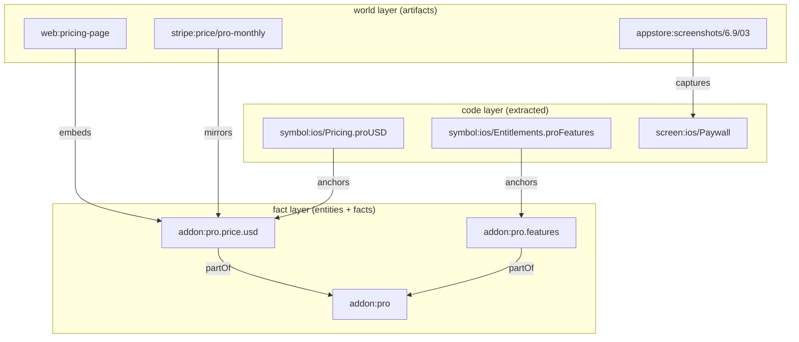

STARCHART models your product as one graph with three layers. The **code** layer is extracted from source. The **fact** layer holds the canonical values you author in YAML. The **world** layer holds the things outside your repo that show those values: pages, store listings, screenshots, Stripe prices, promo reels. Typed edges join them, and a handful of **bridge** edges cross from code into facts and world. This page explains what lives in each layer, how the bridges work, and traces the Pro add-on from the demo through all three.

## The layers at a glance

Every node has a `kind`, and the kind fixes the layer (`LAYER_OF` in [`core/model.ts`](https://github.com/space-pirate-zero/starchart/blob/main/packages/starchart/src/core/model.ts)):

| Layer | Node kinds | Where they come from |
|---|---|---|
| `fact` | `entity`, `fact` | `.starchart/**/*.yaml` entity docs, plus DTCG design tokens ([Design Tokens](Design-Tokens)) |
| `world` | `artifact` | `.starchart/**/*.yaml` artifact docs |
| `code` | `file`, `symbol`, `package`, `route`, `screen`, `flag`, `env`, `event`, `i18n`, `test` | Extracted by the code ingestor on every run ([Code Ingestion](Code-Ingestion)) |

You write the fact and world layers by hand (or accept proposals from `starchart init --discover`). The code layer is never authored: STARCHART rebuilds it from source each time it loads the project, so it can't drift from the code.



Edges point from the dependent to the dependency: `web:pricing-page --embeds--> addon:pro.price.usd` means the page depends on the price. Impact flows the other way, from a changed node to whatever depends on it. See [Edge Types](Edge-Types) for the full direction and propagation rules.

## Fact layer

The fact layer is the single source of truth. It has two kinds of node.

- **Entities** are things that own facts: an add-on, an app, a campaign. Ids are yours to pick; the convention is `kind:name` (`addon:pro`, `app:nebula`).
- **Facts** are values, addressed by dot path under their entity: `addon:pro.price.usd = 4.99`. Nested YAML becomes a tree of leaf and container fact nodes linked by `partOf`.

A fact records *where its truth lives* in `authority`: `graph` (the YAML is the truth, the default), `code` (a code symbol is the truth), or the name of an external system such as `appstore`. Details live in [Facts and Entities](Facts-and-Entities).

## World layer

Artifacts are the things in the world that show, mirror or promote your facts. Each one can carry a `binding` that tells an adapter where it lives (`{ adapter: fs, path: … }`, `{ adapter: stripe, price: … }`). Artifacts declare their dependencies with edges such as `embeds`, `renders`, `describes`, `mirrors` and `captures`. See [Artifacts and Bindings](Artifacts-and-Bindings).

World artifacts are what an impact plan classifies: `auto` (an adapter can fix it), `manual`, `review` or `retire`. Whether an adapter can fix one is asked per artifact, so the same adapter can write a listing's text but leave its screenshots `manual`. See [Impact Analysis](Impact-Analysis).

## Code layer

The ingestor walks every configured scope and emits files, symbols (with literal values where it can read them), screens, routes, packages, env vars, feature flags, analytics events, i18n keys and tests, plus the edges between them: `imports`, `references`, `dependsOn`, `tests`, `serves`, `readsEnv`, `readsFlag`, `contains` and `emits`. Code nodes carry a content `hash`, which is how the lockfile notices code drift. See [Code Ingestion](Code-Ingestion) and [Node IDs](Node-IDs).

## Bridges

Bridges are the edges that cross layers. `BRIDGE_EDGES` in the source is exactly five types:

| Bridge | Typical shape | Created by |
|---|---|---|
| `anchors` | `symbol --anchors--> fact` (or `--> artifact`) | `@starchart anchors` annotations, `authority: code` facts, `edges:` in YAML |
| `displays` | `symbol/file --displays--> fact` | annotations or `edges:` |
| `captures` | `artifact --captures--> screen` | artifact docs (`captures:`) |
| `publishes` | `route --publishes--> artifact` | artifact docs (`publishedBy:`) |
| `emits` | `symbol/file --emits--> event` | extracted analytics calls |

`anchors` is special: it propagates in **both** directions. Change the fact and the hardcoded symbol needs updating; change the symbol and the fact (and everything that embeds it) moves too. That two-way link is what lets a code PR light up the App Store listing. See [Bridges and Discovery](Bridges-and-Discovery).

A symbol can also anchor an **artifact**. The demo's `PRICE_PRO_MONTHLY` constant carries `// @starchart anchors stripe:price/pro-monthly`, because it holds that Stripe price's id. Impact reports it as `code` with the reason "holds this artifact's external id; update it if the id changes", not as a hardcoded copy of the price. See [Impact Analysis](Impact-Analysis#classification-rules).

## Trace: the Pro add-on through all three layers

The demo in [`examples/pro-universe`](https://github.com/space-pirate-zero/starchart/blob/main/examples/pro-universe) has a SwiftUI app and a Next.js site selling a "Pro" add-on.

### 1. Fact layer

`.starchart/entities/pro.yaml` declares the entity and its facts:

```yaml
id: addon:pro
type: [schema:Offer, sc:AddOn]
label: Nebula Pro
of: app:nebula
status: active
owners: ["@zero"]
facts:
  name: Nebula Pro
  price:
    usd: 4.99
    eur: 4.99
  billing: monthly
  productId: { value: nebula_pro_monthly, authority: appstore }
  features: { authority: code, source: { symbol: ios/Entitlements.proFeatures } }
```

That compiles into the entity `addon:pro`, the container fact `addon:pro.price`, the leaves `addon:pro.price.usd` and `addon:pro.price.eur`, an implicit `addon:pro.status` fact, and a `partOf` edge from `addon:pro` up to `app:nebula`.

### 2. Code layer

The ingestor finds `static let proUSD = 4.99` in `apps/ios/Sources/Core/Pricing.swift`. A comment above it says `// @starchart anchors addon:pro.price.usd`, so the ingestor adds `symbol:ios/Pricing.proUSD --anchors--> addon:pro.price.usd`. The `features` fact has `authority: code`, so after ingest STARCHART reads `symbol:ios/Entitlements.proFeatures` (value `["Themes","iCloud sync"]`) into the fact and adds another `anchors` edge. `PaywallView` becomes `screen:ios/Paywall`.

### 3. World layer

Artifacts point at the facts and the screen:

```yaml
- id: appstore:screenshots/6.9/03
  type: schema:ImageObject
  binding: { adapter: appstore, app: "6450000000", set: "6.9", index: 3 }
  captures: screen:ios/Paywall
  embeds: [addon:pro.price.usd]
```

### 4. Change the code, watch the world move

Edit the feature list in Swift and ask for the blast radius of that symbol:

```bash
starchart impact symbol:ios/Entitlements.proFeatures -v
```

```text
Change: symbol:ios/Entitlements.proFeatures

  ! manual  appstore:screenshots/6.9/03                        captures    screen changed; re-capture
      why: symbol:ios/Entitlements.proFeatures --references--> symbol:ios/PaywallView.body --references--> symbol:ios/PaywallView --references--> screen:ios/Paywall --captures--> appstore:screenshots/6.9/03  (confidence 0.69)
  ~ auto    symbol:ios/StarchartFacts.AddonPro.features        anchors     regenerate fact constants (codegen)
      why: symbol:ios/Entitlements.proFeatures --anchors--> addon:pro.features --anchors--> symbol:ios/StarchartFacts.AddonPro.features  (confidence 1)
  …
  ? review  web:pricing-page                                   describes   describes this semantically
      why: symbol:ios/Entitlements.proFeatures --anchors--> addon:pro.features --describes--> web:pricing-page  (confidence 1)
  ? review  web:landing-hero                                   describes   describes this semantically
      why: symbol:ios/Entitlements.proFeatures --anchors--> addon:pro.features --partOf--> addon:pro --describes--> web:landing-hero  (confidence 1)
  ✗ retire  reel:spring-2026                                   promotes    expired 2026-06-30
      why: symbol:ios/Entitlements.proFeatures --anchors--> addon:pro.features --partOf--> addon:pro --promotes--> reel:spring-2026  (confidence 1)
  ✓ tests   test:ios/Tests/PaywallTests.swift                  tests       run these tests
  …

Plan: 1 manual · 2 auto · 4 review · 1 retire · 1 tests · 4 info
```

Read the "why" lines left to right: code (`symbol:ios/Entitlements.proFeatures`) crosses the `anchors` bridge into the fact layer (`addon:pro.features`), climbs `partOf` to the entity (`addon:pro`), then fans out into the world (`web:landing-hero`, `reel:spring-2026`). A second path stays inside code until the screen, then crosses via `captures` to the screenshot. One Swift edit, three layers, nine things to handle.

## See also

- [Facts and Entities](Facts-and-Entities)
- [Artifacts and Bindings](Artifacts-and-Bindings)
- [Edge Types](Edge-Types)
- [Impact Analysis](Impact-Analysis)
- [Bridges and Discovery](Bridges-and-Discovery)
