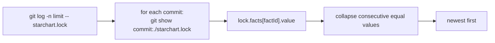

"When did Pro go to 5.99, and who did it?" `starchart.lock` records every fact's value, and you commit it, so git history already *is* the history of every fact. `starchart history <fact>` reads it back: one line per value change, newest first, with commit, date, author and message. This page covers how `factHistory` walks the log, how runs collapse, the limits, the `lockAt(rev)` helper, what you need for it to work, and a real two-commit example.

Source: [`history.ts`](https://github.com/space-pirate-zero/starchart/blob/main/packages/starchart/src/history.ts).

## The command

```text
Usage: starchart history [options] <fact>

time machine: a fact's value across commits

Options:
  -n, --limit <n>  commits to scan (default: "200")
  -h, --help       display help for command
```

Output, one line per entry:

```text
<commit, 8 chars> <author date, YYYY-MM-DD> <value>  <author>: <subject>
```

Values print compactly (JSON, cut at 60 characters with `…`). Entries where the fact was absent from the lock are left out of the CLI output (the library still returns them, with `value: undefined`). The command skips code ingestion, so it is fast even in big repos. It exits 0 whether or not it finds history (only a broken project, such as a missing `.starchart/`, exits 2).

## How `factHistory` works

```ts
export interface FactVersion {
  commit: string;
  date: string;      // author date, ISO 8601
  author: string;
  subject: string;
  value: unknown;    // undefined when the fact was absent
}
export async function factHistory(root: string, factId: string, opts?: { limit?: number }): Promise<FactVersion[]>
```



1. **Walk the log.** `git log --format=%H%x09%aI%x09%an%x09%s -n <limit> -- starchart.lock`, run in the project root. Only commits that touched the lock count. Lines whose first field is not a 7–64 char hex SHA are dropped.
2. **Read each lock.** `git show <commit>:./starchart.lock` for every commit (in parallel). A lock that is missing, unparseable or not `version: 1` reads as "absent".
3. **Pick the value.** `lock.facts[<fact id>].value`. The id must be exact: `addon:pro.price.usd` for a leaf, `addon:pro.price` for the container (which holds the whole object).
4. **Collapse runs.** Walking newest to oldest, consecutive commits with the same value (compared with stable, key-sorted JSON) merge into one entry, and that entry moves back to the **oldest** commit of the run: the commit where the value first appeared. "Absent" is a value too.

All git calls use `execFile` (no shell) with a 64 MiB output buffer. Outside a git repo, or when `git log` fails, the result is `[]`.

### Limits

| Knob | Default | Notes |
|---|---|---|
| CLI `--limit` | 200 | commits that touched the lock, not all commits |
| library `opts.limit` | 50 | floored, minimum 1 |

The limit counts lock commits **before** collapsing. With `-n 1` you only see the newest lock commit, even if the value is years old. A value that has not changed within the scanned window shows the oldest scanned commit, not the true origin; raise `-n` to look further back.

## `lockAt(rev)`

```ts
export async function lockAt(root: string, rev: string): Promise<LockFile>
```

The lock as committed at any revision git understands (`HEAD~3`, `v1.2.0`, `main`, a SHA):

| Situation | Result |
|---|---|
| unknown revision, or one starting with `-` | throws `unknown revision "…"` / `invalid revision "…"` |
| revision exists, lock did not exist yet | an empty lock |
| lock exists but is not a valid version 1 lock | throws `starchart.lock at <rev> is not a valid version 1 lock` |

Useful for diffing fact values between releases:

```ts
import { lockAt } from "@space-pirate-zero/starchart";

const before = await lockAt(process.cwd(), "v1.4.0");
const after = await lockAt(process.cwd(), "HEAD");
for (const [id, { value }] of Object.entries(after.facts)) {
  const old = before.facts[id]?.value;
  if (JSON.stringify(old) !== JSON.stringify(value)) console.log(id, old, "→", value);
}
```

## Requirements

- **A committed lock.** History is exactly as good as your lock commits. Facts edited in YAML but never re-locked leave no trace. The habit that makes this work: change a fact, run `starchart lock` (or `apply` / `ack`, which relock), commit both. One catch: `apply`, `ack` and `lock <ids…>` keep a fact's **old** value in the lock while any artifact that depends on it is still stale, so the new value only lands in the lock (and in history) once the last dependent artifact is synced or acked, or you run a full `starchart lock`.
- **A git checkout with history.** Shallow CI clones only see the commits they fetched.
- **`starchart.lock` at the project root**, where `.starchart/` lives. Nested projects in a monorepo work: paths are resolved relative to that root.

Without a committed lock you get:

```text
$ starchart history addon:pro.price.usd
no history for addon:pro.price.usd (unknown fact, or starchart.lock not committed yet)
```

## Real example

A temp copy of the demo, three commits: launch, a price change, a rename.

```bash
D=$(mktemp -d)/u && cp -R examples/pro-universe $D && cd $D
git init -q && git add -A
git commit -qm "Launch Pro at 4.99"

sed -i '' 's/usd: 4.99/usd: 5.99/' .starchart/entities/pro.yaml
starchart lock
git commit -qam "Raise Pro to 5.99"

sed -i '' 's/Nebula Pro$/Nebula Pro+/' .starchart/entities/pro.yaml
starchart lock
git commit -qam "Rename Pro to Pro+"
```

```text
$ starchart history addon:pro.price.usd
b56c056e 2026-09-20 5.99  Zero: Raise Pro to 5.99
cb75b9e2 2026-09-01 4.99  Zero: Launch Pro at 4.99
```

Three lock commits, two entries: the rename commit kept the price at 5.99, so it collapsed into "Raise Pro to 5.99", the commit where 5.99 first appeared.

```text
$ starchart history addon:pro.name
c3e5c0b6 2026-09-25 "Nebula Pro+"  Zero: Rename Pro to Pro+
cb75b9e2 2026-09-01 "Nebula Pro"  Zero: Launch Pro at 4.99

$ starchart history addon:pro.price
b56c056e 2026-09-20 {"usd":5.99,"eur":4.99}  Zero: Raise Pro to 5.99
cb75b9e2 2026-09-01 {"usd":4.99,"eur":4.99}  Zero: Launch Pro at 4.99

$ starchart history addon:pro.price.usd -n 1
c3e5c0b6 2026-09-25 5.99  Zero: Rename Pro to Pro+
```

The last one shows the limit trap: with one commit scanned, the newest lock commit is all there is.

A typo'd or unknown fact id gets the same message as a missing lock, since it was absent in every scanned lock:

```text
$ starchart history addon:pro.nope
no history for addon:pro.nope (unknown fact, or starchart.lock not committed yet)
```

Exit code 0 either way.

## Limitations

- Only facts. Artifact dependency pins and code hashes are in the lock too, but `history` does not read them (use `lockAt` for that).
- Values come from the lock, not from YAML. A commit that edited YAML without relocking is invisible.
- Renamed facts start a new history; there is no rename tracking.
- Author date, not commit date. Rebases keep the original author date.
- No outcome attribution yet (joining value changes to revenue or conversion metrics).

## See also

- [Lockfile and Drift](Lockfile-and-Drift)
- [Facts and Entities](Facts-and-Entities)
- [CLI Reference](CLI-Reference)
- [Library API](Library-API)
